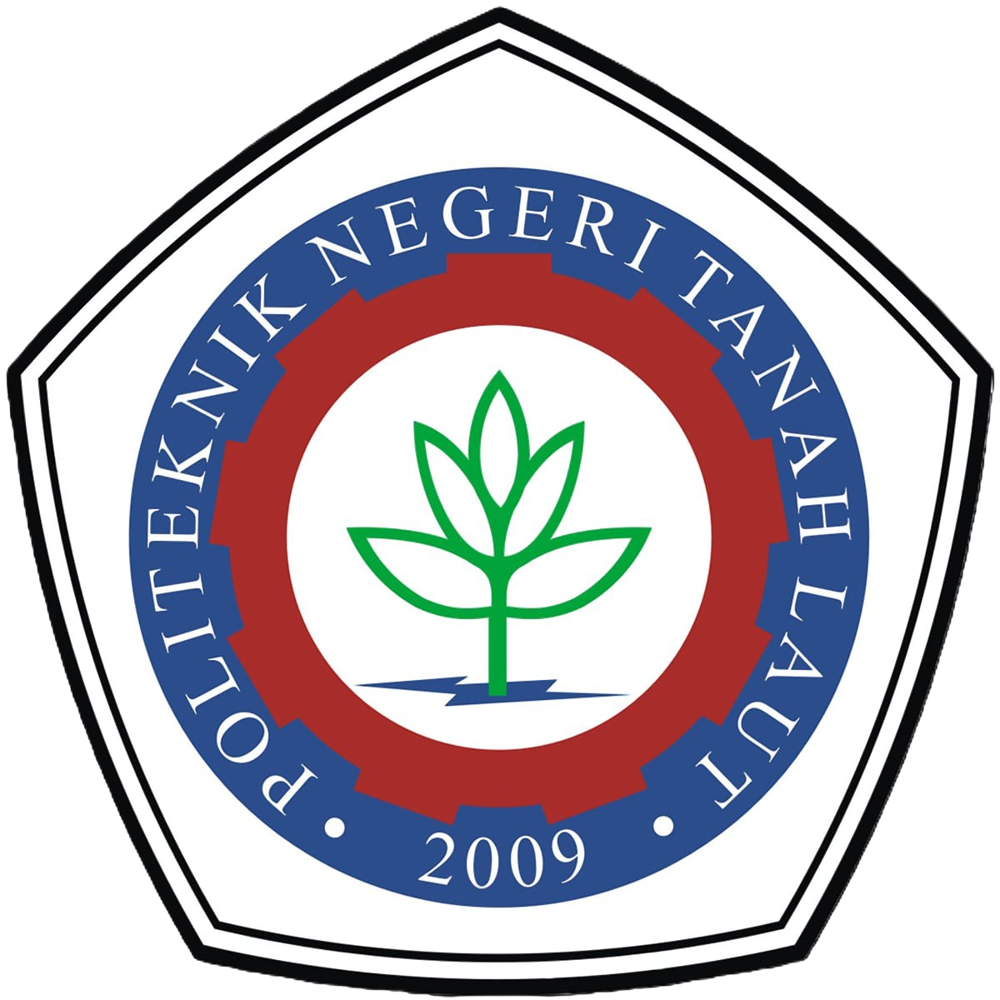
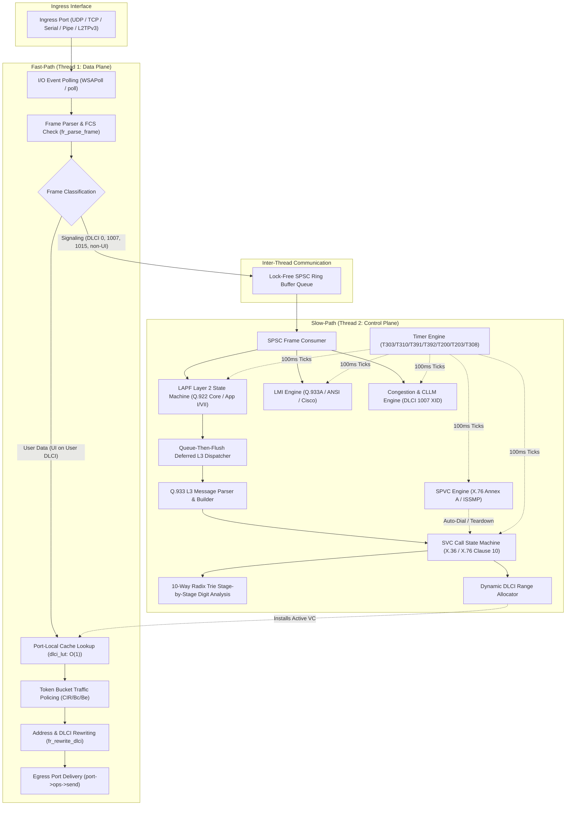

# Virtual Frame Relay Switch (VFRS)

!!! warning
    **Dokumen ini masih berstatus draf!** Perubahan dan pembaruan konten dapat terjadi sewaktu-waktu, seiring dengan kemajuan pengembangan perangkat lunak VFRS.

**RIZKI YANDRI**  
**NIM. 2501402005**  
*Program Studi Sarjana Terapan (D4) Teknologi Rekayasa Komputer Jaringan (TRKJ)*  
*Jurusan Komputer dan Bisnis, Politeknik Negeri Tanah Laut*  

<br/>

<p align="left">
  <a href="https://www.politala.ac.id" target="_blank">
    
  </a>
  &nbsp;&nbsp;&nbsp;&nbsp;
  <a href="https://trkj.politala.ac.id" target="_blank">
    
  </a>
</p>

---

[](https://en.wikipedia.org/wiki/C_(programming_language))
[](#5-build-and-runtime-requirements)
[](#2-standards-compliance--core-capabilities)
[](#6-build-instructions)

---

## Daftar Isi / Table of Contents

- [1. Apa Itu VFRS? (About VFRS)](#1-apa-itu-vfrs-about-vfrs)
- [2. Kepatuhan Standar & Kapabilitas Inti (Standards Compliance & Core Capabilities)](#2-kepatuhan-standar--kapabilitas-inti-standards-compliance--core-capabilities)
  - [2.1 Matriks Standar & Dokumen Spesifikasi Acuan (Primary Standards Matrix)](#21-matriks-standar--dokumen-spesifikasi-acuan-primary-standards-matrix)
  - [2.2 Relasi & Implementasi Berdasarkan Klausul Standar (In-Depth Clause Relations)](#22-relasi--implementasi-berdasarkan-klausul-standar-in-depth-clause-relations)
    - [2.2.1 Lapisan Fisik & Antarmuka DTE/DCE / NNI (ITU-T X.36 §6, X.76 §6)](#221-lapisan-fisik--antarmuka-dtedce--nni-itu-t-x36-6-x76-6)
    - [2.2.2 Data Link Transfer Control, DL-CORE & LAPF (ITU-T X.36 §9, X.76 §9, Q.922 Core & Appendix I/VII)](#222-data-link-transfer-control-dl-core--lapf-itu-t-x36-9-x76-9-q922-core--appendix-ivii)
    - [2.2.3 Parameter Layanan & Kualitas Layanan QoS (ITU-T X.36 §8, X.76 §8, X.146)](#223-parameter-layanan--kualitas-layanan-qos-itu-t-x36-8-x76-8-x146)
    - [2.2.4 Persinyalan Panggilan SVC & Call Control (ITU-T X.36 §10, X.76 §10, Q.933, Q.850)](#224-persinyalan-panggilan-svc--call-control-itu-t-x36-10-x76-10-q933-q850)
    - [2.2.5 Pengelolaan PVC & Local Management Interface LMI (ITU-T X.36 §11, X.76 §11, Q.933 Annex A, ANSI T1.617 Annex D, Cisco GoF)](#225-pengelolaan-pvc--local-management-interface-lmi-itu-t-x36-11-x76-11-q933-annex-a-ansi-t1617-annex-d-cisco-gof)
    - [2.2.6 Manajemen Kemacetan & CLLM (ITU-T X.36 §12 / Annex C, X.76 §12, Q.922 Annex A, I.370)](#226-manajemen-kemacetan--cllm-itu-t-x36-12--annex-c-x76-12-q922-annex-a-i370)
    - [2.2.7 Layanan Multicast Frame Relay (FRF.7 / FRF.19, ITU-T X.6, I.233.1)](#227-layanan-multicast-frame-relay-frf7--frf19-itu-t-x6-i2331)
    - [2.2.8 Rencana Penomoran Internasional & Mesin Analisis Digit (ITU-T X.121, E.164, X.124)](#228-rencana-penomoran-internasional--mesin-analisis-digit-itu-t-x121-e164-x124)
    - [2.2.9 Soft Permanent Virtual Circuits (SPVC per ITU-T X.76 Annex A / ISSMP)](#229-soft-permanent-virtual-circuits-spvc-per-itu-t-x76-annex-a--issmp)
    - [2.2.10 Segmentasi & Fragmentasi Frame (ITU-T X.36 Annex F & FRF.12)](#2210-segmentasi--fragmentasi-frame-itu-t-x36-annex-f--frf12)
    - [2.2.11 Enkapsulasi Pseudowire & Interoperabilitas Modern (RFC 4591, RFC 4349, RFC 2427)](#2211-enkapsulasi-pseudowire--interoperabilitas-modern-rfc-4591-rfc-4349-rfc-2427)
  - [2.3 Ringkasan Kemampuan Inti Forwarding Engine](#23-ringkasan-kemampuan-inti-forwarding-engine)
- [3. Arsitektur Tingkat Tinggi & Model Konkurensi (High-Level Architecture & Concurrency Model)](#3-arsitektur-tingkat-tinggi--model-konkurensi-high-level-architecture--concurrency-model)
  - [3.1 Dual-Plane Threading Architecture](#31-dual-plane-threading-architecture)
  - [3.2 Lock-Free SPSC Control-Plane Ring Buffer](#32-lock-free-spsc-control-plane-ring-buffer)
  - [3.3 Queue-Then-Flush Deferred Callback Mechanism](#33-queue-then-flush-deferred-callback-mechanism)
  - [3.4 Hierarchical Mutex Ordering & Deadlock Prevention](#34-hierarchical-mutex-ordering--deadlock-prevention)
  - [3.5 Port-Local O(1) DLCI Lookup Caches & Hash Registries](#35-port-local-o1-dlci-lookup-caches--hash-registries)
  - [3.6 Architectural Workflow Diagram](#36-architectural-workflow-diagram)
- [4. Layout Repositori & Kode (Repository & Codebase Layout)](#4-layout-repositori--kode-repository--codebase-layout)
- [5. Persyaratan Build & Runtime (Build and Runtime Requirements)](#5-persyaratan-build--runtime-build-and-runtime-requirements)
- [6. Petunjuk Build (Build Instructions)](#6-petunjuk-build-build-instructions)
- [7. Menjalankan VFRS (Running VFRS)](#7-menjalankan-vfrs-running-vfrs)
  - [7.1 Basic Launch](#71-basic-launch)
  - [7.2 Interactive Console Mode](#72-interactive-console-mode)
  - [7.3 Configuration Dry-Run & Semantic Verification](#73-configuration-dry-run--semantic-verification)
- [8. Opsi Baris Perintah (Command-Line Options)](#8-opsi-baris-perintah-command-line-options)
- [9. Arsitektur Sistem Konfigurasi Modern (Configuration System Architecture)](#9-arsitektur-sistem-konfigurasi-modern-configuration-system-architecture)
  - [9.1 Pipeline Lexer, AST Parser & Semantic Compiler](#91-pipeline-lexer-ast-parser--semantic-compiler)
  - [9.2 Strict Schema Validation & Scoped Defaults Cascade](#92-strict-schema-validation--scoped-defaults-cascade)
  - [9.3 10-Way Radix Trie Digit Analysis Engine](#93-10-way-radix-trie-digit-analysis-engine)
- [10. Referensi Perintah Konfigurasi (Configuration Command Reference)](#10-referensi-perintah-konfigurasi-configuration-command-reference)
  - [10.1 Identitas Switch & Dial-Plan Global (`swconfig`)](#101-identitas-switch--dial-plan-global-swconfig)
  - [10.2 Logging & Rotasi Berkas (`log`)](#102-logging--rotasi-berkas-log)
  - [10.3 Cascading Parameter Default Global (`default`)](#103-cascading-parameter-default-global-default)
  - [10.4 Definisi Antarmuka & Transport Driver (`port`)](#104-definisi-antarmuka--transport-driver-port)
  - [10.5 Permanent Virtual Circuits (`pvc` & `pvc mcast`)](#105-permanent-virtual-circuits-pvc--pvc-mcast)
  - [10.6 Local Management Interface (`lmi`)](#106-local-management-interface-lmi)
  - [10.7 LAPF Protocol Parameters (`lapf`)](#107-lapf-protocol-parameters-lapf)
  - [10.8 Persinyalan SVC, Penomoran & Perutean (`svc int`, `svc addr`, `svc route`, `svc mcast`)](#108-persinyalan-svc-penomoran--perutean-svc-int-svc-addr-svc-route-svc-mcast)
  - [10.9 Soft Permanent Virtual Circuits (`spvc`)](#109-soft-permanent-virtual-circuits-spvc)
  - [10.10 Protokol Manajemen Internal Switch (`issmp`)](#1010-protokol-manajemen-internal-switch-issmp)
  - [10.11 Manajemen Kemacetan & CLLM (`cgst`)](#1011-manajemen-kemacetan--cllm-cgst)
  - [10.12 Perekaman Paket Live PCAP (`capture`)](#1012-perekaman-paket-live-pcap-capture)
- [11. Interactive Console Commands (VFRS CLI)](#11-interactive-console-commands-vfrs-cli)
- [12. Testing & Quality Assurance](#12-testing--quality-assurance)
  - [12.1 C Configuration & Digit Analysis Unit Test (`cfg_test.exe`)](#121-c-configuration--digit-analysis-unit-test-cfg_testexe)
  - [12.2 C Information Element & Protocol Unit Test (`ie_test.exe`)](#122-c-information-element--protocol-unit-test-ie_testexe)
  - [12.3 SVC Protocol Compliance Suite (`svc_compliance_test.py`)](#123-svc-protocol-compliance-suite-svc_compliance_testpy)
  - [12.4 Functional & Multi-Hop Call Test Suite (`svc_test.py`)](#124-functional--multi-hop-call-test-suite-svc_testpy)
  - [12.5 High-Throughput Loopback Smoke Test (`run_pipe_loopback_test.sh`)](#125-high-throughput-loopback-smoke-test-run_pipe_loopback_testsh)
- [13. Packet Capture & Wireshark Dissection](#13-packet-capture--wireshark-dissection)
- [14. Troubleshooting & FAQs](#14-troubleshooting--faqs)
- [15. Academic Project & Development Information](#15-academic-project--development-information)

---

## 1. Apa Itu VFRS? (About VFRS)

**VFRS** (*Virtual Frame Relay Switch*) adalah perangkat lunak pensaklaran (*switching engine*) Frame Relay berkecepatan tinggi yang dikembangkan dalam bahasa C standar (C99/C11). VFRS mengemulasikan fungsionalitas node pensaklaran jaringan WAN Frame Relay lengkap sesuai dengan rekomendasi internasional **ITU-T** (International Telecommunication Union), **ANSI** (American National Standards Institute), dan **FRF** (Frame Relay Forum).

Perangkat lunak ini dirancang untuk beroperasi sebagai node jaringan virtual yang tangguh untuk simulasi jaringan skala besar, emulasi laboratorium telekomunikasi, uji kepatuhan protokol (*protocol compliance verification*), serta interkoneksi langsung dengan perangkat keras atau emulator jaringan seperti Cisco IOS (baik pada perangkat fisik melalui antarmuka serial atau emulasi melalui Dynamips / GNS3), perangkat FRAD (_Frame Relay Access Device_), dan simulator/emulator DTE kustom.

### Motivasi & Signifikansi Proyek

Frame Relay merupakan salah satu tonggak terpenting dalam sejarah teknologi jaringan WAN berbasis paket (*packet-switched WAN*), yang meletakkan dasar fundamental bagi konsep *Virtual Circuit*, *Committed Information Rate (CIR)*, *Traffic Policing / Token Bucket*, dan *Explicit Congestion Notification (FECN/BECN)* yang kemudian diadaptasi ke dalam teknologi ATM (Asynchronous Transfer Mode), MPLS (Multi-Protocol Label Switching), dan Carrier Ethernet modern.

VFRS menghadirkan implementasi perangkat lunak mandiri (*standalone*) yang mengintegrasikan:

1. **Dukungan Tiga Mode Virtual Circuit Penuh**:
   - **PVC** (*Permanent Virtual Circuits*): Sirkuit permanen lokal dan inter-switch dengan traffic policing tiga tingkat.
   - **SVC** (*Switched Virtual Circuits*): Sirkuit dinamis berbasis persinyalan panggilan Layer 3 (ITU-T Q.933 / X.36 / X.76) dengan mesin status U0–U22 / N0–N22 lengkap.
   - **SPVC** (*Soft Permanent Virtual Circuits*): Sirkuit hibrida yang menghubungkan access PVC lokal melintasi jaringan inti SVC NNI dengan mekanisme *auto-dial* dan *restoral* asinkron otomatis.
2. **Kepatuhan Persinyalan Lintas Batas (UNI & NNI)**: Mengimplementasikan peran DCE dan DTE secara simultan pada antarmuka *User-to-Network* (ITU-T X.36) dan *Network-to-Network* (ITU-T X.76).
3. **Arsitektur Concurrency Generasi Baru**: Menggunakan model *two-plane execution* (Fast-Path Data Plane dan Slow-Path Control Plane) yang sepenuhnya bebas *deadlock* dengan *lock-free SPSC queues*, pola *queue-then-flush deferred callbacks*, dan struktur data *port-local cache* berkecepatan $O(1)$.
4. **Sistem Konfigurasi & Analisis Digit Modern**: Dilengkapi dengan streaming tokenizer/lexer, parser AST rekursif, validasi skema bertipe ketat, dan mesin analisis digit 10-way Radix Trie ($\mathcal{O}(K)$) untuk perutean rencana penomoran ITU-T X.121 dan E.164.
5. **Multiprotokol Transport L2/L3**: Mengemulasikan jalur komunikasi Frame Relay di atas _named pipes_ Windows/POSIX, _raw socket_ UDP/TCP, serial COM/tty fisik/virtual, hingga terowongan *pseudowire* L2TPv3 (RFC 4591 / RFC 4349).

---

## 2. Kepatuhan Standar & Kapabilitas Inti (Standards Compliance & Core Capabilities)

VFRS dirancang dengan kepatuhan penuh terhadap kumpulan standar formal Frame Relay internasional. Struktur protokol, format frame, mesin persinyalan panggilan (*call control state machine*), dan manajemen kemacetan diimplementasikan secara ketat berdasarkan klausul-klausul spesifik berikut:

### 2.1 Matriks Standar & Dokumen Spesifikasi Acuan (Primary Standards Matrix)

| Standar / Spesifikasi | Judul Resmi Dokumen Standar & Edisi Publikasi | Ruang Lingkup & Klausul Kunci yang Diimplementasikan pada VFRS |
| :--- | :--- | :--- |
| **ITU-T Recommendation X.36** | *"Interface between Data Terminal Equipment (DTE) and Data Circuit-terminating Equipment (DCE) for public data networks providing frame relay data transmission service by dedicated circuit"* (02/2003) | **UNI Data Link, SVC Call Control, LMI & Congestion**:<br>&bull; Klausul 6: *Description of the DTE/DCE interface (physical layer)*<br>&bull; Klausul 7: *Network capabilities* (Priorities, Service classes, Reverse charging, CUG, TNS, Fragmentation)<br>&bull; Klausul 8: *Service parameters and service quality* (AR §8.2.1, Bc §8.2.2, Be §8.2.3, CIR §8.2.4, Tc §8.2.5, N203 §8.2.6, FTP/FDP/Service Class §8.2.7)<br>&bull; Klausul 9: *Data link transfer control* (Frame format §9.2, 2/3/4-octet DLCI §9.3, FCS CRC-16 §9.5, Flag 0x7E)<br>&bull; Klausul 10: *Call connection control* (Signaling DLCI 0 §10.2, Messages §10.5 [Tabel 10-1 s.d. 10-11], Information Elements §10.6 [Gambar 10-2 s.d. 10-22, Tabel 10-12 s.d. 10-25], Call FSM U0–U22/N0–N22 §10.7/§10.10, Timers T301–T322 §10.11)<br>&bull; Klausul 11: *PVC management procedures* (Status Enquiry/Status, LIV, PVC Status, N391–N393, T391–T392, Bidirectional §11.5)<br>&bull; Klausul 12: *Congestion control* (Region I/II/III, FECN, BECN, DE bit, Traffic policing, User rate adaptation)<br>&bull; Annex A: *Support of closed user group optional user facility*<br>&bull; Annex B: *Support of reverse charging and reverse charging acceptance*<br>&bull; Annex C: *Consolidated Link Layer Management (CLLM)* (XID frame pada DLCI 1007)<br>&bull; Annex D: *Transit network selection optional user facility*<br>&bull; Annex E: *Support of the network service access point (NSAP) addressing*<br>&bull; Annex F: *DTE/DCE fragmentation* (FRF.12 compliant segmenter/reassembler)<br>&bull; Annex G: *PVC status reporting enhancements* (Segmented Full Status)<br>&bull; Annex H: *Support of dynamic PVC configuration*<br>&bull; Appendix III: *Loopback detection via transmit/receive sequence verification*<br>&bull; Appendix VII: *Dynamic initial window size calculation $k = 2 + (T_{td} \times R_u) / (4 \times L_d)$* |
| **ITU-T Recommendation X.76** | *"Network-to-network interface between public networks providing PVC and/or SVC frame relay data transmission service"* (02/2003) | **NNI Inter-Switch Data Link, Signaling & Congestion**:<br>&bull; Klausul 6: *Description of the network-to-network physical layer interface*<br>&bull; Klausul 8: *Service parameters and service quality* (AR, CIR, Bc, Be, Tc, N203, FTP, FDP, Service Class)<br>&bull; Klausul 9: *Data link transfer control* (NNI framing, DLCI translation, Q.922 Annex A core attributes)<br>&bull; Klausul 10: *Frame relay SVC signalling* (Signaling channel DLCI 0/1015, Transit Net ID, Call ID, NNI FSM, Table IV.1 exact state validation, Timers T303/T308/T310/T316/T317/T322 §10.8)<br>&bull; Klausul 11: *Additional procedures for PVCs using unnumbered information frames* (Bidirectional LMI polling pada DLCI 0)<br>&bull; Klausul 12: *Congestion control* (NNI congestion handling, FECN/BECN transport, DE bit policing per I.370)<br>&bull; Annex A: *Transit network selection facility & Soft PVC (SPVC) cross-connect support*<br>&bull; Annex B: *Number identification supplementary services & Cause IE diagnostics*<br>&bull; Annex C: *PVC status reporting enhancements* (Segmented Full Status di NNI)<br>&bull; Appendix I: *Network congestion scenarios*<br>&bull; Appendix II: *Signalling scenarios for call establishment and clearing* |
| **ITU-T Recommendation Q.922** | *"ISDN data link layer specification for frame mode bearer services"* (02/1992) | **LAPF Protocol Stack & DL-CORE / DL-CONTROL**:<br>&bull; Klausul 2: *Frame structure for peer-to-peer communication* (Flag `0x7E`, FCS CRC-16, Address field, HDLC zero-bit insertion/extraction)<br>&bull; Klausul 3: *Elements of procedures and formats of fields* (SABME, DISC, DM, UA, FRMR, I-frame, RR, RNR, REJ, UI, XID)<br>&bull; Klausul 5: *Procedures of the data link layer* (Sliding window parameter $k$, T200/T203, N200/N201/N202)<br>&bull; Annex A: *Core aspects of Recommendation Q.922 for use with frame relaying bearer service (DL-CORE)*<br>&bull; Annex A.7: *Consolidated link layer management (CLLM) procedures* (DLCI 1007 XID frame format)<br>&bull; Appendix I: *Responses to network congestion* (Dynamic window size algorithm $V(k)$, BECN scaling $0.625 \times V(k)$, T200/REJ loss scaling $0.25 \times V(k)$, step size $N_w = 5$ recovery mechanism)<br>&bull; Appendix II: *Automatic negotiation of data link layer parameters via XID (GI 0x80 / 0x0F)* |
| **ITU-T Recommendation Q.933** | *"ISDN Digital subscriber Signalling System No. 1 (DSS1) – Signalling specifications for frame mode switched and permanent virtual connection control and status monitoring"* (02/2003) | **SVC Layer 3 Signaling & PVC Status Monitoring**:<br>&bull; Klausul 4: *General message format and information elements coding* (Protocol discriminator `0x08`, 1-octet/2-octet/global Call Reference, Message types, Single-octet vs Variable-length IE stepping, Duplicate mandatory IE retention §10.10.5.2, Sub-IE 0x0B Minimum Acceptable CIR, Cause IE diagnostics in Octet 5 for Causes 96, 98, 99, 100, 101)<br>&bull; Klausul 5: *Call control procedures for basic call* (Call setup, proceed, connect, disconnect, release, restart)<br>&bull; Annex A: *Signalling procedures for frame mode permanent virtual connections (PVC) status monitoring* (Q.933A LMI pada DLCI 0, Report Type `0x51`, Link Integrity `0x53`, PVC Status `0x57`, Codeset 0, T391/T392, N391–N393)<br>&bull; Annex D: *Protocol Implementation Conformance Statement (PICS) proforma for Annex A* |
| **ANSI T1.617 + Annex D** | *"American National Standard for Telecommunications – ISDN – DSS1 – Signaling System for Frame Mode Bearer Services"* (1991) | **ANSI LMI Standard**:<br>&bull; Klausul 3 & 4: Format pesan persinyalan dan Information Elements<br>&bull; *Annex D: Additional Procedures for Frame Relaying Permanent Virtual Connections Using Unnumbered Information Frames* (DLCI 0, UI frame, enkapsulasi **Codeset 5**, Report Type `0x01`, Link Integrity `0x03`, PVC Status `0x07`, T391, T392, N391–N393) |
| **Vendor Consortium (Gang of Four)** | *"Frame Relay Specification with Extensions Based on Proposed T1S1 Standards by cisco Systems, Digital Equipment Corporation, Northern Telecom, StrataCom"* (ConneXions 5-3, 03/1991) | **Cisco / Gang of Four (GoF) LMI**:<br>&bull; Signaling pada **DLCI 1023** menggunakan UI frame (Protocol discriminator `0x09`)<br>&bull; Information Elements pada **Codeset 0**: Report Type (`0x01`), Link Integrity (`0x03`), PVC Status (`0x07`), Multicast (`0x09`) |
| **Frame Relay Forum FRF.7 / FRF.19** | *"Frame Relay PVC Multicast Service and Protocol Description"* (10/1994) | **Multicast Group Replication**:<br>&bull; Klausul 2: Definisi layanan Point-to-Multipoint pada Frame Relay PVC<br>&bull; Klausul 3: Model replikasi frame One-Way (Root $\rightarrow$ Leaves), Two-Way (Root $\leftrightarrow$ Leaves), dan N-Way (Full-Mesh Multipoint-to-Multipoint dengan split-horizon) |
| **Frame Relay Forum FRF.12 / ITU-T X.36 Annex F** | *"Frame Relay Fragmentation Implementation Agreement"* (12/2000) & *"DTE/DCE fragmentation"* | **Segmentasi & Rekonstruksi Frame (FRF.12)**:<br>&bull; End-to-End & UNI/NNI fragmentation untuk mengurangi latensi dan jitter transmisi frame besar |
| **ITU-T Recommendation X.6** | *"Multicast service definition"* (08/1997 / 1993) | **Prinsip Layanan Multicast Data Network**:<br>&bull; Pemetaan grup multicast, integritas transfer data, dan kendali topologi multipoint |
| **ITU-T Recommendation X.121** | *"International numbering plan for public data networks"* (10/2000) | **Rencana Penomoran Jaringan Data Internasional**:<br>&bull; Struktur International Data Number (IDN): DNIC 4-digit (DCC 3-digit + ND 1-digit) + NTN hingga 10-digit<br>&bull; Format penomoran jaringan privat: PNIC, System Group Code (SGC), System Identification Code (SIC), Internal Network Digits (IND)<br>&bull; 10-Way Radix Trie Stage-by-Stage Digit Analysis Engine ($\mathcal{O}(K)$ lookup) |
| **ITU-T Recommendation E.164 & X.124** | *"The international public telecommunication numbering plan"* (05/1997) & *"Arrangements for the interworking of the E.164 and X.121 numbering plans for frame relay and ATM networks"* (1999) | **Penomoran Telekomunikasi Publik & Interworking E.164/X.121**:<br>&bull; Perutean nomor berbasis Country Code (CC), National Destination Code (NDC), dan Subscriber Number (SN)<br>&bull; Konversi/aliasing otomatis antara prefiks E.164 dan X.121 pada antarmuka SVC |
| **ITU-T Recommendation Q.850** | *"Usage of cause and location in the Digital Subscriber Signalling System No. 1 and the Signalling System No. 7 ISDN user part"* (05/1998) | **Kode Penyebab Pelepasan Panggilan (Cause Values & Diagnostics)**:<br>&bull; Cause #1 (*Unallocated number*), #16 (*Normal clearing*), #17 (*User busy*), #21 (*Call rejected*), #29 (*Facility rejected*), #34 (*No circuit available*), #39 (*Permanent connection out of service*), #41 (*Temporary failure*), #47 (*Resources unavailable*), #49 (*QoS unavailable*), #65 (*Bearer cap not implemented*), #88 (*Incompatible destination*), #96 (*Mandatory IE missing*), #98 (*Message incompatible with state*), #99 (*IE non-existent*), #100 (*Invalid IE contents*), #101 (*Message incompatible with state*), #102 (*Recovery on timer expiry*)<br>&bull; Lokasi pengkodean (User, Private net, Public net, Transit net) dan Octet 3a Recommendation field |
| **ITU-T Recommendation I.122 & I.233.1 / I.233.2** | *"Framework for frame mode bearer services"* (03/1993) & *"Frame mode bearer services: ISDN frame relaying / frame switching bearer service"* (1991) | **Arsitektur Dasar Frame Mode Bearer Services**:<br>&bull; Prinsip pemisahan data plane (DL-CORE) dan control plane, multiplexing statistik virtual circuit |
| **ITU-T Recommendation I.370 & I.372** | *"Congestion management for the ISDN frame relaying bearer service"* (1991) & *"Frame relaying bearer service network-to-network interface requirements"* (03/1993) | **Prinsip Pengelolaan Kemacetan & Kebutuhan NNI**:<br>&bull; Klasifikasi kemacetan ringan (*mild*) vs berat (*severe*), aksi penandaan FECN/BECN, pembuangan frame DE, penegakan laju transmisi |
| **ITU-T Recommendation X.146** | *"Performance objectives and quality of service classes applicable to frame relay"* (10/2000) | **Metrik Kualitas Layanan (QoS) Frame Relay**:<br>&bull; Definisi kelas layanan (*Service Classes 0–3*), prioritas transfer (FTP), dan prioritas discard (FDP) |
| **IETF RFC 4591 & RFC 4349** | *"Frame Relay over Layer 2 Tunneling Protocol - Version 3 (L2TPv3)"* (2006) & *"High-Level Data Link Control (HDLC) Frames over L2TPv3"* (2006) | **Enkapsulasi Terowongan L2TPv3 Pseudowire (PWE3)**:<br>&bull; Transportasi frame Frame Relay kanonik dan HDLC berkecepatan tinggi di atas infrastruktur IP |
| **IETF RFC 2427 (RFC 1490) & RFC 2684 (RFC 1483)** | *"Multiprotocol Interconnect over Frame Relay"* (09/1998) & *"Multiprotocol Encapsulation over ATM/Frame Relay"* | **Enkapsulasi Multiprotokol Payload**:<br>&bull; Format enkapsulasi NLPID, SNAP, dan bridging/routing paket protokol layer atas (IPv4, IPv6, ARP, dll.) |
| **Wireshark Libpcap DLT 107** | *Libpcap File Format Specification* (`LINKTYPE_FRELAY`) | **Perekaman Paket Langsung**:<br>&bull; Perekaman frame Frame Relay mentah ke berkas PCAP standar yang kompatibel dengan Wireshark |

---

### 2.2 Relasi & Implementasi Berdasarkan Klausul Standar (In-Depth Clause Relations)

#### 2.2.1 Lapisan Fisik & Antarmuka DTE/DCE / NNI (ITU-T X.36 §6, X.76 §6)
- **ITU-T X.36 Klausul 6 (*Description of the DTE/DCE interface (physical layer)*)** dan **ITU-T X.76 Klausul 6 (*Description of the network-to-network physical layer interface*)**:
  - Mengatur karakteristik antarmuka fisik, penetapan laju akses fisik (*Access Rate* / AR), dan penentuan status kesiapan antarmuka (*operational phases* per X.21, X.21 bis, V.35, G.703, G.704, I.430, I.431).
  - **Implementasi VFRS**: Mengabstraksikan physical layer ke dalam berbagai driver transport modular (`port_udp.c`, `port_tcp.c`, `port_serial.c`, `port_pipe.c`, `port_l2tpv3.c`). Pada antarmuka serial fisik, parameter Access Rate (AR) per X.36 §8.2.1 diturunkan secara otomatis dari *baud rate* perangkat.

#### 2.2.2 Data Link Transfer Control, DL-CORE & LAPF (ITU-T X.36 §9, X.76 §9, Q.922 Core & Appendix I/VII)
- **ITU-T X.36 Klausul 9 (*Data link transfer control*)** dan **ITU-T X.76 Klausul 9 (*Data link transfer control*)**:
  - **§9.2 *Frame format***: Menetapkan struktur kanonik frame `[Flag][Address][Information][FCS][Flag]`. VFRS mengimplementasikan pemeriksaan flag pembuka/penutup `0x7E` serta teknik bit-stuffing/unstuffing 5-bit `1` berturut-turut per Q.922 §2.2–§2.3.
  - **§9.3 *Address field formats***:
    - Format 2-oktet standar (10-bit DLCI, $0 \dots 1023$, DLCI pengguna $16 \dots 991$).
    - Format 3-oktet (16-bit DLCI) per Gambar 9-1b / X.36.
    - Format 4-oktet extended (23-bit DLCI, $0 \dots 8,388,607$) per Gambar 9-2 / X.36.
    - Penanganan semantik bit kendali alamat: bit **C/R** (*Command/Response*), bit **FECN** (*Forward Explicit Congestion Notification*), bit **BECN** (*Backward Explicit Congestion Notification*), bit **DE** (*Discard Eligibility*), dan bit **EA** (*Extension Address*).
  - **§9.5 *Frame Check Sequence (FCS) field***: Validasi dan komputasi CRC-16 standar polinomial $x^{16} + x^{12} + x^5 + 1$ (CCITT CRC-16) pada setiap frame yang diterima dan dikirim.
  - **Pembangun Frame DL-CORE Terpusat (`port_dl_build_frame()`) & Primitif Data Link Terpadu**:
    - Seluruh subsistem switch (SVC, LMI, CLLM, SPVC) menggunakan primitif data link terpadu (`port_dl_send_unit_data()`, `port_dl_send_data()`, `port_dl_send_xid()`, `port_dl_establish_req()`, `port_dl_release_req()`).
    - Bit **FECN**, **BECN**, dan **DE** selalu dipertahankan secara utuh melintasi inti pensaklaran.
  - **Dynamic Per-Port LAPF Registry & Dynamic Windowing ($V(k)$)**:
    - Setiap port memiliki tabel *hash* dinamis 64-slot (`PORT_LAPF_HASH_SIZE 64`) yang mendukung alokasi LAPF pada DLCI 10-bit maupun 23-bit secara instan dalam kompleksitas $O(1)$.
    - **ITU-T X.36 Appendix VII**: Komputasi ukuran jendela awal dinamis:
      $$k = 2 + \frac{T_{td} \times R_u}{4 \times L_d}$$
    - **ITU-T Q.922 Appendix I (*Dynamic Window Congestion Response*)**:
      - Saat menerima notifikasi **BECN**, jendela kerja dipangkas: $V(k) \leftarrow \max(\lfloor 0.625 \times V(k) \rfloor, 1)$.
      - Saat terjadi kehilangan paket (**T200 timeout** atau penerimaan **REJ**), jendela kerja dipangkas drastis: $V(k) \leftarrow \max(\lfloor 0.25 \times V(k) \rfloor, 1)$.
      - Pemulihan bertahap (*step recovery*): Menaikkan $V(k) \leftarrow V(k) + 1$ setiap menerima $N_w = 5$ frame terkonfirmasi hingga mencapai batas ternegosiasi $k$.

#### 2.2.3 Parameter Layanan & Kualitas Layanan QoS (ITU-T X.36 §8, X.76 §8, X.146)
- **ITU-T X.36 Klausul 8 (*Service parameters and service quality*)** dan **ITU-T X.76 Klausul 8 (*Service parameters and service quality*)**:
  - **§8.2.1 Access Rate (AR)**: Kecepatan transfer fisik maksimum pada kanal akses.
  - **§8.2.2 Committed Burst Size ($B_c$)**: Jumlah bit data yang dijamin dapat ditransfer dalam interval $T_c$.
  - **§8.2.3 Excess Burst Size ($B_e$)**: Jumlah bit data berlebih tanpa komitmen yang diupayakan ditransfer oleh jaringan.
  - **§8.2.4 Committed Information Rate (CIR)**: Laju data rata-rata terjamin ($T_c = B_c / \text{CIR}$).
  - **§8.2.6 Maximum octet length of Information Field ($N_{203}$)**: Batas maksimum ukuran payload (standar minimum 1600 oktet).
  - **§8.2.7 Priorities or service class**: Parameter **FTP** (*Frame Transfer Priority*, $0 \dots 15$), **FDP** (*Frame Discard Priority*, $0 \dots 7$), dan **Service Class** ($0 \dots 3$) per Tabel 7-1 X.36 / ITU-T X.146.
  - **Implementasi VFRS**: Menjalankan algoritma *Three-Tier Token Bucket* (`token_bucket_t` di `types.h`, `cgst_mgnt.c`) untuk menegakkan parameter CIR, Bc, dan Be pada level sirkuit virtual secara independen.

#### 2.2.4 Persinyalan Panggilan SVC & Call Control (ITU-T X.36 §10, X.76 §10, Q.933, Q.850)
Persinyalan Switched Virtual Circuit (SVC) pada VFRS mengimplementasikan seluruh pesan, Information Element (IE), state machine, dan timer sesuai **ITU-T Recommendation X.36 Klausul 10**, **ITU-T Recommendation X.76 Klausul 10**, dan **ITU-T Recommendation Q.933**:

1. **Struktur & Definisi Pesan Persinyalan (ITU-T X.36 §10.5, Tabel 10-1 s.d. 10-11)**:
   - **Pesan Pembentukan Sirkuit Virtual (*Virtual Circuit Establishment Messages*)**:
     - `CALL PROCEEDING` (§10.5.1 / Tabel 10-2): Dikirim untuk mengonfirmasi penerimaan `SETUP` dan mengindikasikan alokasi DLCI oleh switch (Signifikansi: Local, Direction: Both).
     - `CONNECT` (§10.5.2 / Tabel 10-3): Dikirim saat DTE tujuan menerima panggilan, memuat parameter QoS final hasil negosiasi (Signifikansi: Global, Direction: Both).
     - `SETUP` (§10.5.8 / Tabel 10-9): Pesan inisiasi panggilan dari calling DTE ke jaringan atau DCE ke called DTE yang memuat nomor pemanggil/tujuan, kapasitas pembawa, dan usulan parameter LLCORE (Signifikansi: Global, Direction: Both).
   - **Pesan Pembersihan Sirkuit Virtual (*Virtual Circuit Clearing Messages*)**:
     - `DISCONNECT` (§10.5.3 / Tabel 10-4): Menginisiasi pelepasan panggilan dari ujung ke ujung (Signifikansi: Global, Direction: Both).
     - `RELEASE` (§10.5.4 / Tabel 10-5): Mengonfirmasi inisiasi pelepasan sirkuit dan meminta pelepasan DLCI lokal (Signifikansi: Local/Global, Direction: Both).
     - `RELEASE COMPLETE` (§10.5.5 / Tabel 10-6): Konfirmasi final pelepasan sirkuit dan pengembalian DLCI ke pool alokasi (Signifikansi: Local/Global, Direction: Both).
   - **Pesan Lain-Lain (*Miscellaneous Messages*)**:
     - `RESTART` (§10.5.6 / Tabel 10-7): Menginisiasi reset dan pembersihan seluruh kanal SVC pada antarmuka menggunakan *Global Call Reference Value* `0x0000` (Signifikansi: Local, Direction: Both).
     - `RESTART ACKNOWLEDGE` (§10.5.7 / Tabel 10-8): Konfirmasi penyelesaian reset antarmuka (Signifikansi: Local, Direction: Both).
     - `STATUS` (§10.5.9 / Tabel 10-10): Mengirimkan status panggilan aktif dan nomor sirkuit saat ini (Signifikansi: Local, Direction: Both).
     - `STATUS ENQUIRY` (§10.5.10 / Tabel 10-11): Permintaan status panggilan dari DTE atau DCE (Signifikansi: Local, Direction: Both).

2. **Format Umum Pesan & Pengkodean Information Element (ITU-T X.36 §10.6, Gambar 10-2 s.d. 10-22, Tabel 10-12 s.d. 10-25)**:
   - Setiap pesan persinyalan pada DLCI 0 (UNI) dan DLCI 0/1015 (NNI) memuat **3 elemen wajib pertama** (Gambar 10-2):
     - **Protocol Discriminator** (§10.6.1 / Gambar 10-3): Nilai biner `0000 1000` (`0x08`) per ITU-T Q.933 / X.36.
     - **Call Reference Information Element** (§10.6.2 / Gambar 10-4): Mendukung panjang 1-oktet (`data[1] == 0x01`), 2-oktet (`data[1] == 0x02`, 15-bit CRV), dan Global CRV `0x0000` per ITU-T Q.933 §4.3 & Q.931 §4.3.
     - **Message Type** (§10.6.3 / Tabel 10-12): 1 oktet kode tipe pesan (`SETUP` `0x05`, `CALL PROCEEDING` `0x02`, `CONNECT` `0x07`, `DISCONNECT` `0x45`, `RELEASE` `0x4D`, `RELEASE COMPLETE` `0x5A`, `RESTART` `0x46`, `RESTART ACKNOWLEDGE` `0x4E`, `STATUS` `0x7D`, `STATUS ENQUIRY` `0x75`).
   - **Penguraian & Pembentukan Information Element (IE) Tingkat Lanjut**:
     1. **Bearer Capability IE** (§10.6.4 / Gambar 10-5, Tabel 10-13, Identifier `0x04`): Menetapkan transfer mode Frame mode dan L2 protocol ITU-T Q.922 Core.
     2. **Call State IE** (§10.6.5 / Gambar 10-6, Tabel 10-14, Identifier `0x14`): Status numerik saat ini (U0–U22 / N0–N22).
     3. **Called Party Number IE** (§10.6.6 / Gambar 10-7, Tabel 10-15, Identifier `0x70`): Tipe/skema penomoran (X.121 / E.164) dan digit alamat.
     4. **Called Party Subaddress IE** (§10.6.7 / Gambar 10-8, Identifier `0x71`): Subaddress NSAP / user-specified terminal tujuan.
     5. **Calling Party Number IE** (§10.6.8 / Gambar 10-9, Tabel 10-16, Identifier `0x6C`): Digit pemanggil beserta *Presentation indicator* dan *Screening indicator*.
     6. **Calling Party Subaddress IE** (§10.6.9 / Gambar 10-10, Identifier `0x6D`): Subaddress terminal pemanggil.
     7. **Cause IE & Diagnostic Field** (§10.6.10 / Gambar 10-11, Tabel 10-17, Identifier `0x08`):
        - Mendukung **Octet 3a** (*Recommendation Field*, Bit 8 = 0) per ITU-T X.76 §10.5.11 / Gambar 19 dan ITU-T Q.850 §6.1.
        - Menyertakan **Octet 5 Diagnostic Field** yang mengidentifikasi pengenal IE penyebab kesalahan untuk Cause 96 (*Mandatory IE missing*), Cause 99 (*IE non-existent*), Cause 100 (*Invalid IE contents*), serta Message Type penyebab kesalahan untuk Cause 98 / 101 (*Message incompatible with call state*) per ITU-T X.36 Annex E dan ITU-T Q.850.
        - Mendukung parsing dan propagasi **Multiple Cause IEs** dalam pesan clearing.
        - **Propagasi Kode Penyebab Lintas Call Leg**: Mempertahankan kode penolakan spesifik dari remote DTE (misal Cause 88 *Incompatible destination*, Cause 17 *User busy*, Cause 21 *Call rejected*, Cause 34 *No circuit available*) ke pihak pemanggil asal.
     8. **Closed User Group IE** (§10.6.11 / Gambar 10-12, Identifier `0x47`): Fasilitas CUG interlock code dan outgoing access per Annex A.
     9. **Connected Number IE** (§10.6.12 / Gambar 10-13, Tabel 10-18, Identifier `0x4C`): Alamat aktual terminal yang menjawab panggilan.
     10. **Connected Subaddress IE** (§10.6.13 / Gambar 10-14, Identifier `0x4D`): Subaddress pihak yang terhubung.
     11. **Data Link Connection Identifier (DLCI) IE** (§10.6.14 / Gambar 10-15, Tabel 10-19, Identifier `0x19`): Field *Pref./Excl.* (Exclusive), panjang DLCI (2/3/4 oktet), dan nilai numerik DLCI yang dialokasikan.
     12. **Link Layer Core Parameters IE** (§10.6.15 / Gambar 10-16, Tabel 10-20, Identifier `0x48`):
         - Negosiasi parameter forward/backward: FMIF, Throughput (CIR), $B_c$, $B_e$.
         - Mendukung **Sub-IE 0x0B Minimum Acceptable CIR**: Memvalidasi batas throughput minimum. Jika switch/jaringan tidak mampu memenuhi nilai minimum yang diminta, panggilan ditolak dengan Cause 49 (*Quality of service unavailable*) per ITU-T X.36 §10.7.1.3.
     13. **Link Layer Protocol Parameters IE** (§10.6.16 / Gambar 10-17, Tabel 10-21, Identifier `0x49`): Parameter LAPF DL-CONTROL (T200, N200, k).
     14. **Low Layer Compatibility IE** (§10.6.17 / Gambar 10-18, Tabel 10-22, Identifier `0x7C`): Kompatibilitas end-to-end layer bawah.
     15. **Priority and Service Class Parameters IE** (§10.6.18 / Gambar 10-19, Tabel 10-23, Identifier `0x6A`): Nilai FTP ($0\dots 15$), FDP ($0\dots 7$), dan Service Class ($0\dots 3$).
     16. **Reverse Charge Indication IE** (§10.6.19 / Gambar 10-20, Tabel 10-24, Identifier `0x4A`): Pengaturan pembebanan biaya pulsa per Annex B.
     17. **Transit Network Selection IE** (§10.6.20 / Gambar 10-21, Tabel 10-25, Identifier `0x78`): Identifikasi jaringan transit per Annex D.
     18. **User-User IE** (§10.6.21 / Gambar 10-22, Identifier `0x7E`): Data transparan user-to-user (hingga 131 oktet).
   - **Ketahanan Parsing IE (Single-Octet vs Variable-Length & Duplicate Retention)**:
     - Differentiating single-octet IEs (Bit 8 = 1, konsumsi 1 oktet tanpa field panjang) dari variable-length IEs (Bit 8 = 0) untuk mencegah desinkronisasi batas buffer pesan.
     - Penegakan **ITU-T X.36 §10.10.5.2**: Mempertahankan instans pertama dari mandatory unrepeatable IE (*Bearer Capability*, *Called Party Number*) dan mengabaikan instans duplikat berikutnya.

3. **Status Panggilan (*Call States*) & Validasi NNI Tabel IV.1/X.76**:
   - Status Lengkap: `U0/N0: NULL`, `U1/N1: CALL INITIATED`, `U2/N2: OVERLAP SENDING`, `U3/N3: OUTGOING CALL PROCEEDING`, `U4/N4: CALL DELIVERED`, `U6/N6: CALL PRESENT`, `U7/N7: CALL RECEIVED`, `U8/N8: CONNECT REQUEST`, `U9/N9: INCOMING CALL PROCEEDING`, `U10/N10: ACTIVE`, `U11/N11: DISCONNECT REQUEST`, `U12/N12: DISCONNECT INDICATION`, `U19/N19: RELEASE REQUEST`, `U21/N21: RESTART REQUEST`, `U22/N22: RESTART`.
   - **Validasi Transisi NNI Ketat (ITU-T X.76 Tabel IV.1)**:
     - `CALL PROCEEDING` hanya diterima pada status `NN6 (Call Present)`. Jika diterima pada status lain, switch merespons dengan pesan `STATUS` memuat Cause 98 (*Message not compatible with call state*) dan mempertahankan status panggilan saat ini.
     - `CONNECT` hanya diterima pada status `NN6 (Call Present)` atau `NN9 (Call Proceeding Received)`.

4. **Pewaktu Persinyalan (*Signalling Timers*) per ITU-T X.36 §10.11 & ITU-T X.76 §10.8**:
   - **T301**: Pewaktu tunggu respons `CONNECT` setelah `CALL DELIVERED` (180s).
   - **T303**: Pewaktu tunggu respons pertama `SETUP` (default 4s, retransmisi maksimum 1 kali).
   - **T305**: Pewaktu tunggu respons `DISCONNECT` (default 30s).
   - **T308**: Pewaktu tunggu respons `RELEASE` (default 4s, retransmisi maksimum 1 kali).
   - **T310**: Pewaktu tunggu `CONNECT` setelah penerimaan `CALL PROCEEDING` (default 35s di UNI / 40s di NNI).
   - **T316**: Pewaktu tunggu pengakuan `RESTART ACKNOWLEDGE` (default 120s).
   - **T317**: Pewaktu internal pembersihan sirkuit saat restart antarmuka (default 10s di DTE / 20s di DCE).
   - **T322**: Pewaktu tunggu respons `STATUS` setelah pengiriman `STATUS ENQUIRY` (default 4s, retransmisi 2 kali).

#### 2.2.5 Pengelolaan PVC & Local Management Interface LMI (ITU-T X.36 §11, X.76 §11, Q.933 Annex A, ANSI T1.617 Annex D, Cisco GoF)
- **ITU-T X.36 Klausul 11 (*PVC management procedures*)** & **ITU-T X.76 Klausul 11 (*Additional procedures for PVCs using unnumbered information frames*)**:
  - Mengelola verifikasi integritas link (*link integrity verification*) dan sinkronisasi status PVC aktif/inaktif/baru/terhapus.
  - Beroperasi pada **DLCI 0** (Q.933A / ANSI) atau **DLCI 1023** (Cisco GoF) menggunakan frame *Unnumbered Information* (UI).
  - Pertukaran pesan periodik: `STATUS ENQUIRY` (`0x75`) dan `STATUS` (`0x7D`).
  - **Struktur Information Element**:
    - *Report Type IE*: Full Status (`0x00`), Link Integrity Verification (`0x01`), Asynchronous Status (`0x02`), Single PVC Status (`0x03`).
    - *Link Integrity Verification IE*: Pasangan nomor urut pengiriman *Send Sequence Number* ($TxSN$) dan penerimaan *Receive Sequence Number* ($RxSN$).
    - *PVC Status IE*: Bit status $N$ (*New*), $D$ (*Delete*), $A$ (*Active*), dan nomor DLCI terkait.
  - **Konfigurasi Parameter Sistem**:
    - Sisi DCE (Network): $T_{392}$ (Timer verifikasi, default 15s), $N_{392}$ (Ambang error, default 3), $N_{393}$ (Jendela event, default 4).
    - Sisi DTE (User): $T_{391}$ (Timer polling status, default 10s), $N_{391}$ (Siklus full status counter, default 6).
  - **Klausul Khusus Lanjutan**:
    - **ITU-T X.36 §11.5 & X.76 §11.4**: Prosedur LMI Dua Arah (*Bidirectional Polling*) untuk antarmuka NNI dan interkoneksi private network.
    - **ITU-T X.36 Annex G & X.76 Annex C**: Prosedur *Segmented Full Status* (menggunakan Report Type *Full Status Continued*) ketika jumlah entri PVC melebihi ukuran satu frame LMI.
    - **ITU-T X.36 Appendix III (*Loopback Detection*)**: Deteksi loopback fisik berbasis pencocokan nomor urut kirim/terima LMI secara otomatis pada modul Q.933A, ANSI, dan Cisco GoF.

#### 2.2.6 Manajemen Kemacetan & CLLM (ITU-T X.36 §12 / Annex C, X.76 §12, Q.922 Annex A, I.370)
- **ITU-T X.36 Klausul 12 (*Congestion control*)**, **ITU-T X.76 Klausul 12 (*Congestion control*)**, dan **ITU-T Recommendation I.370 (*Congestion management for the ISDN frame relaying bearer service*)**:
  - **Klasifikasi Tingkat Kemacetan**: Kondisi Normal (Region I), Kemacetan Ringan / Mild (Region II), dan Kemacetan Berat / Severe (Region III) per Gambar 12-1/X.36.
  - **Mekanisme Notifikasi Eksplisit**:
    - **FECN (*Forward Explicit Congestion Notification*)**: Menandai bit FECN pada frame arah tujuan agar terminal penerima dapat menurunkan permintaan aliran data.
    - **BECN (*Backward Explicit Congestion Notification*)**: Menandai bit BECN pada frame arah berlawanan agar terminal pengirim segera menurunkan laju injeksi trafik ke nilai CIR.
    - **DE (*Discard Eligibility*)**: Menandai bit DE pada frame trafik yang melampaui $B_c$ agar menjadi prioritas pertama yang dibuang saat terjadi kemacetan parah di buffer antarmuka.
  - **ITU-T X.36 Annex C & ITU-T Q.922 Annex A.7 (*Consolidated Link Layer Management - CLLM*)**:
    - Pengiriman pesan notifikasi kemacetan broadcast periodik menggunakan frame LAPF `XID` pada **DLCI 1007**.
    - Menguraikan dan menyusun Parameter Identifiers: *Parameter Set ID* (`PI=0`), *Cause Identifier* (`PI=2`), dan *DLCI List* (`PI=3`) untuk menginformasikan sirkuit-sirkuit virtual yang mengalami kemacetan kepada perangkat DTE yang tidak memiliki trafik data balik.

#### 2.2.7 Layanan Multicast Frame Relay (FRF.7 / FRF.19, ITU-T X.6, I.233.1)
- **Frame Relay Forum FRF.7 (*Frame Relay PVC Multicast Service and Protocol Description*)** dan **ITU-T Recommendation X.6 (*Multicast service definition*)**:
  - **Mode One-Way** (Point-to-Multipoint): Replikasi frame satu arah dari satu DLCI sumber (akar) ke seluruh DLCI anggota dalam grup.
  - **Mode Two-Way** (Bidirectional Multipoint): Memungkinkan komunikasi dua arah antara akar dan daun.
  - **Mode N-Way** (Full-Mesh Multipoint-to-Multipoint): Replikasi frame penuh ke seluruh anggota grup selain pengirim frame (*split-horizon frame distribution*).
  - Integrasi dengan *Traffic Policing*: Setiap grup multicast dikaitkan dengan alokasi token bucket CIR, Bc, dan Be tersendiri (`pvc_mcast_uni.c`, `pvc_mcast_nni.c`).

#### 2.2.8 Rencana Penomoran Internasional & Mesin Analisis Digit (ITU-T X.121, E.164, X.124)
- **ITU-T Recommendation X.121 (*International numbering plan for public data networks*)**:
  - Menguraikan struktur International Data Number (IDN) berbasis **DNIC** (*Data Network Identification Code*, 4 digit) yang terdiri atas **DCC** (*Data Country Code*, 3 digit) dan **ND** (*Network Digit*, 1 digit), diikuti oleh nomor terminal pelanggan (**NTN**).
  - Mendukung struktur penomoran jaringan privat: **PNIC** (*Private Network Identification Code*), **SGC** (*System Group Code*), **SIC** (*System Identification Code*), dan digit internal jaringan tak terbatas (**IND** / *Internal Network Digits*).
  - **Mesin Analisis Digit 10-Way Radix Trie ($\mathcal{O}(K)$)**:
    - Pohon *Radix Trie* (`vfr_digit_node_t`) untuk evaluasi nomor tahap demi tahap (*stage-by-stage digit analysis*).
    - Pencocokan prefiks terpanjang (*Longest Prefix Match* / LPM) instan untuk perutean panggilan keluar NNI dan *Transit Network Selection* (TNS).
  - **Alokasi Penomoran Pelanggan Otomatis (*Autonumbering*)**:
    - Mendukung alokasi sekuensial otomatis dengan *multi-prefix rollover* dinamis dan reservasi nomor sistem (angka 0 semua).
- **ITU-T Recommendation E.164 & X.124**: Mendukung pendaftaran alias penomoran telepon global E.164 (Country Code + National Destination Code + Subscriber Number) dan konversi otomatis antara prefiks E.164 dan X.121.

#### 2.2.9 Soft Permanent Virtual Circuits (SPVC per ITU-T X.76 Annex A / ISSMP)
- **ITU-T Recommendation X.76 Annex A & ISSMP (*Inter-Switch Signaling and Management Protocol*)**:
  - Menghubungkan access PVC lokal pada antarmuka ingress melintasi jaringan inti SVC berbasis persinyalan NNI dinamis menuju access PVC di antarmuka tujuan.
  - **Notifikasi Status PVC Asinkron (`spvc_notify_pvc_status_change()`)**:
    - Saat access PVC lokal mengalami gangguan (*Down*), switch secara otomatis melepaskan koneksi SVC NNI inti seketika dengan Cause 39 (*Permanent connection out of service*) per X.76 Annex A.4.5.3.
    - Saat access PVC kembali aktif (*Up*), switch secara otomatis menginisiasi panggilan penyambungan ulang (*auto-dial / restoral*) ke node tujuan.

#### 2.2.10 Segmentasi & Fragmentasi Frame (ITU-T X.36 Annex F & FRF.12)
- **ITU-T Recommendation X.36 Annex F & FRF.12 (*Frame Relay Fragmentation Implementation Agreement*)**:
  - Mendukung fragmentasi frame besar menjadi segmen-segmen kecil pada antarmuka UNI/NNI dengan penambahan header fragmentasi FRF.12 (bit $B$ *Begin*, bit $E$ *End*, sequence counter $C$).
  - Mencegah penundaan (*delay jitter*) pada sirkuit berprioritas tinggi saat frame data besar sedang ditransmisikan pada link berkecepatan rendah.

#### 2.2.11 Enkapsulasi Pseudowire & Interoperabilitas Modern (RFC 4591, RFC 4349, RFC 2427)
- **IETF RFC 4591 (*Frame Relay over Layer 2 Tunneling Protocol - Version 3*)** & **RFC 4349 (*HDLC over L2TPv3*)**:
  - Mendukung enkapsulasi terowongan Layer-2 pseudowire (PWE3) untuk melewatkan trafik sirkuit Frame Relay dan HDLC antar-switch melalui jaringan paket berbasis IP/Ethernet.
- **IETF RFC 2427 / RFC 1490 (*Multiprotocol Interconnect over Frame Relay*)**:
  - Kompatibilitas penuh dengan format enkapsulasi NLPID/SNAP standar industri yang digunakan oleh router Cisco IOS, Juniper, Linux Frame Relay, dan firewall komersial.

---

### 2.3 Ringkasan Kemampuan Inti Forwarding Engine
- **Panjang Alamat DLCI Fleksibel**:
  - Alamat 2-oktet standar (10-bit DLCI, rentang $0 \dots 1023$, DLCI pengguna $16 \dots 991$).
  - Alamat 3-oktet (16-bit DLCI) dan 4-oktet extended (23-bit DLCI, rentang $0 \dots 8,388,607$ per ITU-T X.36 Gambar 9-2).
- **Enkapsulasi & Framing**:
  - Validasi dan pembuatan Frame Check Sequence CRC-16 (FCS) standar polynomial $x^{16} + x^{12} + x^5 + 1$.
  - HDLC bit-stuffing / unstuffing dengan flag delimiter `0x7E`.
  - Mode raw payload tanpa flag/FCS untuk komunikasi langsung dengan soket Dynamips Cisco.
- **Address Field Rewriting**: Penulisan ulang DLCI ingress ke egress secara *in-place* dengan propagasi bit FECN, BECN, DE, dan C/R.
- **Permanent Virtual Circuits (PVC)**: Deklarasi sirkuit dua arah instan hanya dengan 1 baris konfigurasi, isolasi tabel DLCI per antarmuka, dan integrasi *Traffic Policing* (CIR/Bc/Be/FTP/FDP/Service Class).
- **Switched Virtual Circuits (SVC / Q.933)**: Call State Machine penuh (U0–U22 / N0–N22), alokator rentang dinamis DLCI 23-bit, perutean prefiks X.121/E.164 via 10-way Radix Trie, dan prosedur restart antarmuka X.36/X.76 §10.6.
- **Soft Permanent Virtual Circuits (SPVC)**: Pemetaan otomatis PVC-to-SVC-to-PVC dengan manajemen status asinkron dan auto-teardown / auto-redial.
- **Local Management Interface (LMI)**: Tiga varian protokol (`q933a`, `ansi`, `cisco`), peran DCE dan DTE polling, Segmented Full Status (Annex G / Annex C), loopback detection (Appendix III), dan notifikasi status asinkron.
- **Link Access Procedure for Frame Relay (LAPF / Q.922)**: Registry hash 64-slot per port, windowing dinamis $V(k)$ per Q.922 Appendix I & X.36 Appendix VII, pengelolaan kanal persinyalan andal pada DLCI 0 dan DLCI 1015 (SABME, DISC, I-frame, RR, RNR, REJ, XID).
- **Congestion Management & CLLM**: Deteksi ambang batas frame-rate dan write error, penandaan FECN/BECN otomatis, token bucket 3-tier policing dengan penandaan DE bit, dan transmisi pesan berkala CLLM XID pada DLCI 1007 per X.36 Annex C.
- **Multicast Frame Replication (FRF.7)**: Mode One-Way (Root $\rightarrow$ Members), Two-Way (Root $\leftrightarrow$ Members), dan N-Way (Full-Mesh Multipoint-to-Multipoint dengan split-horizon).
- **Transport Drivers & Layer-2 Emulation**: Named Pipes Windows/POSIX, raw UDP sockets (symmetric/client/server), raw TCP streams (dengan auto-reconnect), serial COM/tty fisik/virtual, dan terowongan L2TPv3 pseudowire.
- **Packet Capture & Live Observability**: Perekam PCAP standar (`LINKTYPE_FRELAY`, DLT 107) granular per-antarmuka atau global switch trace.

---Observability**: Perekam PCAP standar (`LINKTYPE_FRELAY`, DLT 107) granular per-antarmuka atau global switch trace.

---

## 3. Arsitektur Tingkat Tinggi & Model Konkurensi (High-Level Architecture & Concurrency Model)

VFRS dirancang dengan arsitektur konkuren tingkat lanjut untuk menjamin throughput pensaklaran data plane maksimal tanpa terganggu oleh komputasi persinyalan control plane yang kompleks.

```
                  ┌──────────────────────────────────────────────────┐
                  │                 VFRS SWITCH CORE                 │
                  └──────────────────────────────────────────────────┘
                                           │
         ┌─────────────────────────────────┴─────────────────────────────────┐
         ▼                                                                   ▼
┌─────────────────────────────────┐                         ┌─────────────────────────────────┐
│     FAST PATH (Data Plane)      │                         │    SLOW PATH (Control Plane)    │
│            THREAD 1             │                         │            THREAD 2             │
├─────────────────────────────────┤                         ├─────────────────────────────────┤
│ • Main I/O Event Loop           │                         │ • SPSC Queue Consumer Thread    │
│ • WSAPoll() / poll() Sockets    │  SPSC Queue (Lock-Free) │ • Q.933 SVC Call State Machine  │
│ • Fast Packet Ingress           │────────────────────────►│ • LAPF Layer 2 Protocol Stack   │
│ • Local DLCI Lookup Cache (O(1))│  [DLCI 0, 1007, 1015]   │ • LMI Timers & Polling Engine   │
│ • CRC-16 / FCS Validation       │                         │ • Congestion & CLLM Generator   │
│ • Traffic Policing / TokenBucket│                         │ • Periodic 100ms Ticks          │
│ • Fast DLCI Rewrite & Egress    │                         │ • Dynamic PVC/SVC/SPVC Updater  │
└─────────────────────────────────┘                         └─────────────────────────────────┘
```

### 3.1 Dual-Plane Threading Architecture
1. **Fast-Path Thread (Thread 1 - Data Plane)**:
   - Menjalankan loop peristiwa I/O utama (`run_main_loop`) menggunakan pemanggilan `WSAPoll()` (Windows) atau `poll()` (Linux) tanpa menahan kunci mutex.
   - Membaca frame yang masuk dari antarmuka yang siap, melakukan validasi FCS dan parsing alamat DLCI.
   - Mengklasifikasikan frame:
     - Jika frame adalah **User Data (UI frame pada DLCI Pengguna)**: Langsung disakelar via cache lokal port (`dlci_lut[1024]`) dalam kompleksitas waktu $O(1)$ dan segera dikirim ke antarmuka tujuan.
     - Jika frame adalah **Control Plane Frame (DLCI 0, 1007, 1015, atau frame non-UI)**: Frame dimasukkan ke dalam antrean SPSC (*Single-Producer Single-Consumer*) tanpa blocking, sehingga Thread 1 dapat segera melanjutkan pemrosesan paket data berikutnya.
2. **Slow-Path Thread (Thread 2 - Control Plane)**:
   - Menjalankan loop pemrosesan latar belakang (`run_slow_path_thread`).
   - Mengambil (*pop*) frame kontrol dari antrean SPSC dan mendistribusikannya ke subsistem LAPF, Q.933 SVC signaling, LMI handler, SPVC manager, atau CLLM generator.
   - Menjalankan pembaruan pewaktu periodik (*timer tick 100ms*) untuk seluruh port (`lmi_poll_timer`, `cgst_poll_timer`, `lapf_poll_timer`, `svc_poll_timers`, `spvc_poll_timer`).

### 3.2 Lock-Free SPSC Control-Plane Ring Buffer
Komunikasi antara Thread 1 dan Thread 2 menggunakan antrean sirkular *Single-Producer Single-Consumer* (`vfr_spsc_queue_t`).
- Menggunakan operasi atomik dan *hardware memory barriers* (`MemoryBarrier()` pada Windows, `__sync_synchronize()` pada GCC) untuk menyinkronkan pointer `head` dan `tail`.
- Thread 1 tidak pernah terblokir (*zero lock contention*) saat memasukkan frame persinyalan ke antrean.

### 3.3 Queue-Then-Flush Deferred Callback Mechanism
Untuk menghindari *deadlock* dan inversi prioritas saat pemrosesan frame LAPF memicu *event* Layer 3 / SVC (seperti `DL-ESTABLISH` atau `DL-RELEASE` indication), VFRS menerapkan pola **Queue-Then-Flush**:
- Selama pemrosesan frame di `lapf_handle_frame()`, callback tidak dipanggil langsung saat memegang `port->mutex`.
- Callback dan payload L3 dimasukkan ke dalam larik lokal pada stack (`lapf_deferred_cb_t deferred[LAPF_MAX_DEFERRED]`).
- Setelah kunci `port->mutex` dilepas secara aman, fungsi `lapf_flush_deferred()` mengeksekusi callback L3 di luar batas penguncian tanpa risiko *deadlock*.

### 3.4 Hierarchical Mutex Ordering & Deadlock Prevention
Untuk mencegah kondisi *deadlock* (seperti *AB-BA Lock Order Inversion*), VFRS menetapkan dan menegakkan urutan akuisisi kunci mutex global secara ketat:

$$\text{LOCK\_LEVEL\_PORT} \longrightarrow \text{LOCK\_LEVEL\_PVC} \longrightarrow \text{LOCK\_LEVEL\_DLCI} \longrightarrow \text{LOCK\_LEVEL\_MCAST} \longrightarrow \text{LOCK\_LEVEL\_SVC} \longrightarrow \text{LOCK\_LEVEL\_SPVC}$$

Pada mode kompilasi Debug (`make debug`), makro `ASSERT_LOCK_ORDER` secara otomatis memverifikasi hierarki bitmap kunci pada setiap *thread-local storage* (TLS) dan segera mengeluarkan peringatan tegas jika terjadi pelanggaran aturan penguncian.

### 3.5 Port-Local O(1) DLCI Lookup Caches & Hash Registries
Alih-alih melakukan pemindaian linier $O(N)$ pada tabel *hash* global saat paket melintas, setiap struktur `vfr_port_t` memiliki struktur cache lokal:
- `dlci_lut[1024]`: Larik penunjuk (*direct pointer array*) langsung untuk seluruh DLCI standar 10-bit ($0 \dots 1023$). Akses pencarian berlangsung instan dalam $O(1)$ waktu konstan tanpa kunci mutex.
- `dlci_array`: Larik dinamis yang selalu terurut (*sorted dynamic array*) untuk DLCI 23-bit, diakses menggunakan pencarian biner (*binary search*) berkecapatan tinggi $O(\log N)$.
- `lapf_hash[64]`: Tabel *hash* berantai dinamis per-port (`PORT_LAPF_HASH_SIZE 64`) untuk pemetaan instan $O(1)$ konteks protokol LAPF pada DLCI 10-bit maupun 23-bit.

### 3.6 Architectural Workflow Diagram



---

## 4. Layout Repositori & Kode (Repository & Codebase Layout)

```
vfr_switch/
├── Makefile                               # Build automation file (MSYS2 UCRT64 / MinGW / GCC)
├── README.md                              # Dokumentasi teknis komprehensif ini
├── readme-draft-v1.md                     # Draf dokumentasi historis
│
├── bin/                                   # Direktori biner hasil kompilasi & pustaka
│   ├── vfrs.exe                           # Executable utama VFRS switch
│   ├── libvfrs.a                          # Pustaka statis modular switch core
│   └── tests/
│       ├── cfg_test.exe                   # Unit test C konfigurasi & Radix Trie digit analysis
│       └── ie_test.exe                    # Unit test C parser & builder Q.933 IE lengkap
│
├── build/                                 # Objek kompilasi perantara (.o) & dependensi (.d)
│
├── confs/                                 # Berkas konfigurasi referensi & pengujian
│   ├── example_config.conf                # Berkas konfigurasi referensi modern lengkap
│   ├── example_config_new.conf            # Contoh sintaks spesifikasi konfigurasi terkini
│   ├── example_config-legacy.conf         # Contoh konfigurasi format kompatibilitas legacy
│   ├── test_config_pvc-1.conf             # Konfigurasi uji coba PVC
│   ├── vfrs_config_guide.conf             # Panduan detail konfigurasi per-parameter
│   └── vfrsTestSvc.conf                   # Konfigurasi pengujian SVC komprehensif
│
├── docs/                                  # Dokumentasi arsitektur mendalam & analisis
│   ├── LOCKING.md                         # Spesifikasi hierarki penguncian dan pencegahan deadlock
│   ├── vfrs_svc_architecture.md           # Arsitektur detail SVC Q.933 / X.36 Clause 10
│   ├── vfrs_capacity_analysis.md          # Analisis kapasitas tabel & pensaklaran skala besar
│   ├── optimization_walkthrough.md        # Catatan optimasi 4 fase arsitektur
│   ├── X.36_Clause_10.5_to_10.6_tables_and_figures.html # Tabel & gambar resmi ITU-T X.36
│   └── img/                               # Aset grafis & logo institusi
│       ├── logo_politala.png              # Logo Politeknik Negeri Tanah Laut
│       └── logo_trkj.png                  # Logo TRKJ Politala
│
├── include/                               # Master umbrella & public C header files
│   ├── vfr.h                              # Master public header & context definition
│   └── vfr/
│       ├── cfg_ast.h                      # Struktur Abstract Syntax Tree (AST) konfigurasi
│       ├── cfg_lexer.h                    # Antarmuka streaming tokenizer & lexer
│       ├── cfg_schema.h                   # Validator skema bertipe ketat & cascading defaults
│       ├── config.h                       # Antarmuka parser konfigurasi compiler
│       ├── congestion.h                   # Subsistem manajemen kemacetan & CLLM
│       ├── export.h                       # Simbol export/import API makro
│       ├── fragment.h                     # Header fragmentasi FRF.12 / X.36 Annex F
│       ├── lapf.h                         # Antarmuka LAPF (Q.922 Core) & DL primitives
│       ├── logger.h                       # Sistem logging & rotasi berkas log
│       ├── pcap.h                         # Perekam berkas tangkapan PCAP DLT 107
│       ├── platform.h                     # Abstraksi cross-platform (Windows/POSIX)
│       ├── ports.h                        # Antarmuka driver transport port
│       ├── pvc.h                          # Tabel DLCI, PVC, LMI, & Multicast
│       ├── svc.h                          # Framework Switched Virtual Circuit & SPVC
│       ├── switching.h                    # Switching core, frame parser, & CRC-16
│       └── types.h                        # Definisi tipe dasar, konstanta, & antrean SPSC
│
├── src/                                   # Implementasi kode sumber C
│   ├── main.c                             # Entry point, CLI args, single-pass pipeline runner, console CLI
│   ├── core/
│   │   ├── cfg_lexer.c                    # Streaming tokenizer / lexer dengan line-continuation & string parsing
│   │   ├── cfg_schema.c                   # Validator skema numerik/rate/time bertipe ketat & defaults cascade
│   │   ├── cfg_parser.c                   # Parser rekursif berbasis tata bahasa AST
│   │   ├── cfg_compiler.c                 # Semantic AST compiler & runtime state binder
│   │   ├── config.c                       # Helper konfigurasi kompatibilitas
│   │   └── logger.c                       # Thread-safe logger dengan rotasi otomatis
│   ├── switching/
│   │   ├── fr_frame.c                     # Frame parsing, CRC-16 FCS, HDLC bit-stuffing
│   │   ├── fr_switch.c                    # Frame forwarding core, DLCI rewrite, show commands
│   │   ├── fr_fragment.c                  # Segmenter & reassembler frame FRF.12 / X.36 Annex F
│   │   └── svc_routing_common.c           # Mesin analisis digit 10-way Radix Trie & perutean LPM X.121/E.164
│   ├── ports/
│   │   ├── port_common.c                  # Base port abstractions & local cache routing tables
│   │   ├── port_queue.c                   # Lock-free SPSC signaling queue implementation
│   │   ├── port_udp.c                     # Driver transport soket UDP (symmetric/client/server)
│   │   ├── port_tcp.c                     # Driver transport soket TCP dengan thread listener
│   │   ├── port_serial.c                  # Driver transport port serial RS-232 / COM
│   │   ├── port_pipe.c                    # Driver transport named pipe Windows / POSIX
│   │   ├── lapf/
│   │   │   └── port_lapf.c                # Implementasi mesin status LAPF Q.922 Core & DL-CORE primitives
│   │   ├── pcap/
│   │   │   └── port_pcap.c                # Implementasi perekam Libpcap DLT 107
│   │   └── svc_numbering/
│   │       └── svc_numbering.c            # Rencana penomoran subscriber, autoprefix & sequential autonumber
│   ├── pvc/
│   │   ├── pvc_lmi_common.c               # Inisialisasi & pemroses timer LMI bersama
│   │   ├── pvc_lmi_ansi.c                 # Mesin LMI ANSI T1.617 Annex D
│   │   ├── pvc_lmi_q933a.c                # Mesin LMI ITU-T Q.933 Annex A / X.36 Clause 11
│   │   ├── pvc_lmi_gof.c                  # Mesin LMI Cisco / Gang of Four (DLCI 1023)
│   │   ├── pvc_mcast_uni.c                # Mesin replikasi multicast pada antarmuka UNI
│   │   └── pvc_mcast_nni.c                # Mesin replikasi multicast pada antarmuka NNI
│   ├── congestion/
│   │   ├── cgst_mgnt.c                    # Token bucket policing, deteksi rate, & bit marking
│   │   └── cgst_cllm.c                    # Pembuat & pengurai frame XID CLLM pada DLCI 1007
│   └── svc/
│       ├── svc_sig_common.c               # State machine panggilan SVC & alokator rentang DLCI
│       ├── svc_sig_iel.c                  # Pembuat Information Element (IE) Q.933 Layer 3
│       ├── svc_sig_iep.c                  # Pengurai Information Element (IE) Q.933 Layer 3
│       ├── svc_sig_uni.c                  # Alur persinyalan SVC UNI (X.36 Clause 10)
│       ├── svc_sig_nni.c                  # Alur persinyalan SVC NNI (X.76 Clause 10)
│       └── svc_spvc.c                     # Pengelola Soft PVC (SPVC), monitoring status PVC & auto-dial
│
└── tests/                                 # Berkas pengujian unit, fungsional, & kepatuhan
    ├── cfg_test.c                         # Unit test C parser konfigurasi, skema, & Radix Trie
    ├── ie_test.c                          # Unit test C parser & builder Q.933 IE (22 skenario)
    ├── svc_compliance_test.py             # Uji kepatuhan protokol SVC Q.933/X.36 berbasis Python
    ├── svc_test.py                        # Uji fungsional panggilan SVC end-to-end multi-fitur
    ├── loopback_test.py                   # Uji loopback named pipe berkecepatan tinggi
    └── run_pipe_loopback_test.sh          # Skrip shell otomatisasi uji loopback
```

---

## 5. Persyaratan Build & Runtime (Build and Runtime Requirements)

### 5.1 Toolchain Kompilasi
- **Kompiler C**: `gcc` (mendukung standar C99 atau C11 dengan ekstensi GNU).
  - *Windows*: Disarankan menggunakan lingkungan **MSYS2** dengan paket `mingw-w64-ucrt-x86_64-gcc` atau `mingw-w64-x86_64-gcc`.
  - *Linux / POSIX*: `gcc`, `make`, `glibc-devel`.
- **Archiver**: `ar` (untuk pembuatan pustaka statis `libvfrs.a`).
- **Build System**: GNU `make` versi 3.81 atau lebih baru.
- **Python Runtime** (Opsional, untuk test suite): Python 3.8+ (mendukung modul `ctypes`, `socket`, `threading`, dan `subprocess`).

### 5.2 Pustaka Sistem (Linkage)
Pada sistem Windows, VFRS secara otomatis mengaitkan (*link*) pustaka statis:
- `-lws2_32`: Windows Sockets API (Winsock 2 / `WSAPoll`).
- `-lwinmm`: Windows Multimedia Timer Services (presisi timer milidetik).
- `-ladvapi32`: Advanced Windows 32 Security & Named Pipe APIs.

---

## 6. Petunjuk Build (Build Instructions)

Buka terminal (MSYS2 UCRT64 di Windows atau terminal shell di Linux), arahkan ke direktori proyek `vfr_switch`, lalu jalankan target `make`:

### 6.1 Membangun Biner Release Teroptimasi (Default)
Membangun executable `bin/vfrs.exe` dengan optimasi `-O2` dan penghapusan simbol debug (`-s`):
```bash
make release
# atau cukup jalankan:
make
```

### 6.2 Membangun Biner Debug
Membangun executable dengan simbol debug lengkap (`-g3 -O0`), penegakan hierarki penguncian mutex (`ASSERT_LOCK_ORDER`), dan informasi pelacakan mendalam:
```bash
make debug
```

### 6.3 Membangun Pustaka Statis Modular (`libvfrs.a`)
Jika Anda ingin mengintegrasikan inti switching VFRS ke dalam proyek simulator atau aplikasi lain:
```bash
make static-lib
```
Hasil berkas arsip akan tersimpan di `bin/libvfrs.a`.

### 6.4 Menjalankan Seluruh Rangkaian Pengujian
Membangun biner test C dan menjalankan seluruh rangkaian pengujian konfigurasi, unit testing IE, fungsional, dan kepatuhan SVC secara otomatis:
```bash
make test
```

### 6.5 Menjalankan Pengujian Smoke Loopback Named-Pipe
```bash
make check
```

### 6.6 Membersihkan Objek Kompilasi
```bash
make clean      # Menghapus direktori build/, bin/, dan berkas konfigurasi sementara test

---

## 7. Menjalankan VFRS (Running VFRS)

### 7.1 Basic Launch
Menjalankan switch dengan berkas konfigurasi tertentu dalam mode *daemon* / *background switching*:
```bash
./bin/vfrs.exe confs/example_config.conf
```
Switch akan memuat seluruh konfigurasi, menginisialisasi port, memulai Thread 1 (Data Plane) dan Thread 2 (Control Plane), lalu menjalankan pemrosesan paket. Tekan `Ctrl + C` untuk mematikan switch secara aman (*graceful shutdown*).

### 7.2 Interactive Console Mode
Menjalankan switch dengan antarmuka baris perintah interaktif (**VFRS CLI**):
```bash
./bin/vfrs.exe -c confs/example_config.conf
```
Dalam mode konsol, log sistem dialihkan secara bersih, dan pengguna diberikan prompt interaktif `vfrs> ` untuk memantau status port, tabel PVC, panggilan SVC aktif, metrik performa, serta memodifikasi konfigurasi secara dinamis saat switch sedang berjalan.

### 7.3 Configuration Dry-Run & Semantic Verification
Melakukan validasi sintaks dan verifikasi semantik konsistensi berkas konfigurasi tanpa mengaktifkan antarmuka jaringan (*dry-run test*):
```bash
./bin/vfrs.exe -t confs/example_config.conf
```
Output akan menampilkan ringkasan jumlah port yang terdefinisi, rute SVC, grup multicast, dan mendeteksi kesalahan konfigurasi referensi port yang tidak valid.

---

## 8. Opsi Baris Perintah (Command-Line Options)

```
VFRS - Virtual Frame Relay Switch
Usage: vfrs.exe [options] [config_file]

Options:
  -h, --help           Menampilkan pesan bantuan penggunaan opsi baris perintah.
  -t, --check-config   Mode uji coba / dry-run: memvalidasi sintaks dan konsistensi semantik konfigurasi lalu keluar.
  -d, --debug          Menaikkan tingkat logging ke TRACE/DEBUG untuk konsol dan berkas log.
  -c, --console        Mengaktifkan prompt konsol interaktif (vfrs>) untuk manajemen runtime langsung.
  -s, --log-size <mb>  Mengatur ukuran maksimum berkas log dalam Megabytes sebelum dirotasi (default: 10 MB).
  -n, --log-files <n>  Mengatur jumlah maksimum berkas log hasil rotasi yang dipertahankan (default: 5 berkas).
```

---

## 9. Arsitektur Sistem Konfigurasi Modern (Configuration System Architecture)

VFRS menggunakan arsitektur parser konfigurasi generasi baru yang mengadopsi prinsip perancangan kompilator modern (*compiler pipeline*) berbasis aliran tunggal (*single-pass streaming pipeline*), validasi skema bertipe ketat (*strict typed schema validation*), dan pohon sintaks abstrak (*Abstract Syntax Tree* / AST).

```
┌─────────────────┐       ┌─────────────────┐       ┌─────────────────┐       ┌─────────────────┐
│ Streaming Lexer │──────►│  AST Parser     │──────►│ Schema & Scoped │──────►│ Semantic        │
│  (cfg_lexer.c)  │       │ (cfg_parser.c)  │       │ Cascade Validator│      │ Compiler        │
│ • Line-continua.│       │ • Grammar rules │       │  (cfg_schema.c) │       │ (cfg_compiler.c)│
│ • Quoted String │       │ • AST Node Gen  │       │ • Rate/Time/Bool│       │ • Runtime State │
│ • key=val tokens│       │ • Error Recovery│       │ • Defaults Tree │       │ • Radix Trie Gen│
└─────────────────┘       └─────────────────┘       └─────────────────┘       └─────────────────┘
```

### 9.1 Pipeline Lexer, AST Parser & Semantic Compiler
1. **Streaming Tokenizer & Lexer (`cfg_lexer.c`, `include/vfr/cfg_lexer.h`)**:
   - Memproses berkas atau string konfigurasi dalam aliran terpadu tanpa batasan ukuran baris statis.
   - Mendukung penyambungan baris menggunakan karakter *backslash* (`\`).
   - Mengabaikan komentar `#` secara bersih dan mempertahankan koordinat baris serta kolom untuk pelaporan kesalahan yang presisi.
   - Mengurai string berkuotasi (`"..."`) dengan dukungan *escape sequence* (`\n`, `\t`, `\"`, `\\`).
   - Mengidentifikasi pasangan atribut `key=val` secara otomatis.
2. **Recursive Descent AST Parser (`cfg_parser.c`, `include/vfr/cfg_ast.h`)**:
   - Mengurai baris pernyataan ke dalam struktur pohon sintaks abstrak (*Abstract Syntax Tree* / AST) bertipe: `CFG_STMT_SWCONFIG`, `CFG_STMT_LOG`, `CFG_STMT_DEFAULT`, `CFG_STMT_PORT`, `CFG_STMT_PVC`, `CFG_STMT_LMI`, `CFG_STMT_LAPF`, `CFG_STMT_SVC_INT`, `CFG_STMT_SVC_ADDR`, `CFG_STMT_SVC_ROUTE`, `CFG_STMT_SPVC`, `CFG_STMT_CGST`, `CFG_STMT_CAPTURE`.
3. **Semantic AST Compiler (`cfg_compiler.c`)**:
   - Mengompilasi seluruh node AST secara aman ke dalam struktur runtime switch (`vfrs_ctx_t`, `vfr_port_t`, `vfr_pvc_entry_t`, `vfr_call_t`).
   - Menyinkronkan dependensi antar-objek secara otomatis tanpa memerlukan iterasi pass parsing manual berulang.

### 9.2 Strict Schema Validation & Scoped Defaults Cascade
1. **Validator Skema Bertipe Ketat (`cfg_schema.c`, `include/vfr/cfg_schema.h`)**:
   - **Parser Laju Data (`cfg_parse_rate`)**: Mendukung satuan kecepatan `bps`, `k`/`K` ($1.000$), `m`/`M` ($1.000.000$), dan `g`/`G` ($1.000.000.000$). Contoh: `64k` $\rightarrow$ 64.000 bps, `2M` $\rightarrow$ 2.000.000 bps.
   - **Parser Durasi Waktu (`cfg_parse_time_ms`)**: Mendukung satuan milidetik `ms` dan detik `s`/`sec` termasuk bilangan desimal. Contoh: `1.5s` $\rightarrow$ 1500 ms, `500ms` $\rightarrow$ 500 ms.
   - **Parser Boolean (`cfg_parse_bool`)**: Mendukung berbagai format konvensi: `true`/`false`, `enable`/`disable`, `allow`/`deny`, `1`/`0`.
   - **Pengecekan Rentang Numerik**: Memvalidasi batas bawah dan batas atas secara ketat pada seluruh parameter integer (`u8`, `u16`, `u32`).
2. **Cascading Scoped Defaults (`vfr_scoped_defaults_t`)**:
   - Menetapkan hierarki nilai default bertingkat menggunakan pernyataan `default <scope>`:
     - `default interface`: Parameter port fisik (AR, bit DLCI, status pcap).
     - `default lapf`: Parameter jendela geser $k$, timer T200/T203, batas retransmisi N200/N201.
     - `default lmi-dce` & `default lmi-dte`: Timer dan counter verifikasi link LMI.
     - `default pvc`: Batas lalu lintas token bucket (CIR, Bc, Be) dan kelas QoS.
     - `default svc`: Parameter default QoS dan timer persinyalan panggilan SVC (T301 s.d. T322).
     - `default svc uni` & `default svc nni`: Parameter timer khusus untuk antarmuka UNI atau NNI.

### 9.3 10-Way Radix Trie Digit Analysis Engine
Untuk mendukung rencana penomoran internasional **ITU-T X.121** dan **ITU-T E.164**, VFRS mengimplementasikan mesin analisis digit berbasis struktur data **10-Way Radix Tree** (`vfr_digit_node_t` di `src/switching/svc_routing_common.c`):
- Menyediakan evaluasi digit tahap demi tahap (*stage-by-stage digit analysis*) dengan kompleksitas waktu optimal $\mathcal{O}(K)$ (di mana $K$ adalah panjang digit nomor telepon/data).
- **Longest Prefix Match (LPM)**: Menemukan rute keluar NNI yang paling spesifik secara instan.
- **Dukungan Struktur Penomoran Fleksibel**:
  - Penomoran Publik X.121: `DNIC (4 digit)` + `NTN (hingga 10 digit)`.
  - Penomoran Privat X.121: `DNIC` + `SGC` + `SIC` + `IND (Internal Network Digits)`.
  - Penomoran E.164: `Country Code (CC)` + `National Destination Code (NDC)` + `Subscriber Number (SN)`.
- **Alokasi Penomoran Otomatis (*Autonumbering*)**:
  - Alokasi nomor pelanggan secara sekuensial dengan kemampuan *multi-prefix rollover* dinamis dan identifikasi nomor sistem (angka 0 semua).

---

## 10. Referensi Perintah Konfigurasi (Configuration Command Reference)

> [!IMPORTANT]
> **Tata Bahasa Konfigurasi Otoritatif**: Parser konfigurasi modern VFRS (`cfg_parser.c` / `cfg_schema.c`) mengimplementasikan tata bahasa formal modern seperti yang didefinisikan secara otoritatif pada [**`confs/example_config_new.conf`**](file:///c:/Users/rizki/Programming/vfrns/vfr_switch/confs/example_config_new.conf) dan [**`confs/vfrs_config_guide.conf`**](file:///c:/Users/rizki/Programming/vfrns/vfr_switch/confs/vfrs_config_guide.conf). Format konfigurasi *legacy* (seperti sintaksis pada berkas `example_config-legacy.conf`) saat ini **sepenuhnya tidak didukung** (*completely unsupported*). Seluruh parameter dan fungsionalitas di bawah ini divalidasi ketat terhadap skema parser modern. Rujukan teknis mendalam per baris perintah konfigurasi juga dapat dilihat pada [**`docs/CONFIGURATION_REFERENCE.md`**](file:///c:/Users/rizki/Programming/vfrns/vfr_switch/docs/CONFIGURATION_REFERENCE.md).

### 10.1 Identitas Switch & Dial-Plan Global (`swconfig`)
Mengatur identitas instans switch dan parameter rencana penomoran internasional (**ITU-T X.121** atau **ITU-T E.164**) yang menjadi acuan pengalamatan SVC dan perutean panggilan multi-tier antar-switch NNI.

```ini
# Format Rencana Penomoran ITU-T X.121 (Maksimum 14 Digit):
swconfig swid=<string> nspf=x121 {dcc=<nnn> [nd={<n> | none}] | dnic=<nnnn>} \
         [pnic={<number> | none}] [ind=<number>] sgclen={<n> | none} [sgc=<number>] \
         siclen={<n> | none} [sic=<number>] sublen=<n>

# Format Rencana Penomoran ITU-T E.164 (Maksimum 15 Digit):
swconfig swid=<string> nspf=e164 cc=<number> {[ic=<number>] | [ndc=<number> [area=<number>]]} \
         [ind=<number>] sgclen={<n> | none} [sgc=<number>] siclen={<n> | none} [sic=<number>] \
         sublen=<n>
```

#### Penjelasan Parameter `swconfig`:
- `swid=<string>`: Pengenal unik instans switch pada konsol CLI dan berkas log, maksimum 32 karakter (default: `"vfrs0"`).
- `nspf=x121|e164`: Jenis rencana penomoran utama yang digunakan switch (*Numbering Plan Selection*, default: `x121`).
- **Parameter Khusus X.121 (Maksimum 14 Digit per ITU-T X.121)**:
  - `dcc=<nnn>`: *Data Country Code* (3 digit angka, contoh: `510` untuk Indonesia, default: `100`).
  - `nd={<n> | none}`: *Network Digit* / National Digit setelah DCC, 1 digit angka 0–9 (default: `0`).
  - `dnic=<nnnn>`: *Data Network Identification Code* 4-digit (gabungan DCC + ND). Jika dikonfigurasi, nilainya otomatis menggantikan konfigurasi `dcc` dan `nd` (default: `1000`).
  - `pnic={<number> | none}`: *Private Data Network Identification Code* setelah DNIC/DCC (0 sampai 6 digit, default: `none`).
  - `ind=<number>`: *Internal Network Digits* (panjang fleksibel tanpa batas statis, digunakan untuk partisi dan perutean internal jaringan operator).
  - `sgclen={<n> | none}`: Panjang digit Kode Kelompok Sistem (KKS / *System Group Code*), $1 \dots 4$ digit (default: `1`).
  - `sgc=<number>`: Nilai SGC milik instans switch ini ($1 \dots 4$ digit, default: `1`). Jika panjang nilai `sgc` kurang dari `sgclen`, nilai otomatis di-*zero-padded* di depan (misal: `sgc=1` dengan `sgclen=2` menghasilkan `01`).
  - `siclen={<n> | none}`: Panjang digit Kode Identifikasi Sistem (KIS / *System Identification Code*), $1 \dots 4$ digit (default: `1`).
  - `sic=<number>`: Nilai SIC milik instans switch ini ($1 \dots 4$ digit, default: `1`). Otomatis di-*zero-padded* di depan jika kurang dari `siclen` (misal: `sic=1` dengan `siclen=2` menghasilkan `01`).
  - `sublen=<n>` / `subnumlen=<n>`: Panjang nomor pelanggan/terminal yang dialokasikan secara otomatis pada antarmuka UNI. Nilai default dihitung otomatis:
    $$\text{sublen} = 14 - (\text{panjang DNIC} + \text{PNIC} + \text{IND} + \text{SGC} + \text{SIC})$$
- **Parameter Khusus E.164 (Maksimum 15 Digit per ITU-T E.164)**:
  - `cc=<number>`: *Country Code*, 1–3 digit angka (contoh: `62` untuk Indonesia).
  - `ic=<number>`: *International Identification Code*, 1–4 digit.
  - `ndc=<number>`: *National Destination Code* (kode tujuan nasional).
  - `area=<number>`: Kode area geografis regional/lokal.
  - `sublen=<n>`: Panjang nomor terminal pelanggan otomatis ($15 - \text{panjang prefiks}$).
- **Nomor Sistem Otomatis Switch (*Reserved System Address*)**:
  Instans VFRS secara otomatis mengalokasikan nomor sistem internal berupa:
  $$\text{DNIC} + \text{SGC} + \text{SIC} + \underbrace{00\dots0}_{\text{sublen digit}}$$
  *(Contoh: untuk `DNIC=5104`, `SGC=01`, `SIC=01`, `sublen=4` $\rightarrow$ `510401010000`)*. Nomor ini dapat diakses dari seluruh port UNI dan NNI untuk keperluan persinyalan, diagnostik, dan manajemen switch.

*Contoh:*
```ini
swconfig swid=vfrsA nspf=x121 dnic=5104 sgclen=2 sgc=01 siclen=2 sic=01 sublen=4
```

---

### 10.2 Logging & Rotasi Berkas (`log`)
Mengontrol tingkat diagnostik konsol, penulisan berkas log teks di disk, dan kebijakan rotasi arsip otomatis.

```ini
log level con={trace | debug | info | warn | error} txt={trace | debug | info | warn | error}
log file <log-file-path>
log rotation size=<megabytes> files=<jumlah-arsip>
```

#### Penjelasan Parameter `log`:
- `log level con={...} txt={...}`: Mengatur tingkat keparahan pesan log:
  - `con={...}`: Tingkat log yang dicetak ke layar konsol secara real-time (default: `info`).
  - `txt={...}`: Tingkat log yang disimpan ke dalam berkas teks log (default: `info`).
  - Pilihan level: `trace`, `debug`, `info`, `warn`, `error`.
- `log file <path>`: Jalur berkas penyimpanan log (default: `vfrs.log`). Jika tidak dikonfigurasi, penulisan log berkas dinonaktifkan.
- `log rotation size=<megabytes> files=<jumlah-arsip>`: Mengatur kebijakan rotasi otomatis:
  - `size=<number>`: Batas ukuran maksimum per berkas log dalam Megabytes sebelum dirotasi (default: `10` MB).
  - `files=<number>`: Jumlah maksimum riwayat berkas arsip rotasi log yang dipertahankan di disk (default: `5` berkas).

*Contoh:*
```ini
log level con=info txt=debug
log file "logs/vfrsA.log"
log rotation size=10 files=5
```

---

### 10.3 Cascading Parameter Default Global (`default`)
Menetapkan nilai default bertingkat (*scoped cascade*) untuk parameter antarmuka, timer protokol, dan kualitas layanan (QoS). Pernyataan `default` harus ditempatkan sebelum definisi antarmuka individual untuk memastikan nilai terwariskan dengan benar.

```ini
default interface dlcibit={10 | 23} ar=<bps>
default lapf k=<n> n200=<n> n201=<n> t200=<s> t203=<s>
default lmi-dce n392=<n> n393=<n> t392=<s>
default lmi-dte n391=<n> n392=<n> n393=<n> t391=<s>
default pvc cir=<bps> bc=<bits> be=<bits> ftp=<0-15> fdp=<0-7> class=<0-3>
default svc cir=<bps> bc=<bits> be=<bits> fmif=<octets> ftp=<0-15> fdp=<0-7> class=<0-3> \
            {revchg={allow | deny} | {ogrevchg={allow | deny} [icrevchg={allow | deny}]}}
default svc mcast cir=<bps> bc=<bits> be=<bits> fmif=<octets> ftp=<0-15> fdp=<0-7> class=<0-3> \
            {revchg={allow | deny} | {ogrevchg={allow | deny} [icrevchg={allow | deny}]}}
default svc uni t303=<s> t305=<s> t308=<s> t310=<s> t301=<s> t316=<s> t317=<s> t322=<s>
default svc nni t303=<s> t305=<s> t308=<s> t310=<s> t301=<s> t316=<s> t317=<s> t322=<s>
```

#### Penjelasan Parameter `default`:
- **`default interface` (Parameter Fisik Antarmuka)**:
  - `dlcibit={10 | 23}`: Mode kapasitas panjang bit DLCI (10-bit standar maks DLCI 1023, 23-bit extended maks DLCI 8.388.607).
  - `ar=<bps>`: Laju akses fisik dasar antarmuka (*Physical Access Rate*, default: `64000` bps).
- **`default lapf` (Parameter Link Layer LAPF ITU-T Q.922 §5.9)**:
  - `k=<1-127>`: Ukuran jendela *sliding window* I-frame (default: `8`).
  - `n200=<n>`: Batas pengulangan transmisi ulang frame sebelum link dinyatakan reset (default: `3`).
  - `n201=<n>`: Ukuran maksimum payload I-frame dalam oktet (default: `260` oktet).
  - `t200=<s>`: Pewaktu transmisi ulang I-frame (*Retransmission timer*, default: `2s`).
  - `t203=<s>`: Pewaktu pemantauan link idle (*Link idle timer*, default: `30s`).
- **`default lmi-dce` (Parameter Sisi Jaringan LMI ITU-T X.36 §11.6 / X.76 §11.7)**:
  - `t392=<s>`: Pewaktu verifikasi penerimaan polling DCE ($5 \dots 30\text{s}$, default: `15s`).
  - `n392=<n>`: Ambang batas kejadian error (*Error threshold*, $1 \dots 10$, default: `3`).
  - `n393=<n>`: Jendela kejadian yang dipantau (*Monitored events window*, $1 \dots 10$, default: `4`).
- **`default lmi-dte` (Parameter Sisi Terminal LMI ITU-T X.36 §11.5 / X.76 §11.4)**:
  - `t391=<s>`: Interval pengiriman polling status DTE ($5 \dots 30\text{s}$, default: `10s`).
  - `n391=<n>`: Siklus penghitung pengiriman Full Status enquiry DTE ($1 \dots 255$, default: `6`).
  - `n392=<n>`: Ambang batas kejadian error DTE ($1 \dots 10$, default: `3`).
  - `n393=<n>`: Jendela kejadian yang dipantau DTE ($1 \dots 10$, default: `4`).
- **`default pvc` (Kualitas Layanan Sirkuit Permanen ITU-T X.36 §8.2 / §8.3 & X.146)**:
  - `cir=<bps>`: Committed Information Rate default (default: `32000` bps).
  - `bc=<bits>`: Committed burst size default (default: `32000` bits).
  - `be=<bits>`: Excess burst size default (default: `0` bits).
  - `ftp=<0-15>`: Frame Transfer Priority default (default: `8`).
  - `fdp=<0-7>`: Frame Discard Priority default (default: `4`).
  - `class=<0-3>`: Kelas layanan default (default: `1`).
- **`default svc` & `default svc mcast` (QoS & Fasilitas SVC Dinamis)**:
  - `cir=<bps>`: CIR default saat DTE tidak menyertakan IE LLCORE (default: `32000` bps).
  - `bc=<bits>` / `be=<bits>`: Committed burst / excess burst size default (default: `32000` / `0`).
  - `fmif=<octets>`: *Maximum Frame Information Field Size* untuk SVC (default: `1600` oktet).
  - `ftp=<0-15>` / `fdp=<0-7>` / `class=<0-3>`: Prioritas transfer, pembuangan, dan kelas layanan per ITU-T X.146.
  - `revchg={allow | deny}`: Izin umum penerimaan panggilan beban balik (*Reverse Charging* per ITU-T X.36 Annex B).
  - `ogrevchg={allow | deny}`: Izin panggilan keluar beban balik.
  - `icrevchg={allow | deny}`: Izin panggilan masuk beban balik.
- **`default svc uni` & `default svc nni` (Pewaktu Persinyalan Panggilan Layer 3)**:
  - `t303=<s>`: SETUP sent, awaiting response ($4\text{s}$).
  - `t305=<s>`: DISCONNECT sent, awaiting RELEASE ($30\text{s}$).
  - `t308=<s>`: RELEASE sent, awaiting RELEASE COMPLETE ($4\text{s}$).
  - `t310=<s>`: Awaiting CONNECT after CALL PROCEEDING ($35\text{s}$ UNI / $40\text{s}$ NNI).
  - `t301=<s>`: Alerting received, awaiting CONNECT ($180\text{s}$).
  - `t316=<s>`: RESTART sent ($120\text{s}$).
  - `t317=<s>`: RESTART received, internal clearing watchdog ($10\text{s}$ UNI / $20\text{s}$ NNI).
  - `t322=<s>`: STATUS ENQUIRY sent ($4\text{s}$).

*Contoh:*
```ini
default interface dlcibit=10 ar=64000
default lapf k=8 n200=3 n201=260 t200=2s t203=30s
default lmi-dce n392=3 n393=4 t392=15s
default lmi-dte n391=6 n392=3 n393=4 t391=10s
default pvc cir=32000 bc=32000 be=0 ftp=8 fdp=4 class=1
default svc cir=32000 bc=32000 be=0 fmif=1600 ftp=8 fdp=4 class=1 revchg=allow
```

---

### 10.4 Definisi Antarmuka & Transport Driver (`port`)
Mendefinisikan antarmuka fisik, soket jaringan UDP/TCP, *named pipes*, port serial, atau terowongan L2TPv3.

```ini
# Named Pipes (Windows IPC / Linux FIFO):
port <port-name> {pipe-client | pipe-server} <pipe-name> [dlcibit={10 | 23}] [ar=<bps>]

# Terowongan L2TPv3 Pseudowire (RFC 4591 / RFC 4349):
port <port-name> l2tpv3fr [<local-host>] <remote-host> <base-vcid> [dlcibit={10 | 23}] [ar=<bps>]
port <port-name> l2tpv3hdlc [<local-host>] <remote-host> <vcid> [dlcibit={10 | 23}] [ar=<bps>]

# Port Serial Fisik & Virtual:
port <port-name> serial <serial-device> [baud=<number>] [dlcibit={10 | 23}] [ar=<bps>]

# Aliran Koneksi TCP:
port <port-name> tcp [<local-host>] <local-port> <remote-host> <remote-port> [dlcibit={10 | 23}] [ar=<bps>]
port <port-name> tcp-client <remote-host> <remote-port> [dlcibit={10 | 23}] [ar=<bps>]
port <port-name> tcp-server [<bind-ip>] <local-port> [dlcibit={10 | 23}] [ar=<bps>]

# Soket Jaringan UDP:
port <port-name> udp [<local-host>] <local-port> <remote-host> <remote-port> [dlcibit={10 | 23}] [ar=<bps>]
port <port-name> udp-client <remote-host> <remote-port> [dlcibit={10 | 23}] [ar=<bps>]
port <port-name> udp-server [<bind-ip>] <local-port> [dlcibit={10 | 23}] [ar=<bps>]
```

#### Karakteristik & Ketentuan Transport:
- **Batasan Kapasitas Antarmuka**:
  - Format penamaan: `uni<X>/<Y>` (DCE sisi jaringan) dan `nni<X>/<Y>` (STE simetris).
  - Skala maksimum: 65.536 port per tipe antarmuka (total 131.072 port per instans switch).
- **Framing & Kompatibilitas Emulator**:
  - Transport TCP dan Named Pipe menggunakan enkapsulasi **4-byte big-endian length prefix**, kompatibel penuh dengan DynaMIPS / GNS3.
- **Mode Soket TCP/UDP**:
  - `tcp`/`udp`: Mode berpasangan simetris (kedua ujung mendengarkan dan mengirim).
  - `tcp-client`/`udp-client`: Mode klien dengan *auto-reconnection exponential backoff* ($1\text{s} \dots 60\text{s}$).
  - `tcp-server`/`udp-server`: Mode server dengan opsi `TCP_NODELAY` dan `SO_KEEPALIVE` aktif secara otomatis.
- **Port Serial**:
  - Laju akses fisik ($AR$) otomatis diturunkan (*auto-derived*) dari nilai baudrate serial (mendukung hingga 8.192.000 bps).
- **Rentang Alokasi Alamat DLCI (10-bit vs 23-bit per ITU-T X.36)**:
  - `0`: *Reserved* untuk LMI (UI-frame) dan Persinyalan SVC (I-frame).
  - `1 - 15`: *Reserved for future use*.
  - `16 - 991`: *User data virtual circuits* (PVC dan SVC dinamis).
  - `992 - 1007`: *Layer 2 management* (CLLM pada DLCI 1007).
  - `1008 - 1022`: *Reserved for future use*.
  - `1023`: *Reserved* untuk Cisco / Gang of Four LMI.
  - `1024 - 8.388.607`: *Extended user virtual circuits* (hanya pada antarmuka dengan `dlcibit=23`).

*Contoh:*
```ini
port uni0/0 udp 127.0.0.1 10000 127.0.0.1 10001 dlcibit=23 ar=2M
port uni0/1 udp 127.0.0.1 10002 127.0.0.1 10003 dlcibit=23 ar=2M
port uni1/0 pipe-server \\.\pipe\vfr_uni10
port uni1/1 pipe-client \\.\pipe\vfr_uni10
port uni2/0 serial COM3 baud=115200
port nni0/0 udp 127.0.0.1 20000 127.0.0.1 20001 ar=10M
```

---

### 10.5 Permanent Virtual Circuits (`pvc` & `pvc mcast`)
Mendefinisikan pemetaan sirkuit permanen point-to-point dan grup replikasi frame multicast per **FRF.7** / **ITU-T X.6**.

```ini
# Sirkuit Point-to-Point PVC:
pvc <port-name-1> <dlci-1> <port-name-2> <dlci-2> [cir=<bps>] [bc=<bits>] [be=<bits>] \
    [ftp=<0-15>] [fdp=<0-7>] [class=<0-3>]

# Sirkuit Multicast PVC:
pvc mcast <group-name> [cir=<bps>] [bc=<bits>] [be=<bits>] [ftp=<0-15>] [fdp=<0-7>] [class=<0-3>]
pvc mcast group <group-name> <source-port-name> <source-dlci> [oneway | twoway | nway]
pvc mcast member <group-name> <member-port-name> <member-dlci> [cir=<bps>] [bc=<bits>] [be=<bits>] \
    [ftp=<0-15>] [fdp=<0-7>] [class=<0-3>]
```

#### Penjelasan Parameter `pvc` & `pvc mcast`:
- `<port-name-1> <dlci-1> <port-name-2> <dlci-2>`: Endpoint pemetaan dua arah antara dua pasangan port dan nomor DLCI.
- `cir=<bps>`: *Committed Information Rate* dalam bit per detik (mengaktifkan *traffic policing token bucket*).
- `bc=<bits>`: *Committed Burst size* dalam bit ($T_c = B_c / \text{CIR}$).
- `be=<bits>`: *Excess Burst size* dalam bit (frame yang melebihi $B_c$ ditandai bit DE per ITU-T X.36 §8.2).
- `ftp=<0-15>`: *Frame Transfer Priority* (nilai lebih tinggi = prioritas transfer lebih tinggi).
- `fdp=<0-7>`: *Frame Discard Priority* (nilai lebih tinggi = dibuang paling akhir saat buffer penuh).
- `class=<0-3>` / `srvcls=<0-3>`: Kelas layanan per Tabel 7-1 ITU-T X.36 / ITU-T X.146.
- **Multicast Group Statements**:
  - `pvc mcast <group-name>`: Mendefinisikan grup multicast dan batas QoS global grup.
  - `pvc mcast group <group-name> <source-port> <source-dlci> [oneway | twoway | nway]`: Menentukan port dan DLCI akar (*root*) serta model replikasi:
    - `oneway`: Replikasi satu arah dari akar ke daun (*Point-to-Multipoint*).
    - `twoway`: Replikasi dua arah (daun dapat merespons ke akar).
    - `nway`: Komunikasi multipoint-to-multipoint penuh (*Full-Mesh* dengan aturan *split-horizon*).
  - `pvc mcast member <group-name> <member-port> <member-dlci>`: Mendaftarkan port dan DLCI anggota daun (*leaf*) ke dalam grup multicast.
- **Three-Tier Token Bucket Traffic Policing (ITU-T X.36 §8.2)**:
  - Lalu lintas *Committed* (dalam batas $B_c$): Diteruskan utuh (*passthrough*).
  - Lalu lintas *Excess* (melebihi $B_c$ hingga $B_c + B_e$): Diteruskan dengan penandaan bit **DE = 1**.
  - Lalu lintas di luar $B_c + B_e$: Diberi prioritas terendah dan langsung dibuang (*dropped*) saat terjadi kemacetan buffer.
- **Aturan Endpoint Multicast**:
  - Sebuah pasangan `(port, dlci)` hanya boleh menjadi anggota dari satu grup multicast dan tidak boleh bertabrakan dengan titik masuk PVC biasa.
  - Pengirim tidak akan pernah menerima duplikat frame-nya sendiri (*split-horizon*).
- **Semantik Bit Keaktifan LMI Multicast**:
  - `oneway` / `twoway` Root: Status aktif jika minimal satu daun operasional.
  - `oneway` Leaf: Status aktif saat konektivitas point-to-point dan multicast ke root terpenuhi.
  - `twoway` Leaf: Status aktif saat koneksi ke root aktif.
  - `nway` Member: Status aktif saat minimal satu anggota lain dalam mesh aktif.

*Contoh:*
```ini
pvc uni0/0 100 uni0/1 200 cir=64000
pvc uni0/0 101 uni0/1 201 cir=32000 bc=32000 be=0 ftp=8 fdp=4 class=1
pvc mcast bcast1 cir=64000
pvc mcast group bcast1 uni0/0 1019 oneway
pvc mcast member bcast1 uni0/1 1020
```

---

### 10.6 Local Management Interface (`lmi`)
Mengonfigurasi protokol pengelolaan status PVC Local Management Interface (LMI) untuk sisi jaringan (DCE) maupun terminal pengguna (DTE).

```ini
# Sisi Jaringan (DCE):
lmi <port-name> [dce] [ansi | cisco | none | q933a] [t392=<s>] [n392=<n>] [n393=<n>] [async={true | false}]

# Sisi Terminal Pengguna (DTE):
lmi <port-name> dte [ansi | cisco | q933a] [t391=<s>] [n391=<n>] [n392=<n>] [n393=<n>] [async={true | false}]
```

#### Penjelasan Parameter `lmi`:
- **Tipe Protokol LMI**:
  - `q933a`: ITU-T Q.933 Annex A / X.36 & X.76 Klausul 11 (Protocol Discriminator `0x08`, Codeset 0, DLCI 0, default).
  - `ansi`: ANSI T1.617 Annex D (Protocol Discriminator `0x08`, enkapsulasi Codeset 5, DLCI 0).
  - `cisco`: Cisco / Gang of Four LMI (Protocol Discriminator `0x09`, Codeset 0, DLCI 1023).
  - `none`: Menonaktifkan protokol LMI pada antarmuka tersebut secara eksplisit.
- **Parameter Sisi DCE (Jaringan)**:
  - `t392=<s>`: Pewaktu verifikasi penerimaan polling DCE ($5 \dots 30\text{s}$, default: `15s`).
  - `n392=<n>`: Ambang batas kejadian error (*Error threshold*, $1 \dots 10$, default: `3`).
  - `n393=<n>`: Jendela kejadian yang dipantau (*Monitored events window*, $1 \dots 10$, default: `4`).
  - `async={true | false}`: Mengizinkan pengiriman pesan STATUS asinkron tanpa menunggu polling.
- **Parameter Sisi DTE (Pengguna / Bidirectional)**:
  - `dte`: Mengaktifkan mode polling sisi DTE (LMI bidirectional).
  - `t391=<s>`: Interval pengiriman polling status DTE ($5 \dots 30\text{s}$, default: `10s`).
  - `n391=<n>`: Siklus pengiriman Full Status enquiry DTE ($1 \dots 255$, default: `6`).
- **Ketentuan Bidirectional LMI**:
  - Pada seluruh antarmuka NNI (`nni*/*`), polling DTE otomatis diaktifkan dan diwajibkan per ITU-T X.76 §11.4 (*Bidirectional LMI*).

*Contoh:*
```ini
lmi uni0/0 dce q933a t392=15s n392=3 n393=4
lmi uni0/1 ansi
lmi uni0/2 cisco
lmi uni0/0 dte q933a t391=10s n391=6
```

---

### 10.7 LAPF Protocol Parameters (`lapf`)
Mengonfigurasi parameter kanal kendali data link LAPF ITU-T Q.922 per antarmuka.

```ini
lapf <port-name> [sabme={active | passive | bidirectional}] [xid={active | passive | disable}] \
     [k=<n>] [n200=<n>] [n201=<n>] [t200=<s>] [t203=<s>]
```

#### Penjelasan Parameter `lapf`:
- `sabme={active | passive | bidirectional}`: Mode inisiasi pembentukan link LAPF saat switch start (`active` memicu pengiriman frame SABME segera).
- `xid={active | passive | disable}`: Mode pertukaran frame XID untuk negosiasi parameter data link (Group ID `0x80`).
- `k=<n>`: Ukuran jendela transmisi *sliding window* ($1 \dots 127$, default: `8`).
- `n200=<n>`: Jumlah maksimum retransmisi sebelum link dinyatakan reset (default: `3`).
- `n201=<n>`: Ukuran payload I-frame maksimum dalam oktet (default: `260` oktet).
- `t200=<s>`: Pewaktu transmisi ulang I-frame (*Retransmission timer*, default: `2s`).
- `t203=<s>`: Pewaktu pemantauan link idle keepalive (*Link idle timer*, default: `30s`).

*Contoh:*
```ini
lapf uni0/0 k=8 n200=3 n201=260 t200=2s t203=30s
lapf nni0/0 sabme=active k=16
```

---

### 10.8 Persinyalan SVC, Penomoran & Perutean (`svc int`, `svc addr`, `svc route`, `svc mcast`)
Mengaktifkan dan mengatur layanan sirkuit dinamis Switched Virtual Circuit per **ITU-T X.36 Klausul 10**, **ITU-T X.76 Klausul 10**, dan **ITU-T Recommendation Q.933**.

#### 1. Inisialisasi Antarmuka SVC (`svc int`)
```ini
svc int <port-name> [dlci_low=<number>] [dlci_high=<number>] \
        [t303=<s>] [t305=<s>] [t308=<s>] [t310=<s>] [t301=<s>] [t316=<s>] [t317=<s>] [t322=<s>] \
        [cirdef=<bps>] [bcdef=<bits>] [bedef=<bits>] [fmifdef=<octets>] \
        [ftpdef=<0-15>] [fdpdef=<0-7>] [clsdef=<0-3>] \
        [revchg={allow | deny} | {ogrevchg={allow | deny} [icrevchg={allow | deny}]}]
```
- `dlci_low=<number>`: Nilai DLCI terendah pool alokasi dinamis SVC (default: `512`).
- `dlci_high=<number>`: Nilai DLCI tertinggi pool alokasi dinamis SVC (default: `991`).
- `cirdef=<bps>`, `bcdef=<bits>`, `bedef=<bits>`, `fmifdef=<octets>`: Nilai default parameter QoS bila DTE tidak menyertakan IE LLCORE.
- `ftpdef=<0-15>`, `fdpdef=<0-7>`, `clsdef=<0-3>`: Prioritas transfer, pembuangan, dan kelas layanan default.
- `revchg={allow | deny}`: Kebijakan penerimaan reverse charging (*incoming* & *outgoing*).
- `t301` s.d. `t322`: Override pewaktu persinyalan panggilan Layer 3 pada antarmuka ini.

#### 2. Registrasi Nomor Pelanggan (`svc addr`)
```ini
# Format 1: Mode Manual (Nomor penuh ditentukan secara eksplisit):
svc addr <port-name> manual [x121 | e164] <primary-full-number> \
         [alias [x121 | e164] <alias-full-number> [revchg={allow | deny} | {ogrevchg={allow | deny} [icrevchg={allow | deny}]}]]

# Format 2: Mode Autoprefix (Nomor terminal lokal otomatis digabung dengan prefiks switch):
svc addr <port-name> autoprefix [x121 | e164] <primary-subscriber-number> \
         [alias [x121 | e164] <alias-full-number> [revchg={allow | deny} | {ogrevchg={allow | deny} [icrevchg={allow | deny}]}]]

# Format 3: Mode Autonumber (Alokasi nomor terminal sekuensial otomatis):
svc addr <port-name> autonumber [x121 | e164] {global | group | global-reverse | group-reverse} \
         [alias [x121 | e164] <alias-full-number> [revchg={allow | deny} | {ogrevchg={allow | deny} [icrevchg={allow | deny}]}]]
```
- `manual`: Mode pengalamatan manual penuh (mendukung makro mnemonik `D`=DNIC, `G`=SGC, `E`=SIC, misal: `DGE0001` $\rightarrow$ `510401010001`).
- `autoprefix`: Menyisipkan prefiks switch (`DNIC + SGC + SIC`) di depan nomor terminal secara otomatis.
- `autonumber`: Alokasi sekuensial otomatis dengan *multi-prefix rollover* (`global`, `group`, dll.).
- `alias`: Mendaftarkan nomor alias sekunder (misal alias E.164 untuk nomor primer X.121).
- **Penolakan Nomor Tak Terdaftar**: Panggilan yang ditujukan ke nomor yang tidak terdaftar akan langsung ditolak dengan pesan `RELEASE COMPLETE` ber-Cause IE `#1: Unallocated number` atau Cause `#3: No route to destination` per ITU-T Q.850.

#### 3. Tabel Perutean Panggilan SVC NNI (`svc route`)
```ini
# Format 1: Rute Struktural X.121:
svc route <port-name> x121 {dcc=<nnn> [nd={<n> | none}] | dnic=<nnnn>} [pnic={<number> | none}] \
          [ind=<number>] sgclen={<n> | none} [sgc=<number>] siclen={<n> | none} [sic=<number>] \
          [revchg={allow | deny} | {ogrevchg={allow | deny} [icrevchg={allow | deny}]}]

# Format 2: Rute Struktural E.164:
svc route <port-name> e164 cc=<number> {[ic=<number>] | [ndc=<number> [area=<number>]]} \
          [ind=<number>] sgclen={<n> | none} [sgc=<number>] siclen={<n> | none} [sic=<number>] \
          [revchg={allow | deny} | {ogrevchg={allow | deny} [icrevchg={allow | deny}]}]

# Format 3: Rute Prefix / Regex Longest Prefix Match (LPM):
svc route <port-name> prefix {x121 | e164} <prefix-regex> \
          [revchg={allow | deny} | {ogrevchg={allow | deny} [icrevchg={allow | deny}]}]
```
- `<port-name>`: Antarmuka keluar NNI untuk rute panggilan tersebut.
- `prefix`: Rute prefiks berbasis 10-way Radix Trie dengan pencocokan terpanjang (*Longest Prefix Match* / LPM).

#### 4. Layanan Konferensi & Multicast SVC (`svc mcast`)
```ini
svc mcast <group-name> conference [x121 | e164] <conference-full-number>
svc mcast <group-name> subaddress <subaddressing-number>
svc mcast <group-name> confsubadd [x121 | e164] <conference-full-number> <subaddressing-number>
svc mcast <group-name> source {x121 | e164} {<source-full-number> | <port-name>} [subaddr=<subaddressing-number>] [oneway | twoway | nway]
svc mcast <group-name> member {x121 | e164} {<member-full-number> | <port-name>} [subaddr=<subaddressing-number>]
```

*Contoh Lengkap SVC:*
```ini
svc int uni0/0 dlci_low=512 dlci_high=991 revchg=allow
svc int uni0/1 dlci_low=512 dlci_high=991 revchg=allow

svc addr uni0/0 manual x121 510401010001 alias e164 628110001
svc addr uni0/1 autoprefix x121 0002 alias e164 628110002
svc addr uni0/2 autonumber x121 group

svc route nni0/0 x121 dnic=5104 sgc=02
svc route nni0/1 e164 cc=60
svc route nni0/0 prefix x121 510402
```

---

### 10.9 Soft Permanent Virtual Circuits (`spvc`)
Mendefinisikan pemetaan sirkuit permanen hibrida (*Soft PVC*) yang menghubungkan sirkuit access PVC lokal melintasi jaringan inti SVC NNI per **ITU-T X.76 Annex A** & **ISSMP**.

```ini
spvc pvc-link <port-name-1> <local-dlci> [lspvcid=<local-correlator-id>] <dest-vfrs-number> \
     tgt={specific | correlator} {tdlci=<target-dlci> | tspvcid=<target-correlator-id>} \
     [cir=<bps>] [bc=<bits>] [be=<bits>] [ftp=<0-15>] [fdp=<0-7>] [class=<0-3>] \
     [revchg={allow | deny} | {ogrevchg={allow | deny} [icrevchg={allow | deny}]}]
```

#### Penjelasan Parameter `spvc`:
- `pvc-link <port> <dlci>`: Antarmuka dan DLCI access PVC lokal yang dipantau statusnya.
- `lspvcid=<id>`: Correlator ID lokal untuk identifikasi sesi SPVC.
- `<dest-vfrs-number>`: Nomor tujuan remote switch / STE perutean NNI.
- `tgt={specific | correlator}`: Target pengikatan remote DLCI spesifik (`tdlci`) atau berbasis correlator (`tspvcid`).
- `tdlci=<target-dlci>`: Nomor DLCI tujuan pada remote switch.
- `tspvcid=<target-correlator-id>`: Target correlator ID pada remote switch.
- `cir=<bps>`, `bc=<bits>`, `be=<bits>`, `ftp=<0-15>`, `fdp=<0-7>`, `class=<0-3>`: Parameter negosiasi QoS untuk kanal SVC inti.
- `retry=<s>`: Interval pengulangan *auto-dial* saat koneksi terputus (default: `5s`).

*Contoh:*
```ini
spvc pvc-link uni0/0 100 510402010001 tgt=specific tdlci=200 cir=64000 bc=64000 be=0 class=1
```

---

### 10.10 Protokol Manajemen Internal Switch (`issmp`)
Mengonfigurasi protokol **ISSMP** (*Inter-Switch Signaling & Management Protocol*) untuk koordinasi topologi, perutean dinamis, dan persinyalan antar-switch virtual dalam jaringan VFRNS.

```ini
issmp <port-name> {enable | disable} as=<number> isic=<number> cost=<number> [pw=<string>]
```

> [!WARNING]
> **Status Implementasi ISSMP**: Saat ini modul protokol ISSMP masih berstatus *draft / reserved specification* (mengacu pada dokumen draf awal [**`vfrns_issmp_protocol_spec.md`**](file:///c:/Users/rizki/Programming/vfrns/vfrns_issmp_protocol_spec.md)).

#### Arsitektur & Perancangan Protokol ISSMP:
ISSMP dirancang secara khusus untuk lingkungan pensaklaran VFRNS sebagai protokol hibrida yang memadukan dua paradigma besar telekomunikasi dan jaringan komputer:
1. **Telephony & ISDN Signaling (SS7 ISUP/MTP3 + DSS1/DSS2 Q.931/Q.932/Q.933 + ITU-T X.76)**:
   - Menyediakan pembentukan koneksi sirkuit SVC/SPVC multi-hop berkecepatan tinggi, negosiasi kapabilitas antar-node switch, serta sinkronisasi status call state antar-instans VFRS.
2. **Dynamic IP Routing Protocols (BGP + OSPF + RIP)**:
   - Menyediakan pertukaran informasi metrik link, pembentukan topologi *Autonomous System* (`as=<number>`), propagasi status link antar-switch (`isic=<number>`), pencegahan *routing loop*, serta konvergensi perutean terpendek secara dinamis.
3. **Native Frame Relay Transport**:
   - Berjalan secara *native* di atas Frame Relay pada **DLCI 1015** dengan Network Layer Protocol Identifier **NLPID `0x8F`** (*Private Network Layer Protocols*), memanfaatkan frame LAPF tipe I (*Information*) dan tipe U (*Unnumbered*) untuk menjangkau lapisan DL-CORE dan DL-CONTROL tanpa memerlukan tumpukan protokol IP perantara.

*Contoh Konfigurasi:*
```ini
issmp nni0/0 enable as=100 isic=1 cost=10 pw="secret123"
```

---

### 10.11 Manajemen Kemacetan & CLLM (`cgst`)
Mengatur ambang batas deteksi kemacetan per **ITU-T X.36 Klausul 12**, notifikasi FECN/BECN, pembuangan frame DE, dan transmisi pesan berkala CLLM per **ITU-T X.36 Annex C** & **ITU-T Q.922 Annex A.7**.

```ini
cgst <port-name> rate=<fps> [clear=<fps>] [threshold=<number>] [cllm={enable | disable} [txint=<s>]]
```

#### Penjelasan Parameter `cgst`:
- `rate=<fps>`: Ambang batas minimum laju frame masuk per detik untuk menyatakan kondisi kemacetan (*Congestion Region II/III*).
- `clear=<fps>`: Ambang batas laju frame untuk menyatakan kondisi kembali normal (*Region I*, default: `rate / 2`).
- `threshold=<number>`: Jumlah kegagalan penulisan buffer transmisi berturut-turut untuk memicu kemacetan (default: 0 = nonaktif).
- `cllm={enable | disable}`: Mengaktifkan transmisi periodik frame XID CLLM pada DLCI 1007.
- `txint=<s>`: Interval waktu transmisi pesan notifikasi CLLM selama masa kemacetan, $5 \dots 30\text{s}$ (default: `10s`).

#### Mekanisme Aksi Kemacetan Bertingkat:
1. **Kemacetan Ringan s.d. Sedang (Region II)**:
   - Bit **FECN** disetel `1` pada frame arah maju (menuju node tujuan).
   - Bit **BECN** disetel `1` pada frame arah berlawanan (menuju node sumber).
2. **Kemacetan Sedang s.d. Berat (Region III)**:
   - Frame dengan bit **DE = 1** langsung dibuang (*discarded*).
   - Frame notifikasi CLLM XID dikirimkan secara periodik pada DLCI 1007 ke antarmuka yang terhubung.
3. **Aturan Transparansi Bit Non-Clearing (ITU-T X.36 §9.3.3)**:
   - Switch **DILARANG MERESET** bit FECN, BECN, atau DE yang bernilai 1 kembali menjadi 0. Bit tersebut harus diteruskan secara utuh (*passthrough*) ke node tujuan.

*Contoh:*
```ini
cgst uni0/0 rate=1000 clear=500 threshold=5 cllm=enable txint=5s
```

---

### 10.12 Perekaman Paket Live PCAP (`capture`)
Merekam frame Frame Relay secara langsung ke berkas PCAP standar (`LINKTYPE_FRELAY`, DLT 107) yang kompatibel penuh dengan Wireshark.

```ini
capture {<port-name> | <group-name> | global | all} <pcap-file-path> [svccap={iframe | uiframe}]
```

#### Penjelasan Parameter `capture`:
- `{<port-name> | <group-name> | global | all}`: Target perekaman (port spesifik seperti `uni0/0`, kelompok port, atau seluruh lalu lintas switch dengan `all`/`global`).
- `<pcap-file-path>`: Jalur berkas rekaman PCAP yang akan dibuat di disk.
- `svccap={iframe | uiframe}`: Tipe frame LAPF yang digunakan untuk merekam payload persinyalan SVC Q.933 dalam berkas PCAP (default: `iframe`).

*Contoh:*
```ini
capture uni0/0 "captures/uni00_trace.pcap" svccap=iframe
capture all "captures/switch_full.pcap"
```

---

## 11. Interactive Console Commands (VFRS CLI)

Saat VFRS dijalankan dalam mode konsol interaktif (`./bin/vfrs.exe -c confs/example_config.conf`), CLI menyediakan perintah real-time berikut:

| Perintah Konsol | Deskripsi & Fungsionalitas Operasional |
| :--- | :--- |
| `show config` / `show running-config` | Menampilkan seluruh konfigurasi aktif yang sedang berjalan (*running-config*). |
| `show defaults` | Menampilkan nilai parameter default global (timers, QoS, counters, limits). |
| `show swconfig` | Menampilkan identitas switch, kode DNIC, DCC, ND, PNIC, SGC, SIC, dan rencana penomoran. |
| `show ports` | Menampilkan status operasional link, file descriptor, tipe transport, dan ringkasan port. |
| `show pvc` | Menampilkan tabel seluruh sirkuit virtual permanen (PVC) beserta status keaktifannya. |
| `show stats` | Menampilkan ringkasan statistik lalu lintas global untuk seluruh antarmuka. |
| `show stats <port>` | Menampilkan statistik detail antarmuka tertentu (Tx/Rx frames, bytes, drops, errors). |
| `show svc calls` | Menampilkan daftar seluruh sesi panggilan SVC aktif beserta Call Reference Value (CRV). |
| `show svc call <crv>` | Menampilkan parameter teknis panggilan SVC tertentu (DLCI alokasi, QoS, timer, IE). |
| `show svc stats` / `show svc statistics` | Menampilkan ringkasan statistik persinyalan SVC (total setup, connected, rejected). |
| `show svc subscribers` | Menampilkan tabel seluruh nomor pelanggan/terminal yang teregistrasi per-port. |
| `show svc routes` | Menampilkan tabel perutean NNI SVC hierarkis (LPM dan rute struktural). |
| `svc restart <port>` | Menginisiasi prosedur `RESTART` antarmuka NNI per ITU-T X.76 §10.6 menggunakan Global CRV `0x0000`. |
| `svc clear <port> <crv>` | Memaksa pemutusan dan pelepasan panggilan SVC aktif dengan Cause Code #16 (*Normal Clearing*). |
| `pvc add <p1> <d1> <p2> <d2> [cir <n>] [bc <n>] [be <n>]` | Menambahkan pemetaan sirkuit PVC baru secara dinamis ke forwarding table saat runtime. |
| `pvc del <port> <dlci>` | Menghapus pemetaan sirkuit PVC secara dinamis dari tabel switching. |
| `lmi set <port> type <ansi\|q933a\|cisco>` | Mengubah jenis protokol LMI pada suatu antarmuka secara dinamis tanpa restart. |
| `congestion set <port> cir <n> [bc <n>] [be <n>]` | Memperbarui parameter batas token bucket / traffic policer pada suatu antarmuka. |
| `reload <config_file>` | Membersihkan tabel dinamis dan memuat ulang berkas konfigurasi secara aman (*hot reload*). |
| `clear stats [<port>]` | Mereset penghitung statistik lalu lintas (pada port tertentu atau seluruh port). |
| `help` | Menampilkan ringkasan seluruh perintah konsol yang tersedia. |
| `quit` / `exit` | Melakukan pelepasan sirkuit secara aman (*graceful teardown*) dan mematikan switch. |

---

## 12. Testing & Quality Assurance

VFRS dilengkapi dengan infrastruktur pengujian berlapis yang mencakup unit testing komponen C, pengujian kepatuhan protokol berbasis Python, hingga stress testing performa tinggi.

### 12.1 C Configuration & Digit Analysis Unit Test (`cfg_test.exe`)
Menguji lexer/tokenizer streaming, validator skema bertipe ketat, pohon analisis digit 10-way Radix Trie, hierarki cascading defaults, dan compiler AST:
```bash
./bin/tests/cfg_test.exe
```
*Cakupan:*
- **Stream Lexer & Tokenizer**: Line continuation (`\`), komentar `#`, parsing string berkuotasi, penguraian token `key=val`.
- **Strict Schema Parsers**: Parsing laju (`64000 bps`, `64k`, `2M`), durasi (`1500ms`, `1.5s`), boolean (`allow`/`deny`, `enable`/`disable`), serta penolakan nilai negatif atau non-numerik.
- **Digit Analysis Tree**: Longest Prefix Match pada X.121 dan E.164, perutean multi-tier DNIC/SGC/SIC, dan deteksi nomor tak teralokasi (*unallocated number*).
- **End-to-End AST Compilation**: Kompilasi konfigurasi modern 0 error, pewarisan default antarmuka, dan alokasi *autoprefix* / *autonumber*.

### 12.2 C Information Element & Protocol Unit Test (`ie_test.exe`)
Menguji parser dan generator Information Element (IE) Q.933 Layer 3 serta parser frame CLLM XID per **ITU-T X.36 Annex C** dan **ITU-T Q.922 Annex A.7** (22 skenario uji):
```bash
./bin/tests/ie_test.exe
```
*Cakupan:*
- **Encoding/Decoding 18 IEs**: Bearer Capability (`0x04`), Called/Calling Party Number (`0x70`/`0x6C`), LLCORE QoS (`0x48`), Priority & Service Class (`0x6A`), Reverse Charging (`0x4A`), SPVC Called Party IE.
- **Sub-IE 0x0B Minimum Acceptable CIR**: Perhitungan magnitude & multiplier throughput minimum.
- **Cause IE Diagnostics & Recommendations**: Pengujian parsing Octet 3a (Recommendation field) dan Octet 5 diagnostic field untuk Cause 96, 98, 99, 100, 101.
- **Header Parsing**: 1-octet, 2-octet, dan Global CRV `0x0000`.
- **CLLM XID Parameter 3 Bit Alignment**: Pemetaan list DLCI kemacetan pada DLCI 1007.

### 12.3 SVC Protocol Compliance Suite (`svc_compliance_test.py`)
Rangkaian uji kepatuhan standar **ITU-T X.36 Klausul 10 (*Call connection control*)** dan **ITU-T Recommendation Q.933** yang berjalan di atas Named Pipes Windows:
```bash
python tests/svc_compliance_test.py
```
*Skenario Uji Kepatuhan:*
1. **Unrecognized STATUS ENQUIRY**: Menguji pengembalian pesan `STATUS` Call State Null dengan Cause 30 (*Response to STATUS ENQUIRY*).
2. **Unrecognized STATUS Handling**: Menguji pengembalian `RELEASE COMPLETE` dengan Cause 101 saat menerima STATUS non-Null pada CRV tak dikenal, dan pengabaian jika melaporkan state Null.
3. **Missing Mandatory IE Detection**: Validasi Cause IE `#96: Mandatory IE missing` dengan field diagnostik berisi identitas IE yang hilang (`0x04`).
4. **Single-Octet IE Stepping**: Verifikasi injeksi IE single-octet tanpa merusak offset penguraian IE variabel berikutnya.
5. **Duplicate Mandatory IE Retention**: Penegakan §10.10.5.2 dengan mempertahankan instans pertama dan membuang instans duplikat.
6. **Full Call Establishment & Bidirectional Data Plane**: Pembentukan sirkuit SVC penuh dari `SETUP` hingga `RELEASE COMPLETE` serta pengujian transmisi data plane dua arah.

### 12.4 Functional & Multi-Hop Call Test Suite (`svc_test.py`)
Menguji skenario pemanggilan SVC lintas antarmuka NNI per **ITU-T X.76 Klausul 10 (*Frame relay SVC signalling*)**, fasilitas *Reverse Charging Acceptance & Prevention*, negosiasi QoS, dan SPVC restoral:
```bash
python tests/svc_test.py
```

### 12.5 High-Throughput Loopback Smoke Test (`run_pipe_loopback_test.sh`)
Menguji ketahanan pengiriman paket berkelanjutan pada laju tinggi melalui named-pipe loopback:
```bash
bash tests/run_pipe_loopback_test.sh
```

---

## 13. Packet Capture & Wireshark Dissection

VFRS menghasilkan berkas capture PCAP dengan *Data Link Type* **DLT 107 (`LINKTYPE_FRELAY`)**.

```
┌────────────────────────────────────────────────────────┐
│             WIRESHARK PACKET DISSECTION                │
├────────────────────────────────────────────────────────┤
│ Frame 1: 14 bytes on wire (112 bits)                   │
│ Frame Relay: DLCI 0, C/R: 0, FECN: 0, BECN: 0, DE: 0   │
│ Link Access Procedure, Frame Relay (LAPF):             │
│     Control field: I, N(S)=0, N(R)=0 (0x0000)          │
│ Q.933 Frame Relay Call Control:                        │
│     Protocol Discriminator: Q.933 (0x08)               │
│     Call Reference Value: 0x0001 (originated)          │
│     Message Type: SETUP (0x05)                         │
│     Bearer Capability (0x04): Frame Relay              │
│     Called Party Number (0x70): 510401010002           │
│     Link Layer Core Parameters (0x48): CIR=64000       │
└────────────────────────────────────────────────────────┘
```

Untuk menganalisis lalu lintas VFRS secara langsung di Wireshark:
1. Konfigurasikan opsi `pcap=<filename>` pada port yang diinginkan atau gunakan `capture all switch.pcap`.
2. Buka berkas `.pcap` di Wireshark.
3. Wireshark akan mendissect lapisan secara otomatis:
   - **LMI Traffic**: Ditampilkan sebagai `FR LMI` pada DLCI 0 (ANSI/Q.933A) atau DLCI 1023 (Cisco).
   - **SVC Signaling**: Ditampilkan sebagai `Q.922/LAPF` $\rightarrow$ `Q.933`.
   - **User Data**: Ditampilkan sebagai protokol payload enkapsulasi (misal: IPv4, IPX, atau raw data).

---

## 14. Troubleshooting & FAQs

### Q1: Switch gagal berjalan dengan pesan `Failed to open port`?
- **Penyebab**: Port soket UDP/TCP lokal sudah digunakan oleh proses lain, port serial COM sedang dibuka oleh program terminal (misalnya PuTTY), atau named pipe server belum dibuat.
- **Solusi**: Gunakan port yang berbeda pada file `.conf`, tutup aplikasi lain yang menggunakan port serial COM yang sama, dan jalankan perintah uji coba dengan opsi `-t` untuk memeriksa parameter konfigurasi.

### Q2: Status LMI pada router DTE Cisco tidak pernah menjadi `UP`?
- **Penyebab**: Ketidakcocokan tipe LMI antara router dan switch, atau pewaktu polling tidak sinkron.
- **Solusi**:
  - Secara default, VFRS menggunakan `q933a`. Jika router Cisco dikonfigurasi dengan `frame-relay lmi-type cisco`, sesuaikan baris konfigurasi VFRS menjadi `lmi <port> cisco`.
  - Pastikan pewaktu `t392` pada VFRS lebih besar dari pewaktu `t391` pada router DTE (misal: router T391=10s $\rightarrow$ VFRS T392=15s).

### Q3: Panggilan SVC ditolak dengan pesan `RELEASE COMPLETE (Cause: Unallocated Number)`?
- **Penyebab**: Nomor tujuan (*Called Party Number*) belum terdaftar pada `svc_addr` di port lokal atau tidak ada rute keluar yang cocok pada tabel `svc_route`.
- **Solusi**: Jalankan perintah `show svc subscribers` dan `show svc routes` di konsol VFRS untuk memverifikasi kecocokan nomor dan prefiks tujuan.

---

## 15. Academic Project & Development Information

Proyek pengembangan **Virtual Frame Relay Switch (VFRS)** ini dikerjakan sebagai bagian dari penelitian dan pengembangan akademik pada:

- **Pengembang / Peneliti**: RIZKI YANDRI (NIM. 2501402005)
- **Program Studi**: Sarjana Terapan (D4) Teknologi Rekayasa Komputer Jaringan (TRKJ)
- **Jurusan**: Komputer dan Bisnis
- **Institusi**: Politeknik Negeri Tanah Laut (Politala), Kalimantan Selatan, Indonesia
- **Situs Resmi Politala**: [https://www.politala.ac.id](https://www.politala.ac.id)
- **Situs Resmi TRKJ Politala**: [https://trkj.politala.ac.id](https://trkj.politala.ac.id)

---

<p align="center">
  <b>Virtual Frame Relay Switch (VFRS) &bull; &copy; 2026 Rizki Yandri &bull; TRKJ Politeknik Negeri Tanah Laut</b>
</p>
