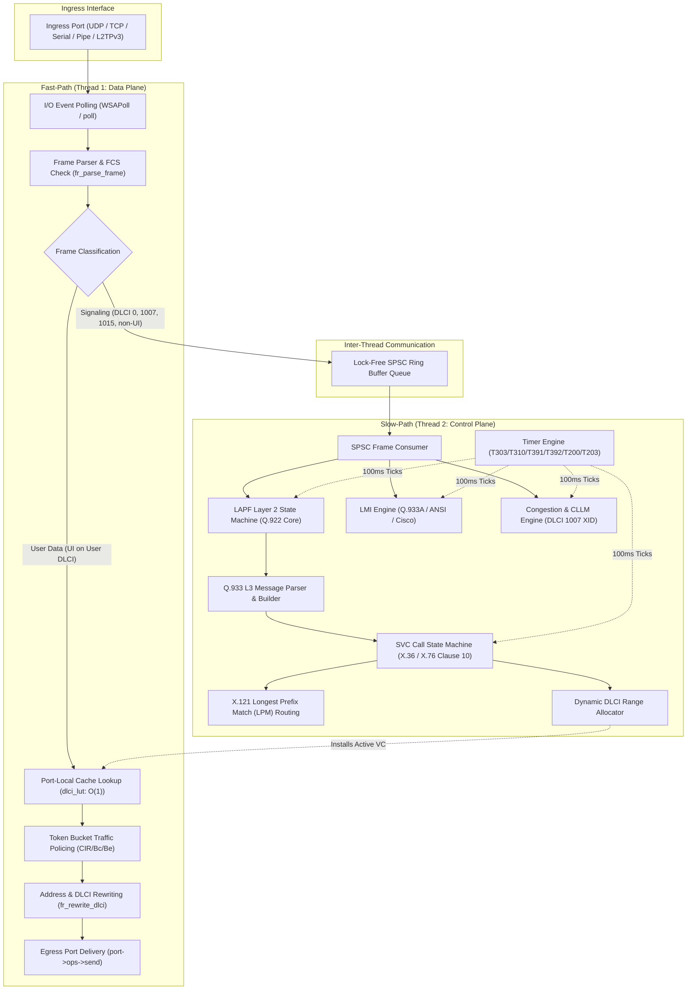

# Virtual Frame Relay Switch (VFRS)

!!! note
    **Dokumen ini masih berstatus draf!** Perubahan dan pembaruan konten dapat terjadi sewaktu-waktu, seiring dengan kemajuan pengembangan perangkat lunak VFRS.

**RIZKI YANDRI**  
**NIM. 2501402005**  
*Program Studi Sarjana Terapan (D4) Teknologi Rekayasa Komputer Jaringan (TRKJ)*  
*Jurusan Komputer dan Bisnis, Politeknik Negeri Tanah Laut*  

<br/>

<p align="left">
  <a href="https://www.politala.ac.id" target="_blank">
    
  </a>
  &nbsp;&nbsp;&nbsp;&nbsp;
  <a href="https://trkj.politala.ac.id" target="_blank">
    
  </a>
</p>

---

[](https://en.wikipedia.org/wiki/C_(programming_language))
[](#5-build-and-runtime-requirements)
[](#2-standards-compliance--core-capabilities)
[](#6-build-instructions)

---

## Daftar Isi / Table of Contents

- [1. Apa Itu VFRS? (About VFRS)](#1-apa-itu-vfrs-about-vfrs)
- [2. Standards Compliance & Core Capabilities](#2-standards-compliance--core-capabilities)
  - [2.1 Matriks Standar & Dokumen Spesifikasi Acuan (Primary Standards Matrix)](#21-matriks-standar--dokumen-spesifikasi-acuan-primary-standards-matrix)
  - [2.2 Relasi & Implementasi Berdasarkan Klausul Standar (In-Depth Clause Relations)](#22-relasi--implementasi-berdasarkan-klausul-standar-in-depth-clause-relations)
    - [2.2.1 Lapisan Fisik & Antarmuka DTE/DCE / NNI (ITU-T X.36 §6, X.76 §6)](#221-lapisan-fisik--antarmuka-dtedce--nni-itu-t-x36-6-x76-6)
    - [2.2.2 Data Link Transfer Control & DL-CORE (ITU-T X.36 §9, X.76 §9, Q.922 Annex A)](#222-data-link-transfer-control--dl-core-itu-t-x36-9-x76-9-q922-annex-a)
    - [2.2.3 Parameter Layanan & Kualitas Layanan QoS (ITU-T X.36 §8, X.76 §8, X.146)](#223-parameter-layanan--kualitas-layanan-qos-itu-t-x36-8-x76-8-x146)
    - [2.2.4 Persinyalan Panggilan SVC & Call Control (ITU-T X.36 §10, X.76 §10, Q.933, Q.850)](#224-persinyalan-panggilan-svc--call-control-itu-t-x36-10-x76-10-q933-q850)
    - [2.2.5 Pengelolaan PVC & Local Management Interface LMI (ITU-T X.36 §11, X.76 §11, Q.933 Annex A, ANSI T1.617 Annex D, Cisco GoF)](#225-pengelolaan-pvc--local-management-interface-lmi-itu-t-x36-11-x76-11-q933-annex-a-ansi-t1617-annex-d-cisco-gof)
    - [2.2.6 Manajemen Kemacetan & CLLM (ITU-T X.36 §12 / Annex C, X.76 §12, Q.922 Annex A, I.370)](#226-manajemen-kemacetan--cllm-itu-t-x36-12--annex-c-x76-12-q922-annex-a-i370)
    - [2.2.7 Layanan Multicast Frame Relay (FRF.7 / FRF.19, ITU-T X.6, I.233.1)](#227-layanan-multicast-frame-relay-frf7--frf19-itu-t-x6-i2331)
    - [2.2.8 Rencana Penomoran Internasional & Perutean SVC (ITU-T X.121, E.164, X.124)](#228-rencana-penomoran-internasional--perutean-svc-itu-t-x121-e164-x124)
    - [2.2.9 Enkapsulasi Pseudowire & Interoperabilitas Modern (RFC 4591, RFC 4349, RFC 2427)](#229-enkapsulasi-pseudowire--interoperabilitas-modern-rfc-4591-rfc-4349-rfc-2427)
  - [2.3 Ringkasan Kemampuan Inti Forwarding Engine](#23-ringkasan-kemampuan-inti-forwarding-engine)
- [3. High-Level Architecture & Concurrency Model](#3-high-level-architecture--concurrency-model)
  - [3.1 Dual-Plane Threading Architecture](#31-dual-plane-threading-architecture)
  - [3.2 Lock-Free SPSC Control-Plane Ring Buffer](#32-lock-free-spsc-control-plane-ring-buffer)
  - [3.3 Hierarchical Mutex Ordering & Deadlock Prevention](#33-hierarchical-mutex-ordering--deadlock-prevention)
  - [3.4 Port-Local O(1) DLCI Lookup Caches](#34-port-local-o1-dlci-lookup-caches)
  - [3.5 Architectural Workflow Diagram](#35-architectural-workflow-diagram)
- [4. Repository & Codebase Layout](#4-repository--codebase-layout)
- [5. Build and Runtime Requirements](#5-build-and-runtime-requirements)
- [6. Build Instructions](#6-build-instructions)
- [7. Running VFRS](#7-running-vfrs)
  - [7.1 Basic Launch](#71-basic-launch)
  - [7.2 Interactive Console Mode](#72-interactive-console-mode)
  - [7.3 Configuration Dry-Run & Semantic Verification](#73-configuration-dry-run--semantic-verification)
- [8. Command-Line Options](#8-command-line-options)
- [9. Configuration System Architecture](#9-configuration-system-architecture)
  - [9.1 Multi-Pass Lexical & Semantic Parser](#91-multi-pass-lexical--semantic-parser)
  - [9.2 Syntax & Formatting Conventions](#92-syntax--formatting-conventions)
- [10. Configuration Command Reference](#10-configuration-command-reference)
  - [10.1 Switch Identity & Global Numbering (`swconfig`)](#101-switch-identity--global-numbering-swconfig)
  - [10.2 Logging & Rotation (`log_level`, `log_file`, `log_rotation`)](#102-logging--rotation-log_level-log_file-log_rotation)
  - [10.3 Global Default Parameters (`defaults`)](#103-global-default-parameters-defaults)
  - [10.4 Interface Definition (`port`)](#104-interface-definition-port)
  - [10.5 Permanent Virtual Circuits (`pvc`)](#105-permanent-virtual-circuits-pvc)
  - [10.6 Local Management Interface (`lmi`, `lmi_dte`)](#106-local-management-interface-lmi-lmi_dte)
  - [10.7 LAPF Protocol Parameters (`lapf`)](#107-lapf-protocol-parameters-lapf)
  - [10.8 SVC Interface, Numbering & Routing (`svc_int`, `svc_addr`, `svc_route`)](#108-svc-interface-numbering--routing-svc_int-svc_addr-svc_route)
  - [10.9 Congestion Management & CLLM (`congestion`, `cllm`)](#109-congestion-management--cllm-congestion-cllm)
  - [10.10 Multicast Groups & Members (`mcast`, `mcast_member`)](#1010-multicast-groups--members-mcast-mcast_member)
  - [10.11 Packet Capture (`capture`)](#1011-packet-capture-capture)
- [11. Interactive Console Commands (VFRS CLI)](#11-interactive-console-commands-vfrs-cli)
- [12. Testing & Quality Assurance](#12-testing--quality-assurance)
  - [12.1 C Unit Test Suite (`ie_test.exe`)](#121-c-unit-test-suite-ie_testexe)
  - [12.2 SVC Protocol Compliance Suite (`svc_compliance_test.py`)](#122-svc-protocol-compliance-suite-svc_compliance_testpy)
  - [12.3 Functional & Multi-Hop Call Test Suite (`svc_test.py`)](#123-functional--multi-hop-call-test-suite-svc_testpy)
  - [12.4 High-Throughput Loopback Smoke Test (`run_pipe_loopback_test.sh`)](#124-high-throughput-loopback-smoke-test-run_pipe_loopback_testsh)
- [13. Packet Capture & Wireshark Dissection](#13-packet-capture--wireshark-dissection)
- [14. Troubleshooting & FAQs](#14-troubleshooting--faqs)
- [15. Academic Project & Development Information](#15-academic-project--development-information)

---

## 1. Apa Itu VFRS? (About VFRS)

**VFRS** (*Virtual Frame Relay Switch*) adalah perangkat lunak pensaklaran (*switching engine*) Frame Relay berkecepatan tinggi yang dikembangkan dalam bahasa C standar (C99/C11). VFRS mengemulasikan fungsionalitas node pensaklaran jaringan WAN Frame Relay lengkap sesuai dengan rekomendasi internasional **ITU-T** (International Telecommunication Union), **ANSI** (American National Standards Institute), dan **FRF** (Frame Relay Forum).

Perangkat lunak ini dirancang untuk beroperasi sebagai node jaringan virtual yang tangguh untuk simulasi jaringan skala besar, emulasi laboratorium telekomunikasi, uji kepatuhan protokol (*protocol compliance verification*), serta interkoneksi langsung dengan perangkat keras atau emulator jaringan seperti Cisco IOS (baik pada perangkat fisik melalui antarmuka serial atau emulasi melalui Dynamips / GNS3), perangkat FRAD (_Frame Relay Access Device_), dan simulator/emulator DTE kustom.

### Motivasi & Signifikansi Proyek

Frame Relay merupakan salah satu tonggak terpenting dalam sejarah teknologi jaringan WAN berbasis paket (*packet-switched WAN*), yang meletakkan dasar fundamental bagi konsep *Virtual Circuit*, *Committed Information Rate (CIR)*, *Traffic Policing / Token Bucket*, dan *Explicit Congestion Notification (FECN/BECN)* yang kemudian diadaptasi ke dalam teknologi ATM (Asynchronous Transfer Mode), MPLS (Multi-Protocol Label Switching), dan Carrier Ethernet modern.

VFRS menghadirkan implementasi perangkat lunak mandiri (*standalone*) yang mengintegrasikan:

1. **Dukungan Dua Mode Virtual Circuit Penuh**: Baik sirkuit permanen (**PVC**) maupun sirkuit dinamis berbasis persinyalan panggilan (**SVC** via Q.933/X.36/X.76).
2. **Kepatuhan Persinyalan Lintas Batas (UNI & NNI)**: Mengimplementasikan peran DCE dan DTE secara simultan pada antarmuka *User-to-Network* (ITU-T X.36) dan *Network-to-Network* (ITU-T X.76).
3. **Arsitektur Concurrency Generasi Baru**: Menggunakan model *two-plane execution* (Fast-Path Data Plane dan Slow-Path Control Plane) yang sepenuhnya bebas *deadlock* dengan *lock-free SPSC queues* dan struktur data *port-local cache* berkecepatan $O(1)$.
4. **Multiprotokol Transport L2/L3**: Mengemulasikan jalur komunikasi Frame Relay di atas _named pipes_ Windows/POSIX, _raw socket_ UDP/TCP, serial COM/tty fisik/virtual, hingga terowongan *pseudowire* L2TPv3 (RFC 4591 / RFC 4349).

---

## 2. Standards Compliance & Core Capabilities

VFRS dirancang dengan kepatuhan penuh terhadap kumpulan standar formal Frame Relay internasional. Struktur protokol, format frame, mesin persinyalan panggilan (*call control state machine*), dan manajemen kemacetan diimplementasikan secara ketat berdasarkan klausul-klausul spesifik berikut:

### 2.1 Matriks Standar & Dokumen Spesifikasi Acuan (Primary Standards Matrix)

| Standar / Spesifikasi | Judul Resmi Dokumen Standar & Edisi Publikasi | Ruang Lingkup & Klausul Kunci yang Diimplementasikan pada VFRS |
| :--- | :--- | :--- |
| **ITU-T Recommendation X.36** | *"Interface between Data Terminal Equipment (DTE) and Data Circuit-terminating Equipment (DCE) for public data networks providing frame relay data transmission service by dedicated circuit"* (02/2003) | **UNI Data Link, SVC Call Control, LMI & Congestion**:<br>&bull; Klausul 6: *Description of the DTE/DCE interface (physical layer)*<br>&bull; Klausul 7: *Network capabilities* (Priorities, Service classes, Reverse charging, CUG, TNS, Fragmentation)<br>&bull; Klausul 8: *Service parameters and service quality* (AR §8.2.1, Bc §8.2.2, Be §8.2.3, CIR §8.2.4, Tc §8.2.5, N203 §8.2.6, FTP/FDP/Service Class §8.2.7)<br>&bull; Klausul 9: *Data link transfer control* (Frame format §9.2, 2/3/4-octet DLCI §9.3, FCS CRC-16 §9.5, Flag 0x7E)<br>&bull; Klausul 10: *Call connection control* (Signaling DLCI 0 §10.2, Messages §10.5 [Tabel 10-1 s.d. 10-11], Information Elements §10.6 [Gambar 10-2 s.d. 10-22, Tabel 10-12 s.d. 10-25], Call FSM U0–U22/N0–N22 §10.7/§10.10, Timers T301–T322 §10.11)<br>&bull; Klausul 11: *PVC management procedures* (Status Enquiry/Status, LIV, PVC Status, N391–N393, T391–T392, Bidirectional §11.5)<br>&bull; Klausul 12: *Congestion control* (Region I/II/III, FECN, BECN, DE bit, Traffic policing, User rate adaptation)<br>&bull; Annex A: *Support of closed user group optional user facility*<br>&bull; Annex B: *Support of reverse charging and reverse charging acceptance*<br>&bull; Annex C: *Consolidated Link Layer Management (CLLM)* (XID frame pada DLCI 1007)<br>&bull; Annex D: *Transit network selection optional user facility*<br>&bull; Annex E: *Support of the network service access point (NSAP) addressing*<br>&bull; Annex F: *DTE/DCE fragmentation*<br>&bull; Annex G: *PVC status reporting enhancements* (Segmented Full Status)<br>&bull; Annex H: *Support of dynamic PVC configuration* |
| **ITU-T Recommendation X.76** | *"Network-to-network interface between public networks providing PVC and/or SVC frame relay data transmission service"* (02/2003) | **NNI Inter-Switch Data Link, Signaling & Congestion**:<br>&bull; Klausul 6: *Description of the network-to-network physical layer interface*<br>&bull; Klausul 8: *Service parameters and service quality* (AR, CIR, Bc, Be, Tc, N203, FTP, FDP, Service Class)<br>&bull; Klausul 9: *Data link transfer control* (NNI framing, DLCI translation, Q.922 Annex A core attributes)<br>&bull; Klausul 10: *Frame relay SVC signalling* (Signaling channel DLCI 0/1015, Transit Net ID, Call ID, NNI FSM, Timers T303/T308/T310/T316/T317/T322 §10.8)<br>&bull; Klausul 11: *Additional procedures for PVCs using unnumbered information frames* (Bidirectional LMI polling pada DLCI 0)<br>&bull; Klausul 12: *Congestion control* (NNI congestion handling, FECN/BECN transport, DE bit policing per I.370)<br>&bull; Annex A: *Transit network selection facility*<br>&bull; Annex B: *Number identification supplementary services*<br>&bull; Annex C: *PVC status reporting enhancements* (Segmented Full Status di NNI)<br>&bull; Appendix I: *Network congestion scenarios*<br>&bull; Appendix II: *Signalling scenarios for call establishment and clearing* |
| **ITU-T Recommendation Q.922** | *"ISDN data link layer specification for frame mode bearer services"* (02/1992) | **LAPF Protocol Stack & DL-CORE**:<br>&bull; Klausul 2: *Frame structure for peer-to-peer communication* (Flag `0x7E`, FCS CRC-16, Address field, HDLC zero-bit insertion/extraction)<br>&bull; Klausul 3: *Elements of procedures and formats of fields* (SABME, DISC, DM, UA, FRMR, I-frame, RR, RNR, REJ, UI, XID)<br>&bull; Klausul 5: *Procedures of the data link layer* (Sliding window parameter $k$, T200/T203, N200/N201/N202)<br>&bull; Annex A: *Core aspects of Recommendation Q.922 for use with frame relaying bearer service (DL-CORE)*<br>&bull; Annex A.7: *Consolidated link layer management (CLLM) procedures* (DLCI 1007 XID frame format)<br>&bull; Appendix I: *Responses to network congestion* (Dynamic window size algorithm $V(k)$, step size $N_w$, slow-start mechanism)<br>&bull; Appendix II: *Automatic negotiation of data link layer parameters* |
| **ITU-T Recommendation Q.933** | *"ISDN Digital subscriber Signalling System No. 1 (DSS1) – Signalling specifications for frame mode switched and permanent virtual connection control and status monitoring"* (02/2003) | **SVC Layer 3 Signaling & PVC Status Monitoring**:<br>&bull; Klausul 4: *General message format and information elements coding* (Protocol discriminator `0x08`, Call reference, Message types, Information Elements [0x04 Bearer Cap, 0x08 Cause, 0x14 Call State, 0x18 Chan ID, 0x1E Progress, 0x48 LLCORE, 0x49 LL Protocol, 0x4C Connected, 0x6C Calling, 0x70 Called, 0x78 TNS, 0x79 Restart])<br>&bull; Klausul 5: *Call control procedures for basic call* (Call setup, proceed, connect, disconnect, release, restart)<br>&bull; Annex A: *Signalling procedures for frame mode permanent virtual connections (PVC) status monitoring* (Q.933A LMI pada DLCI 0, Report Type `0x51`, Link Integrity `0x53`, PVC Status `0x57`, Codeset 0, T391/T392, N391–N393)<br>&bull; Annex D: *Protocol Implementation Conformance Statement (PICS) proforma for Annex A* |
| **ANSI T1.617 + Annex D** | *"American National Standard for Telecommunications – ISDN – DSS1 – Signaling System for Frame Mode Bearer Services"* (1991) | **ANSI LMI Standard**:<br>&bull; Klausul 3 & 4: Format pesan persinyalan dan Information Elements<br>&bull; *Annex D: Additional Procedures for Frame Relaying Permanent Virtual Connections Using Unnumbered Information Frames* (DLCI 0, UI frame, enkapsulasi **Codeset 5**, Report Type `0x01`, Link Integrity `0x03`, PVC Status `0x07`, T391, T392, N391–N393) |
| **Vendor Consortium (Gang of Four)** | *"Frame Relay Specification with Extensions Based on Proposed T1S1 Standards by cisco Systems, Digital Equipment Corporation, Northern Telecom, StrataCom"* (ConneXions 5-3, 03/1991) | **Cisco / Gang of Four (GoF) LMI**:<br>&bull; Signaling pada **DLCI 1023** menggunakan UI frame (Protocol discriminator `0x09`)<br>&bull; Information Elements pada **Codeset 0**: Report Type (`0x01`), Link Integrity (`0x03`), PVC Status (`0x07`), Multicast (`0x09`) |
| **Frame Relay Forum FRF.7 / FRF.19** | *"Frame Relay PVC Multicast Service and Protocol Description"* (10/1994) | **Multicast Group Replication**:<br>&bull; Klausul 2: Definisi layanan Point-to-Multipoint pada Frame Relay PVC<br>&bull; Klausul 3: Model replikasi frame One-Way (Root $\rightarrow$ Leaves), Two-Way (Root $\leftrightarrow$ Leaves), dan N-Way (Full-Mesh Multipoint-to-Multipoint dengan split-horizon) |
| **ITU-T Recommendation X.6** | *"Multicast service definition"* (08/1997 / 1993) | **Prinsip Layanan Multicast Data Network**:<br>&bull; Pemetaan grup multicast, integritas transfer data, dan kendali topologi multipoint |
| **ITU-T Recommendation X.121** | *"International numbering plan for public data networks"* (10/2000) | **Rencana Penomoran Jaringan Data Internasional**:<br>&bull; Struktur International Data Number (IDN): DNIC 4-digit (DCC 3-digit + ND 1-digit) + NTN hingga 10-digit<br>&bull; Format penomoran jaringan privat: PNIC, System Group Code (SGC), System Identification Code (SIC) |
| **ITU-T Recommendation E.164 & X.124** | *"The international public telecommunication numbering plan"* (05/1997) & *"Arrangements for the interworking of the E.164 and X.121 numbering plans for frame relay and ATM networks"* (1999) | **Penomoran Telekomunikasi Publik & Interworking E.164/X.121**:<br>&bull; Perutean nomor berbasis E.164 dan konversi/aliasing nomor X.121 / E.164 pada antarmuka SVC |
| **ITU-T Recommendation Q.850** | *"Usage of cause and location in the Digital Subscriber Signalling System No. 1 and the Signalling System No. 7 ISDN user part"* (05/1998) | **Kode Penyebab Pelepasan Panggilan (Cause Values)**:<br>&bull; Cause #1 (*Unallocated number*), #16 (*Normal clearing*), #17 (*User busy*), #34 (*No circuit available*), #41 (*Temporary failure*), #47 (*Resources unavailable*), #49 (*QoS unavailable*), #65 (*Bearer cap not implemented*), #96 (*Mandatory IE missing*), #100 (*Invalid IE contents*), #102 (*Recovery on timer expiry*) |
| **ITU-T Recommendation I.122 & I.233.1 / I.233.2** | *"Framework for frame mode bearer services"* (03/1993) & *"Frame mode bearer services: ISDN frame relaying / frame switching bearer service"* (1991) | **Arsitektur Dasar Frame Mode Bearer Services**:<br>&bull; Prinsip pemisahan data plane (DL-CORE) dan control plane, multiplexing statistik virtual circuit |
| **ITU-T Recommendation I.370 & I.372** | *"Congestion management for the ISDN frame relaying bearer service"* (1991) & *"Frame relaying bearer service network-to-network interface requirements"* (03/1993) | **Prinsip Pengelolaan Kemacetan & Kebutuhan NNI**:<br>&bull; Klasifikasi kemacetan ringan (*mild*) vs berat (*severe*), aksi penandaan FECN/BECN, pembuangan frame DE, penegakan laju transmisi |
| **ITU-T Recommendation X.146** | *"Performance objectives and quality of service classes applicable to frame relay"* (10/2000) | **Metrik Kualitas Layanan (QoS) Frame Relay**:<br>&bull; Definisi kelas layanan (*Service Classes 0–3*), prioritas transfer (FTP), dan prioritas discard (FDP) |
| **IETF RFC 4591 & RFC 4349** | *"Frame Relay over Layer 2 Tunneling Protocol - Version 3 (L2TPv3)"* (2006) & *"High-Level Data Link Control (HDLC) Frames over L2TPv3"* (2006) | **Enkapsulasi Terowongan L2TPv3 Pseudowire (PWE3)**:<br>&bull; Transportasi frame Frame Relay kanonik dan HDLC berkecepatan tinggi di atas infrastruktur IP |
| **IETF RFC 2427 (RFC 1490) & RFC 2684 (RFC 1483)** | *"Multiprotocol Interconnect over Frame Relay"* (09/1998) & *"Multiprotocol Encapsulation over ATM/Frame Relay"* | **Enkapsulasi Multiprotokol Payload**:<br>&bull; Format enkapsulasi NLPID, SNAP, dan bridging/routing paket protokol layer atas (IPv4, IPv6, ARP, dll.) |
| **Wireshark Libpcap DLT 107** | *Libpcap File Format Specification* (`LINKTYPE_FRELAY`) | **Perekaman Paket Langsung**:<br>&bull; Perekaman frame Frame Relay mentah ke berkas PCAP standar yang kompatibel dengan Wireshark |

---

### 2.2 Relasi & Implementasi Berdasarkan Klausul Standar (In-Depth Clause Relations)

#### 2.2.1 Lapisan Fisik & Antarmuka DTE/DCE / NNI (ITU-T X.36 §6, X.76 §6)
- **ITU-T X.36 Klausul 6 (*Description of the DTE/DCE interface (physical layer)*)** dan **ITU-T X.76 Klausul 6 (*Description of the network-to-network physical layer interface*)**:
  - Mengatur karakteristik antarmuka fisik, penetapan laju akses fisik (*Access Rate* / AR), dan penentuan status kesiapan antarmuka (*operational phases* per X.21, X.21 bis, V.35, G.703, G.704, I.430, I.431).
  - **Implementasi VFRS**: Mengabstraksikan physical layer ke dalam berbagai driver transport modular (`port_udp.c`, `port_tcp.c`, `port_serial.c`, `port_pipe.c`, `port_l2tpv3.c`). Pada antarmuka serial fisik, parameter Access Rate (AR) per X.36 §8.2.1 diturunkan secara otomatis dari *baud rate* perangkat.

#### 2.2.2 Data Link Transfer Control & DL-CORE (ITU-T X.36 §9, X.76 §9, Q.922 Annex A)
- **ITU-T X.36 Klausul 9 (*Data link transfer control*)** dan **ITU-T X.76 Klausul 9 (*Data link transfer control*)**:
  - **§9.2 *Frame format***: Menetapkan struktur kanonik frame `[Flag][Address][Information][FCS][Flag]`. VFRS mengimplementasikan pemeriksaan flag pembuka/penutup `0x7E` serta teknik bit-stuffing/unstuffing 5-bit `1` berturut-turut per Q.922 §2.2–§2.3.
  - **§9.3 *Address field formats***:
    - Format 2-oktet standar (10-bit DLCI, $0 \dots 1023$, DLCI pengguna $16 \dots 991$).
    - Format 3-oktet (16-bit DLCI) per Gambar 9-1b / X.36.
    - Format 4-oktet extended (23-bit DLCI, $0 \dots 8,388,607$) per Gambar 9-2 / X.36.
    - Penanganan semantik bit kendali alamat: bit **C/R** (*Command/Response*), bit **FECN** (*Forward Explicit Congestion Notification*), bit **BECN** (*Backward Explicit Congestion Notification*), bit **DE** (*Discard Eligibility*), dan bit **EA** (*Extension Address*).
  - **§9.5 *Frame Check Sequence (FCS) field***: Validasi dan komputasi CRC-16 standar polinomial $x^{16} + x^{12} + x^5 + 1$ (CCITT CRC-16) pada setiap frame yang diterima dan dikirim.
  - **ITU-T Q.922 Annex A (*Core aspects of Recommendation Q.922 for use with frame relaying bearer service (DL-CORE)*)**: VFRS mengimplementasikan seluruh fungsi inti DL-CORE pada *fast-path switching core* (`fr_frame.c`, `fr_switch.c`) tanpa membebani thread kontrol.

#### 2.2.3 Parameter Layanan & Kualitas Layanan QoS (ITU-T X.36 §8, X.76 §8, X.146)
- **ITU-T X.36 Klausul 8 (*Service parameters and service quality*)** dan **ITU-T X.76 Klausul 8 (*Service parameters and service quality*)**:
  - **§8.2.1 Access Rate (AR)**: Kecepatan transfer fisik maksimum pada kanal akses.
  - **§8.2.2 Committed Burst Size ($B_c$)**: Jumlah bit data yang dijamin dapat ditransfer dalam interval $T_c$.
  - **§8.2.3 Excess Burst Size ($B_e$)**: Jumlah bit data berlebih tanpa komitmen yang diupayakan ditransfer oleh jaringan.
  - **§8.2.4 Committed Information Rate (CIR)**: Laju data rata-rata terjamin ($T_c = B_c / \text{CIR}$).
  - **§8.2.6 Maximum octet length of Information Field ($N_{203}$)**: Batas maksimum ukuran payload (standar minimum 1600 oktet).
  - **§8.2.7 Priorities or service class**: Parameter **FTP** (*Frame Transfer Priority*, $0 \dots 15$), **FDP** (*Frame Discard Priority*, $0 \dots 7$), dan **Service Class** ($0 \dots 3$) per Tabel 7-1 X.36 / ITU-T X.146.
  - **Implementasi VFRS**: Menjalankan algoritma *Three-Tier Token Bucket* (`token_bucket_t` di `types.h`, `cgst_mgnt.c`) untuk menegakkan parameter CIR, Bc, dan Be pada level sirkuit virtual secara independen.

#### 2.2.4 Persinyalan Panggilan SVC & Call Control (ITU-T X.36 §10, X.76 §10, Q.933, Q.850)
Persinyalan Switched Virtual Circuit (SVC) pada VFRS mengimplementasikan seluruh pesan, Information Element (IE), state machine, dan timer sesuai **ITU-T Recommendation X.36 Klausul 10**, **ITU-T Recommendation X.76 Klausul 10**, dan **ITU-T Recommendation Q.933**:

1. **Struktur & Definisi Pesan Persinyalan (ITU-T X.36 §10.5, Tabel 10-1 s.d. 10-11)**:
   - **Pesan Pembentukan Sirkuit Virtual (*Virtual Circuit Establishment Messages*)**:
     - `CALL PROCEEDING` (§10.5.1 / Tabel 10-2): Dikirim untuk mengonfirmasi penerimaan `SETUP` dan mengindikasikan alokasi DLCI oleh switch (Signifikansi: Local, Direction: Both).
     - `CONNECT` (§10.5.2 / Tabel 10-3): Dikirim saat DTE tujuan menerima panggilan, memuat parameter QoS final hasil negosiasi (Signifikansi: Global, Direction: Both).
     - `SETUP` (§10.5.8 / Tabel 10-9): Pesan inisiasi panggilan dari calling DTE ke jaringan atau DCE ke called DTE yang memuat nomor pemanggil/tujuan, kapasitas pembawa, dan usulan parameter LLCORE (Signifikansi: Global, Direction: Both).
   - **Pesan Pembersihan Sirkuit Virtual (*Virtual Circuit Clearing Messages*)**:
     - `DISCONNECT` (§10.5.3 / Tabel 10-4): Menginisiasi pelepasan panggilan dari ujung ke ujung (Signifikansi: Global, Direction: Both).
     - `RELEASE` (§10.5.4 / Tabel 10-5): Mengonfirmasi inisiasi pelepasan sirkuit dan meminta pelepasan DLCI lokal (Signifikansi: Local/Global, Direction: Both).
     - `RELEASE COMPLETE` (§10.5.5 / Tabel 10-6): Konfirmasi final pelepasan sirkuit dan pengembalian DLCI ke pool alokasi (Signifikansi: Local/Global, Direction: Both).
   - **Pesan Lain-Lain (*Miscellaneous Messages*)**:
     - `RESTART` (§10.5.6 / Tabel 10-7): Menginisiasi reset dan pembersihan seluruh kanal SVC pada antarmuka menggunakan *Global Call Reference Value* `0x0000` (Signifikansi: Local, Direction: Both).
     - `RESTART ACKNOWLEDGE` (§10.5.7 / Tabel 10-8): Konfirmasi penyelesaian reset antarmuka (Signifikansi: Local, Direction: Both).
     - `STATUS` (§10.5.9 / Tabel 10-10): Mengirimkan status panggilan aktif dan nomor sirkuit saat ini (Signifikansi: Local, Direction: Both).
     - `STATUS ENQUIRY` (§10.5.10 / Tabel 10-11): Permintaan status panggilan dari DTE atau DCE (Signifikansi: Local, Direction: Both).

2. **Format Umum Pesan & Pengkodean Information Element (ITU-T X.36 §10.6, Gambar 10-2 s.d. 10-22, Tabel 10-12 s.d. 10-25)**:
   - Setiap pesan persinyalan pada DLCI 0 (UNI) dan DLCI 0/1015 (NNI) memuat **3 elemen wajib pertama** (Gambar 10-2):
     - **Protocol Discriminator** (§10.6.1 / Gambar 10-3): Nilai biner `0000 1000` (`0x08`) per ITU-T Q.933 / X.36.
     - **Call Reference Information Element** (§10.6.2 / Gambar 10-4): Panjang 3 oktet (Field length `0x02`), memuat *Call Reference Flag* (`0` = inisiator pesan, `1` = penerima pesan) dan 15-bit *Call Reference Value* (CRV). Nilai CRV `0x0000` dicadangkan untuk *Global Call Reference*.
     - **Message Type** (§10.6.3 / Tabel 10-12): 1 oktet kode tipe pesan (`SETUP` `0x05`, `CALL PROCEEDING` `0x02`, `CONNECT` `0x07`, `DISCONNECT` `0x45`, `RELEASE` `0x4D`, `RELEASE COMPLETE` `0x5A`, `RESTART` `0x46`, `RESTART ACKNOWLEDGE` `0x4E`, `STATUS` `0x7D`, `STATUS ENQUIRY` `0x75`).
   - **18 Information Elements (IE) Variabel Lengkap yang Diimplementasikan VFRS (`svc_sig_iel.c`, `svc_sig_iep.c`)**:
     1. **Bearer Capability IE** (§10.6.4 / Gambar 10-5, Tabel 10-13, Identifier `0x04`): Menetapkan transfer capability Unrestricted digital info, Frame mode, dan User L2 protocol ITU-T Q.922 Core.
     2. **Call State IE** (§10.6.5 / Gambar 10-6, Tabel 10-14, Identifier `0x14`): Status panggilan numerik saat ini.
     3. **Called Party Number IE** (§10.6.6 / Gambar 10-7, Tabel 10-15, Identifier `0x70`): Tipe/skema penomoran (International / Unknown, X.121 / E.164) dan digit alamat tujuan.
     4. **Called Party Subaddress IE** (§10.6.7 / Gambar 10-8, Identifier `0x71`): Subaddress NSAP / user-specified terminal tujuan.
     5. **Calling Party Number IE** (§10.6.8 / Gambar 10-9, Tabel 10-16, Identifier `0x6C`): Digit alamat pemanggil beserta *Presentation indicator* dan *Screening indicator* (User-provided verified / Network-provided).
     6. **Calling Party Subaddress IE** (§10.6.9 / Gambar 10-10, Identifier `0x6D`): Subaddress terminal pemanggil.
     7. **Cause IE** (§10.6.10 / Gambar 10-11, Tabel 10-17, Identifier `0x08`): Lokasi dan kode penyebab pelepasan per ITU-T Q.850.
     8. **Closed User Group IE** (§10.6.11 / Gambar 10-12, Identifier `0x47`): Fasilitas CUG interlock code dan outgoing access per Annex A.
     9. **Connected Number IE** (§10.6.12 / Gambar 10-13, Tabel 10-18, Identifier `0x4C`): Alamat aktual terminal yang menjawab panggilan.
     10. **Connected Subaddress IE** (§10.6.13 / Gambar 10-14, Identifier `0x4D`): Subaddress pihak yang terhubung.
     11. **Data Link Connection Identifier (DLCI) IE** (§10.6.14 / Gambar 10-15, Tabel 10-19, Identifier `0x19`): Field *Pref./Excl.* (Exclusive), panjang DLCI (2/3/4 oktet), dan nilai numerik DLCI yang dialokasikan.
     12. **Link Layer Core Parameters IE** (§10.6.15 / Gambar 10-16, Tabel 10-20, Identifier `0x48`): Parameter QoS forward/backward: FMIF, Throughput (CIR), Minimum throughput, $B_c$, dan $B_e$.
     13. **Link Layer Protocol Parameters IE** (§10.6.16 / Gambar 10-17, Tabel 10-21, Identifier `0x49`): Parameter LAPF DL-CONTROL (T200, N200, k).
     14. **Low Layer Compatibility IE** (§10.6.17 / Gambar 10-18, Tabel 10-22, Identifier `0x7C`): Kompatibilitas end-to-end layer bawah.
     15. **Priority and Service Class Parameters IE** (§10.6.18 / Gambar 10-19, Tabel 10-23, Identifier `0x6A`): Nilai FTP ($0\dots 15$), FDP ($0\dots 7$), dan Service Class ($0\dots 3$).
     16. **Reverse Charge Indication IE** (§10.6.19 / Gambar 10-20, Tabel 10-24, Identifier `0x4A`): Pengaturan pembebanan biaya pulsa per Annex B.
     17. **Transit Network Selection IE** (§10.6.20 / Gambar 10-21, Tabel 10-25, Identifier `0x78`): Identifikasi jaringan transit per Annex D.
     18. **User-User IE** (§10.6.21 / Gambar 10-22, Identifier `0x7E`): Data transparan user-to-user (hingga 131 oktet).

3. **Status Panggilan (*Call States*) per ITU-T X.36 §10.7 / §10.10**:
   - `U0 / N0: NULL` &ndash; Tidak ada koneksi panggilan aktif.
   - `U1 / N1: CALL INITIATED` &ndash; SETUP telah dikirim, menunggu respons `CALL PROCEEDING`.
   - `U2 / N2: OVERLAP SENDING` &ndash; Pengiriman digit tambahan.
   - `U3 / N3: OUTGOING CALL PROCEEDING` &ndash; Panggilan sedang diproses di jaringan, menunggu `CONNECT`.
   - `U4 / N4: CALL DELIVERED` &ndash; Panggilan telah sampai di terminal tujuan.
   - `U6 / N6: CALL PRESENT` &ndash; SETUP diterima dari jaringan oleh called DTE.
   - `U7 / N7: CALL RECEIVED` &ndash; Konfirmasi penerimaan panggilan di sisi penerima.
   - `U8 / N8: CONNECT REQUEST` &ndash; Permintaan koneksi terkirim.
   - `U9 / N9: INCOMING CALL PROCEEDING` &ndash; Sisi penerima sedang memproses panggilan.
   - `U10 / N10: ACTIVE` &ndash; Sirkuit SVC aktif dua arah, data plane terhubung penuh.
   - `U11 / N11: DISCONNECT REQUEST` &ndash; Inisiasi pemutusan sirkuit terkirim.
   - `U12 / N12: DISCONNECT INDICATION` &ndash; Indikasi pemutusan diterima dari remote node.
   - `U19 / N19: RELEASE REQUEST` &ndash; Inisiasi pelepasan kanal, menunggu `RELEASE COMPLETE`.
   - `U21 / N21: RESTART REQUEST` &ndash; Permintaan restart antarmuka terkirim dengan Global CRV.
   - `U22 / N22: RESTART` &ndash; Antarmuka sedang dalam proses restart pembersihan sirkuit.

4. **Pewaktu Persinyalan (*Signalling Timers*) per ITU-T X.36 §10.11 & ITU-T X.76 §10.8**:
   - **T301**: Pewaktu tunggu respons `CONNECT` setelah `CALL DELIVERED` (180s).
   - **T303**: Pewaktu tunggu respons pertama `SETUP` (default 4s, retransmisi maksimum 1 kali).
   - **T305**: Pewaktu tunggu respons `DISCONNECT` (default 30s).
   - **T308**: Pewaktu tunggu respons `RELEASE` (default 4s, retransmisi maksimum 1 kali).
   - **T310**: Pewaktu tunggu `CONNECT` setelah penerimaan `CALL PROCEEDING` (default 35s di UNI / 40s di NNI).
   - **T316**: Pewaktu tunggu pengakuan `RESTART ACKNOWLEDGE` (default 120s).
   - **T317**: Pewaktu internal pembersihan sirkuit saat restart antarmuka (default 10s di DTE / 20s di DCE).
   - **T322**: Pewaktu tunggu respons `STATUS` setelah pengiriman `STATUS ENQUIRY` (default 4s, retransmisi 2 kali).

#### 2.2.5 Pengelolaan PVC & Local Management Interface LMI (ITU-T X.36 §11, X.76 §11, Q.933 Annex A, ANSI T1.617 Annex D, Cisco GoF)
- **ITU-T X.36 Klausul 11 (*PVC management procedures*)** & **ITU-T X.76 Klausul 11 (*Additional procedures for PVCs using unnumbered information frames*)**:
  - Mengelola verifikasi integritas link (*link integrity verification*) dan sinkronisasi status PVC aktif/inaktif/baru/terhapus.
  - Beroperasi pada **DLCI 0** (Q.933A / ANSI) atau **DLCI 1023** (Cisco GoF) menggunakan frame *Unnumbered Information* (UI).
  - Pertukaran pesan periodik: `STATUS ENQUIRY` (`0x75`) dan `STATUS` (`0x7D`).
  - **Struktur Information Element**:
    - *Report Type IE*: Full Status (`0x00`), Link Integrity Verification (`0x01`), Asynchronous Status (`0x02`), Single PVC Status (`0x03`).
    - *Link Integrity Verification IE*: Pasangan nomor urut pengiriman *Send Sequence Number* ($TxSN$) dan penerimaan *Receive Sequence Number* ($RxSN$).
    - *PVC Status IE*: Bit status $N$ (*New*), $D$ (*Delete*), $A$ (*Active*), dan nomor DLCI terkait.
  - **Konfigurasi Parameter Sistem**:
    - Sisi DCE (Network): $T_{392}$ (Timer verifikasi, default 15s), $N_{392}$ (Ambang error, default 3), $N_{393}$ (Jendela event, default 4).
    - Sisi DTE (User): $T_{391}$ (Timer polling status, default 10s), $N_{391}$ (Siklus full status counter, default 6).
  - **Klausul Khusus Lanjutan**:
    - **ITU-T X.36 §11.5 & X.76 §11.4**: Prosedur LMI Dua Arah (*Bidirectional Polling*) untuk antarmuka NNI dan interkoneksi private network.
    - **ITU-T X.36 Annex G & X.76 Annex C**: Prosedur *Segmented Full Status* (menggunakan Report Type *Full Status Continued*) ketika jumlah entri PVC melebihi ukuran satu frame LMI.

#### 2.2.6 Manajemen Kemacetan & CLLM (ITU-T X.36 §12 / Annex C, X.76 §12, Q.922 Annex A, I.370)
- **ITU-T X.36 Klausul 12 (*Congestion control*)**, **ITU-T X.76 Klausul 12 (*Congestion control*)**, dan **ITU-T Recommendation I.370 (*Congestion management for the ISDN frame relaying bearer service*)**:
  - **Klasifikasi Tingkat Kemacetan**: Kondisi Normal (Region I), Kemacetan Ringan / Mild (Region II), dan Kemacetan Berat / Severe (Region III) per Gambar 12-1/X.36.
  - **Mekanisme Notifikasi Eksplisit**:
    - **FECN (*Forward Explicit Congestion Notification*)**: Menandai bit FECN pada frame arah tujuan agar terminal penerima dapat menurunkan permintaan aliran data.
    - **BECN (*Backward Explicit Congestion Notification*)**: Menandai bit BECN pada frame arah berlawanan agar terminal pengirim segera menurunkan laju injeksi trafik ke nilai CIR.
    - **DE (*Discard Eligibility*)**: Menandai bit DE pada frame trafik yang melampaui $B_c$ agar menjadi prioritas pertama yang dibuang saat terjadi kemacetan parah di buffer antarmuka.
  - **ITU-T X.36 Annex C & ITU-T Q.922 Annex A.7 (*Consolidated Link Layer Management - CLLM*)**:
    - Pengiriman pesan notifikasi kemacetan broadcast periodik menggunakan frame LAPF `XID` pada **DLCI 1007**.
    - Menguraikan dan menyusun Parameter Identifiers: *Parameter Set ID* (`PI=0`), *Cause Identifier* (`PI=2`), dan *DLCI List* (`PI=3`) untuk menginformasikan sirkuit-sirkuit virtual yang mengalami kemacetan kepada perangkat DTE yang tidak memiliki trafik data balik.

#### 2.2.7 Layanan Multicast Frame Relay (FRF.7 / FRF.19, ITU-T X.6, I.233.1)
- **Frame Relay Forum FRF.7 (*Frame Relay PVC Multicast Service and Protocol Description*)** dan **ITU-T Recommendation X.6 (*Multicast service definition*)**:
  - **Mode One-Way** (Point-to-Multipoint): Replikasi frame satu arah dari satu DLCI sumber (akar) ke seluruh DLCI anggota dalam grup.
  - **Mode Two-Way** (Bidirectional Multipoint): Memungkinkan komunikasi dua arah antara akar dan daun.
  - **Mode N-Way** (Full-Mesh Multipoint-to-Multipoint): Replikasi frame penuh ke seluruh anggota grup selain pengirim frame (*split-horizon frame distribution*).
  - Integrasi dengan *Traffic Policing*: Setiap grup multicast dikaitkan dengan alokasi token bucket CIR, Bc, dan Be tersendiri (`pvc_mcast_uni.c`, `pvc_mcast_nni.c`).

#### 2.2.8 Rencana Penomoran Internasional & Perutean SVC (ITU-T X.121, E.164, X.124)
- **ITU-T Recommendation X.121 (*International numbering plan for public data networks*)**:
  - Menguraikan struktur International Data Number (IDN) berbasis **DNIC** (*Data Network Identification Code*, 4 digit) yang terdiri atas **DCC** (*Data Country Code*, 3 digit) dan **ND** (*Network Digit*, 1 digit), diikuti oleh nomor terminal pelanggan (**NTN**).
  - Mendukung struktur penomoran jaringan privat: **PNIC** (*Private Network Identification Code*), **SGC** (*System Group Code*), dan **SIC** (*System Identification Code*).
  - VFRS menyediakan fitur makro mnemonik ekspansi (`D`=DNIC, `G`=SGC, `E`=SIC) dan mesin *Longest Prefix Match* (LPM) untuk penentuan port keluar NNI secara otomatis.
- **ITU-T Recommendation E.164 & X.124**: Mendukung pendaftaran alias penomoran telepon global E.164 dan konversi otomatis antara prefiks E.164 dan X.121.

#### 2.2.9 Enkapsulasi Pseudowire & Interoperabilitas Modern (RFC 4591, RFC 4349, RFC 2427)
- **IETF RFC 4591 (*Frame Relay over Layer 2 Tunneling Protocol - Version 3*)** & **RFC 4349 (*HDLC over L2TPv3*)**:
  - Mendukung enkapsulasi terowongan Layer-2 pseudowire (PWE3) untuk melewatkan trafik sirkuit Frame Relay dan HDLC antar-switch melalui jaringan paket berbasis IP/Ethernet.
- **IETF RFC 2427 / RFC 1490 (*Multiprotocol Interconnect over Frame Relay*)**:
  - Kompatibilitas penuh dengan format enkapsulasi NLPID/SNAP standar industri yang digunakan oleh router Cisco IOS, Juniper, Linux Frame Relay, dan firewall komersial.

---

### 2.3 Ringkasan Kemampuan Inti Forwarding Engine
- **Panjang Alamat DLCI Fleksibel**:
  - Alamat 2-oktet standar (10-bit DLCI, rentang $0 \dots 1023$, DLCI pengguna $16 \dots 991$).
  - Alamat 3-oktet (16-bit DLCI) dan 4-oktet extended (23-bit DLCI, rentang $0 \dots 8,388,607$ per ITU-T X.36 Gambar 9-2).
- **Enkapsulasi & Framing**:
  - Validasi dan pembuatan Frame Check Sequence CRC-16 (FCS) standar polynomial $x^{16} + x^{12} + x^5 + 1$.
  - HDLC bit-stuffing / unstuffing dengan flag delimiter `0x7E`.
  - Mode raw payload tanpa flag/FCS untuk komunikasi langsung dengan soket Dynamips Cisco.
- **Address Field Rewriting**: Penulisan ulang DLCI ingress ke egress secara *in-place* dengan propagasi bit FECN, BECN, DE, dan C/R.
- **Permanent Virtual Circuits (PVC)**: Deklarasi sirkuit dua arah instan hanya dengan 1 baris konfigurasi, isolasi tabel DLCI per antarmuka, dan integrasi *Traffic Policing* (CIR/Bc/Be/FTP/FDP/Service Class).
- **Switched Virtual Circuits (SVC / Q.933)**: Call State Machine penuh (U0–U22), alokator rentang dinamis DLCI 23-bit, perutean prefiks X.121/E.164 LPM, dan prosedur restart antarmuka X.36/X.76 §10.6.
- **Local Management Interface (LMI)**: Tiga varian protokol (`q933a`, `ansi`, `cisco`), peran DCE dan DTE polling, Segmented Full Status (Annex G / Annex C), dan notifikasi status asinkron.
- **Link Access Procedure for Frame Relay (LAPF / Q.922)**: Pengelolaan kanal persinyalan andal pada DLCI 0 dan DLCI 1015 (SABME, DISC, I-frame, RR, RNR, REJ, sliding window $k$, T200/T203).
- **Congestion Management & CLLM**: Deteksi ambang batas frame-rate dan write error, penandaan FECN/BECN otomatis, token bucket 3-tier policing dengan penandaan DE bit, dan transmisi pesan berkala CLLM XID pada DLCI 1007 per X.36 Annex C.
- **Multicast Frame Replication (FRF.7)**: Mode One-Way (Root $\rightarrow$ Members), Two-Way (Root $\leftrightarrow$ Members), dan N-Way (Full-Mesh Multipoint-to-Multipoint dengan split-horizon).
- **Transport Drivers & Layer-2 Emulation**: Named Pipes Windows/POSIX, raw UDP sockets (symmetric/client/server), raw TCP streams (dengan auto-reconnect), serial COM/tty fisik/virtual, dan terowongan L2TPv3 pseudowire.
- **Packet Capture & Live Observability**: Perekam PCAP standar (`LINKTYPE_FRELAY`, DLT 107) granular per-antarmuka atau global switch trace.

---


## 3. High-Level Architecture & Concurrency Model

VFRS dirancang dengan arsitektur konkuren tingkat lanjut untuk menjamin throughput pensaklaran data plane maksimal tanpa terganggu oleh komputasi persinyalan control plane yang kompleks.

```
                  ┌──────────────────────────────────────────────────┐
                  │                 VFRS SWITCH CORE                 │
                  └──────────────────────────────────────────────────┘
                                           │
         ┌─────────────────────────────────┴─────────────────────────────────┐
         ▼                                                                   ▼
┌─────────────────────────────────┐                         ┌─────────────────────────────────┐
│     FAST PATH (Data Plane)      │                         │    SLOW PATH (Control Plane)    │
│            THREAD 1             │                         │            THREAD 2             │
├─────────────────────────────────┤                         ├─────────────────────────────────┤
│ • Main I/O Event Loop           │                         │ • SPSC Queue Consumer Thread    │
│ • WSAPoll() / poll() Sockets    │  SPSC Queue (Lock-Free) │ • Q.933 SVC Call State Machine  │
│ • Fast Packet Ingress           │────────────────────────►│ • LAPF Layer 2 Protocol Stack   │
│ • Local DLCI Lookup Cache (O(1))│  [DLCI 0, 1007, 1015]   │ • LMI Timers & Polling Engine   │
│ • CRC-16 / FCS Validation       │                         │ • Congestion & CLLM Generator   │
│ • Traffic Policing / TokenBucket│                         │ • Periodic 100ms Ticks          │
│ • Fast DLCI Rewrite & Egress    │                         │ • Dynamic PVC/SVC Table Updater │
└─────────────────────────────────┘                         └─────────────────────────────────┘
```

### 3.1 Dual-Plane Threading Architecture
1. **Fast-Path Thread (Thread 1 - Data Plane)**:
   - Menjalankan loop peristiwa I/O utama (`run_main_loop`) menggunakan pemanggilan `WSAPoll()` (Windows) atau `poll()` (Linux) tanpa menahan kunci mutex.
   - Membaca frame yang masuk dari antarmuka yang siap, melakukan validasi FCS dan parsing alamat DLCI.
   - Mengklasifikasikan frame:
     - Jika frame adalah **User Data (UI frame pada DLCI Pengguna)**: Langsung disakelar via cache lokal port (`dlci_lut[1024]`) dalam kompleksitas waktu $O(1)$ dan segera dikirim ke antarmuka tujuan.
     - Jika frame adalah **Control Plane Frame (DLCI 0, 1007, 1015, atau frame non-UI)**: Frame dimasukkan ke dalam antrean SPSC (*Single-Producer Single-Consumer*) tanpa blocking, sehingga Thread 1 dapat segera melanjutkan pemrosesan paket data berikutnya.
2. **Slow-Path Thread (Thread 2 - Control Plane)**:
   - Menjalankan loop pemrosesan latar belakang (`run_slow_path_thread`).
   - Mengambil (*pop*) frame kontrol dari antrean SPSC dan mendistribusikannya ke subsistem LAPF, Q.933 SVC signaling, LMI handler, atau CLLM parser.
   - Menjalankan pembaruan pewaktu periodik (*timer tick 100ms*) untuk seluruh port (`lmi_poll_timer`, `cgst_poll_timer`, `lapf_poll_timer`, `svc_poll_timers`).

### 3.2 Lock-Free SPSC Control-Plane Ring Buffer
Komunikasi antara Thread 1 dan Thread 2 menggunakan antrean sirkular *Single-Producer Single-Consumer* (`vfr_spsc_queue_t`).
- Menggunakan operasi atomik dan *hardware memory barriers* (`MemoryBarrier()` pada Windows, `__sync_synchronize()` pada GCC) untuk menyinkronkan pointer `head` dan `tail`.
- Thread 1 tidak pernah terblokir (*zero lock contention*) saat memasukkan frame persinyalan ke antrean.

### 3.3 Hierarchical Mutex Ordering & Deadlock Prevention
Untuk mencegah kondisi *deadlock* (seperti *AB-BA Lock Order Inversion*), VFRS menetapkan dan menegakkan urutan akuisisi kunci mutex global secara ketat:

$$\text{LOCK\_LEVEL\_PORT} \longrightarrow \text{LOCK\_LEVEL\_PVC} \longrightarrow \text{LOCK\_LEVEL\_DLCI} \longrightarrow \text{LOCK\_LEVEL\_MCAST} \longrightarrow \text{LOCK\_LEVEL\_SVC}$$

Pada mode kompilasi Debug (`make debug`), makro `ASSERT_LOCK_ORDER` secara otomatis memverifikasi hierarki bitmap kunci pada setiap *thread-local storage* (TLS) dan segera mengeluarkan peringatan tegas jika terjadi pelanggaran aturan penguncian.

### 3.4 Port-Local O(1) DLCI Lookup Caches
Alih-alih melakukan pemindaian linier $O(N)$ pada tabel *hash* global saat paket melintas, setiap struktur `vfr_port_t` memiliki struktur cache lokal:
- `dlci_lut[1024]`: Larik penunjuk (*direct pointer array*) langsung untuk seluruh DLCI standar 10-bit ($0 \dots 1023$). Akses pencarian berlangsung instan dalam $O(1)$ waktu konstan tanpa kunci mutex.
- `dlci_array`: Larik dinamis yang selalu terurut (*sorted dynamic array*) untuk DLCI 23-bit, diakses menggunakan pencarian biner (*binary search*) berkecapatan tinggi $O(\log N)$.

### 3.5 Architectural Workflow Diagram



---

## 4. Repository & Codebase Layout

```
vfr_switch/
├── Makefile                               # Build automation file (MSYS2 UCRT64 / MinGW / GCC)
├── README.md                              # Dokumentasi teknis utama ini
├── readme-draft-v1.md                     # Draf dokumentasi awal
│
├── bin/                                   # Direktori keluaran berkas biner & pustaka statis
│   ├── vfrs.exe                           # Executable utama VFRS switch
│   ├── libvfrs.a                          # Pustaka statis modular switch core
│   └── tests/
│       └── ie_test.exe                    # Biner unit test C untuk Q.933 IE
│
├── build/                                 # Objek kompilasi perantara (.o) & dependensi (.d)
│
├── confs/                                 # Contoh berkas konfigurasi siap pakai
│   ├── example_config.conf                # Berkas konfigurasi referensi lengkap
│   ├── example_config-legacy.conf         # Contoh konfigurasi format legacy
│   ├── test_config_pvc-1.conf             # Konfigurasi uji coba PVC
│   └── vfrsTestSvc.conf                   # Konfigurasi pengujian SVC komprehensif
│
├── docs/                                  # Dokumentasi arsitektur mendalam & analisis
│   ├── LOCKING.md                         # Spesifikasi hierarki penguncian dan pencegahan deadlock
│   ├── vfrs_svc_architecture.md           # Arsitektur detail SVC Q.933 / X.36 Clause 10
│   ├── vfrs_capacity_analysis.md          # Analisis kapasitas tabel & pensaklaran skala besar
│   ├── optimization_walkthrough.md        # Catatan optimasi 4 fase arsitektur
│   └── img/                               # Aset grafis & logo institusi
│       ├── logo_politala.png              # Logo Politeknik Negeri Tanah Laut
│       └── logo_trkj.png                  # Logo TRKJ Politala
│
├── include/                               # Master umbrella & public C header files
│   ├── vfr.h                              # Master public header & context definition
│   └── vfr/
│       ├── config.h                       # Antarmuka parser konfigurasi
│       ├── congestion.h                   # Subsistem manajemen kemacetan & CLLM
│       ├── export.h                       # Simbol export/import API makro
│       ├── lapf.h                         # Antarmuka LAPF (Q.922 Core)
│       ├── logger.h                       # Sistem logging & rotasi berkas log
│       ├── pcap.h                         # Perekam berkas tangkapan PCAP
│       ├── platform.h                     # Abstraksi cross-platform (Windows/POSIX)
│       ├── ports.h                        # Antarmuka driver transport port
│       ├── pvc.h                          # Tabel DLCI, PVC, LMI, & Multicast
│       ├── svc.h                          # Framework Switched Virtual Circuit
│       ├── switching.h                    # Switching core, frame parser, & CRC-16
│       └── types.h                        # Definisi tipe dasar, konstanta, & antrean SPSC
│
├── src/                                   # Implementasi kode sumber C
│   ├── main.c                             # Entry point, CLI args, multi-pass parser, console loop
│   ├── core/
│   │   ├── config.c                       # Lexical tokenizer & config parser helpers
│   │   └── logger.c                       # Thread-safe logger dengan rotasi otomatis
│   ├── switching/
│   │   ├── fr_frame.c                     # Frame parsing, CRC-16 FCS, HDLC bit-stuffing
│   │   ├── fr_switch.c                    # Frame forwarding core, DLCI rewrite, show commands
│   │   └── svc_routing_common.c           # Perutean prefiks X.121/E.164 & LPM table
│   ├── ports/
│   │   ├── port_common.c                  # Base port abstractions & local cache routing tables
│   │   ├── port_queue.c                   # Lock-free SPSC signaling queue implementation
│   │   ├── port_udp.c                     # Driver transport soket UDP (symmetric/client/server)
│   │   ├── port_tcp.c                     # Driver transport soket TCP dengan thread listener
│   │   ├── port_serial.c                  # Driver transport port serial RS-232 / COM
│   │   ├── port_pipe.c                    # Driver transport named pipe Windows / POSIX
│   │   ├── lapf/
│   │   │   └── port_lapf.c                # Implementasi mesin status LAPF Q.922 Core
│   │   ├── pcap/
│   │   │   └── port_pcap.c                # Implementasi perekam Libpcap DLT 107
│   │   └── svc_numbering/
│   │       └── svc_numbering.c            # Rencana penomoran subscriber & mnemonic expansion
│   ├── pvc/
│   │   ├── pvc_lmi_common.c               # Inisialisasi & pemroses timer LMI bersama
│   │   ├── pvc_lmi_ansi.c                 # Mesin LMI ANSI T1.617 Annex D
│   │   ├── pvc_lmi_q933a.c                # Mesin LMI ITU-T Q.933 Annex A / X.36 Clause 11
│   │   ├── pvc_lmi_gof.c                  # Mesin LMI Cisco / Gang of Four (DLCI 1023)
│   │   ├── pvc_mcast_uni.c                # Mesin replikasi multicast pada antarmuka UNI
│   │   └── pvc_mcast_nni.c                # Mesin replikasi multicast pada antarmuka NNI
│   ├── congestion/
│   │   ├── cgst_mgnt.c                    # Token bucket policing, deteksi rate, & bit marking
│   │   └── cgst_cllm.c                    # Pembuat & pengurai frame XID CLLM pada DLCI 1007
│   └── svc/
│       ├── svc_sig_common.c               # State machine panggilan SVC & alokator rentang DLCI
│       ├── svc_sig_iel.c                  # Pembuat Information Element (IE) Q.933 Layer 3
│       ├── svc_sig_iep.c                  # Pengurai Information Element (IE) Q.933 Layer 3
│       ├── svc_sig_uni.c                  # Alur persinyalan SVC UNI (X.36 Clause 10)
│       └── svc_sig_nni.c                  # Alur persinyalan SVC NNI (X.76 Clause 10)
│
└── tests/                                 # Berkas pengujian unit, fungsional, & kepatuhan
    ├── ie_test.c                          # Unit test C parser & builder Q.933 IE
    ├── svc_compliance_test.py             # Uji kepatuhan protokol SVC Q.933/X.36 berbasis Python
    ├── svc_test.py                        # Uji fungsional panggilan SVC end-to-end multi-fitur
    ├── loopback_test.py                   # Uji loopback named pipe berkecepatan tinggi
    └── run_pipe_loopback_test.sh          # Skrip shell otomatisasi uji loopback
```

---

## 5. Build and Runtime Requirements

### 5.1 Toolchain Kompilasi
- **Kompiler C**: `gcc` (mendukung standar C99 atau C11 dengan ekstensi GNU).
  - *Windows*: Disarankan menggunakan lingkungan **MSYS2** dengan paket `mingw-w64-ucrt-x86_64-gcc` atau `mingw-w64-x86_64-gcc`.
  - *Linux / POSIX*: `gcc`, `make`, `glibc-devel`.
- **Archiver**: `ar` (untuk pembuatan pustaka statis `libvfrs.a`).
- **Build System**: GNU `make` versi 3.81 atau lebih baru.
- **Python Runtime** (Opsional, untuk test suite): Python 3.8+ (mendukung modul `ctypes`, `socket`, `threading`, dan `subprocess`).

### 5.2 Pustaka Sistem (Linkage)
Pada sistem Windows, VFRS secara otomatis mengaitkan (*link*) pustaka statis:
- `-lws2_32`: Windows Sockets API (Winsock 2 / `WSAPoll`).
- `-lwinmm`: Windows Multimedia Timer Services (presisi timer milidetik).
- `-ladvapi32`: Advanced Windows 32 Security & Named Pipe APIs.

---

## 6. Build Instructions

Buka terminal (MSYS2 UCRT64 di Windows atau terminal shell di Linux), arahkan ke direktori proyek `vfr_switch`, lalu jalankan target `make`:

### 6.1 Membangun Biner Release Teroptimasi (Default)
Membangun executable `bin/vfrs.exe` dengan optimasi `-O2` dan penghapusan simbol debug (`-s`):
```bash
make release
# atau cukup jalankan:
make
```

### 6.2 Membangun Biner Debug
Membangun executable dengan simbol debug lengkap (`-g3 -O0`), penegakan hierarki penguncian mutex (`ASSERT_LOCK_ORDER`), dan informasi pelacakan mendalam:
```bash
make debug
```

### 6.3 Membangun Pustaka Statis Modular (`libvfrs.a`)
Jika Anda ingin mengintegrasikan inti switching VFRS ke dalam proyek simulator atau aplikasi lain:
```bash
make static-lib
```
Hasil berkas arsip akan tersimpan di `bin/libvfrs.a`.

### 6.4 Menjalankan Seluruh Rangkaian Pengujian
Membangun biner test C dan menjalankan rangkaian pengujian unit, fungsional, dan kepatuhan SVC secara otomatis:
```bash
make test
```

### 6.5 Menjalankan Pengujian Smoke Loopback Named-Pipe
```bash
make check
```

### 6.6 Membersihkan Objek Kompilasi
```bash
make clean      # Menghapus direktori build/, bin/, dan berkas konfigurasi sementara test
make distclean  # Menghapus seluruh artefak build, berkas log (*.log), dan rekaman (*.pcap)
```

---

## 7. Running VFRS

### 7.1 Basic Launch
Menjalankan switch dengan berkas konfigurasi tertentu dalam mode *daemon* / *background switching*:
```bash
./bin/vfrs.exe confs/example_config.conf
```
Switch akan memuat seluruh konfigurasi, menginisialisasi port, memulai Thread 1 (Data Plane) dan Thread 2 (Control Plane), lalu menjalankan pemrosesan paket. Tekan `Ctrl + C` untuk mematikan switch secara aman (*graceful shutdown*).

### 7.2 Interactive Console Mode
Menjalankan switch dengan antarmuka baris perintah interaktif (**VFRS CLI**):
```bash
./bin/vfrs.exe -c confs/example_config.conf
```
Dalam mode konsol, log sistem dialihkan secara bersih, dan pengguna diberikan prompt interaktif `vfrs> ` untuk memantau status port, tabel PVC, panggilan SVC aktif, metrik performa, serta memodifikasi konfigurasi secara dinamis saat switch sedang berjalan.

### 7.3 Configuration Dry-Run & Semantic Verification
Melakukan validasi sintaks dan verifikasi semantik konsistensi berkas konfigurasi tanpa mengaktifkan antarmuka jaringan (*dry-run test*):
```bash
./bin/vfrs.exe -t confs/example_config.conf
```
Output akan menampilkan ringkasan jumlah port yang terdefinisi, rute SVC, grup multicast, dan mendeteksi kesalahan konfigurasi referensi port yang tidak valid.

---

## 8. Command-Line Options

```
VFRS - Virtual Frame Relay Switch
Usage: vfrs.exe [options] [config_file]

Options:
  -h, --help           Menampilkan pesan bantuan penggunaan opsi baris perintah.
  -t, --check-config   Mode uji coba / dry-run: memvalidasi sintaks dan konsistensi semantik konfigurasi lalu keluar.
  -d, --debug          Menaikkan tingkat logging ke TRACE/DEBUG untuk konsol dan berkas log.
  -c, --console        Mengaktifkan prompt konsol interaktif (vfrs>) untuk manajemen runtime langsung.
  -s, --log-size <mb>  Mengatur ukuran maksimum berkas log dalam Megabytes sebelum dirotasi (default: 10 MB).
  -n, --log-files <n>  Mengatur jumlah maksimum berkas log hasil rotasi yang dipertahankan (default: 5 berkas).
```

---

## 9. Configuration System Architecture

### 9.1 Multi-Pass Lexical & Semantic Parser
Untuk menyelesaikan masalah dependensi silang antar-pernyataan (misalnya: definisi parameter default global harus diketahui sebelum port dibuat, dan port harus terdaftar sebelum PVC atau rute SVC merujuk ke port tersebut), konfigurasi VFRS diproses dalam **Tiga Pass Analisis**:

1. **Pass 1 (Global Defaults & Identities)**:
   - Memproses pernyataan identitas switch (`swconfig`), tingkat log (`log_level`), berkas log (`log_file`), rotasi log (`log_rotation`), dan nilai parameter default global (`defaults`).
2. **Pass 2 (Interfaces, Circuits, Signaling & Capture)**:
   - Memproses antarmuka fisik/virtual (`port`), sirkuit permanen (`pvc`), LMI (`lmi`, `lmi_dte`), LAPF (`lapf`), multicast (`mcast`, `mcast_member`), SVC (`svc_int`, `svc_addr`, `svc_route`), deteksi kemacetan (`congestion`), dan perekam paket (`capture`).
3. **Pass 3 (CLLM Overrides & Semantic Cross-Validation)**:
   - Memproses konfigurasi transmisi CLLM (`cllm`) untuk memastikan nilai *override* eksplisit diterapkan dengan benar di atas pengaturan kemacetan dasar.
   - Menjalankan fungsi `vfrs_validate_config()` untuk memeriksa konsistensi semantik (memastikan seluruh PVC, grup multicast, dan rute merujuk ke nama port yang valid).

### 9.2 Syntax & Formatting Conventions
- **Komentar**: Baris yang diawali dengan tanda pagar (`#`) diabaikan oleh parser.
- **Pemisah Token**: Token dipisahkan oleh spasi atau tabulasi (*whitespace*).
- **String Bertanda Petik**: Mendukung token string yang diapit tanda petik ganda (`"..."`).
- **Penyambungan Baris**: Karakter garis miring terbalik (`\`) di akhir baris memungkinkan pernyataan konfigurasi panjang disambung ke baris berikutnya.
- **Konvensi Penamaan Port**:
  - `uni<Group>/<Index>`: Antarmuka *User-to-Network Interface* per ITU-T X.36 (VFRS bertindak sebagai DCE). Contoh: `uni0/0`, `uni1/0`.
  - `nni<Group>/<Index>`: Antarmuka *Network-to-Network Interface* per ITU-T X.76 (VFRS bertindak sebagai DCE dan DTE simultan). Contoh: `nni0/0`, `nni1/0`.
  - `Group` dan `Index` bernilai $0 \dots 255$.

---

## 10. Configuration Command Reference

### 10.1 Switch Identity & Global Numbering (`swconfig`)
Mengatur identitas instans switch dan parameter rencana penomoran internasional ITU-T X.121 untuk persinyalan dan perutean SVC NNI.

```ini
swconfig swid=<id> [dcc=<nnn>] [nd=<num>|none] [dnic=<nnnn>] [pnic=<num>|none] \
         [sgclen=<n>] [sgc=<num>] [siclen=<n>] [sic=<num>] [subnumlen=<n>]
```

- `swid=<string>`: Identifikasi unik switch pada antarmuka konsol dan berkas log (default: `"vfrs0"`).
- `dcc=<nnn>`: *Data Country Code* 3-digit per ITU-T X.121 (default: `100`).
- `nd=<num>|none`: *Network Digit* 1-digit setelah DCC (default: `none`).
- `dnic=<nnnn>`: *Data Network Identification Code* 4-digit (menggantikan DCC + ND jika dikonfigurasi bersama, default: `1000`).
- `pnic=<num>|none`: *Private Data Network Identification Code* setelah DNIC/DCC (default: `none`).
- `sgclen=<n>`: Panjang *System Group Code* (SGC / KKS) dalam digit, $1 \dots 4$ (default: `1`).
- `sgc=<num>`: Nilai SGC (otomatis di-*zero-padding* di depan jika panjang digit kurang dari `sgclen`).
- `siclen=<n>`: Panjang *System Identification Code* (SIC / KIS) dalam digit, $1 \dots 4$ (default: `1`).
- `sic=<num>`: Nilai SIC (otomatis di-*zero-padding* di depan jika panjang digit kurang dari `siclen`).
- `subnumlen=<n>`: Panjang nomor pelanggan/terminal untuk alokasi penomoran otomatis pada antarmuka UNI, $1 \dots 6$ (default: `4`).

*Contoh:*
```ini
swconfig swid=vfrsA dnic=5104 pnic=none sgclen=2 sgc=1 siclen=2 sic=1 subnumlen=4
```

---

### 10.2 Logging & Rotation (`log_level`, `log_file`, `log_rotation`)
Mengatur keluaran log sistem ke layar konsol dan berkas teks serta kebijakan rotasi berkas otomatis.

```ini
log_level [con=<level>] [txt=<level>]
log_file <path>
log_rotation [size=<mb>] [files=<n>]
```

- `<level>`: `trace`, `debug`, `info`, `warn`, `error`.
- `con=<level>`: Tingkat log yang dicetak ke layar konsol (default: `info`).
- `txt=<level>`: Tingkat log yang ditulis ke berkas log (default: `debug`).
- `log_file <path>`: Alamat berkas log di disk. Jika tidak ditentukan, log berkas dinonaktifkan.
- `size=<mb>`: Batas ukuran berkas log dalam Megabytes sebelum dirotasi (default: `10` MB).
- `files=<n>`: Jumlah maksimum riwayat berkas rotasi log yang dipertahankan (default: `5` berkas).

*Contoh:*
```ini
log_level con=info txt=debug
log_file logs/vfrsA.log
log_rotation size=10 files=5
```

---

### 10.3 Global Default Parameters (`defaults`)
Menetapkan nilai default global sebelum didefinisikan per-antarmuka individual. Pernyataan `defaults` harus ditempatkan di awal berkas konfigurasi (Pass 1).

```ini
defaults [lapf_k=<n>] [lapf_n200=<n>] [lapf_n201=<n>] [lapf_t200=<s>] [lapf_t203=<s>] \
         [lmi_t392=<s>] [lmi_n392=<n>] [lmi_n393=<n>] \
         [lmi_dte_t391=<s>] [lmi_dte_n391=<n>] [lmi_dte_n392=<n>] [lmi_dte_n393=<n>] \
         [svc_uni_t303=<s>] [svc_uni_t305=<s>] [svc_uni_t308=<s>] [svc_uni_t310=<s>] \
         [svc_uni_t301=<s>] [svc_uni_t316=<s>] [svc_uni_t317=<s>] [svc_uni_t322=<s>] \
         [svc_nni_t303=<s>] [svc_nni_t308=<s>] [svc_nni_t310=<s>] [svc_nni_t301=<s>] \
         [svc_nni_t316=<s>] [svc_nni_t317=<s>] [svc_nni_t322=<s>] \
         [ar=<bps>] [svc_default_cir=<bps>] [svc_default_bc=<bits>] [svc_default_be=<bits>] \
         [svc_default_fmif=<octets>] [svc_default_ftp=<0-15>] [svc_default_fdp=<0-7>] \
         [svc_default_svc_class=<0-3>]
```

- **LAPF Defaults (ITU-T Q.922 §5.9)**:
  - `lapf_k=<1-127>`: Ukuran jendela transmisi *sliding window* (default: `8`).
  - `lapf_n200=<n>`: Batas pengulangan transmisi ulang frame (default: `3`).
  - `lapf_n201=<n>`: Panjang maksimum field informasi I-frame dalam oktet (default: `260`).
  - `lapf_t200=<s>`: Pewaktu transmisi ulang dalam detik (default: `2`s).
  - `lapf_t203=<s>`: Pewaktu pemantauan link idle dalam detik (default: `30`s).
- **LMI DCE Defaults (ITU-T X.36 §11.6 / X.76 §11.7)**:
  - `lmi_t392=<s>`: Pewaktu verifikasi polling DCE dalam detik, $5 \dots 30\text{s}$ (default: `15`s).
  - `lmi_n392=<n>`: Ambang batas error event count, $1 \dots 10$ (default: `3`).
  - `lmi_n393=<n>`: Jendela event yang dipantau, $1 \dots 10$ (default: `4`).
- **LMI DTE Polling Defaults (ITU-T X.36 §11.5 / X.76 §11.4)**:
  - `lmi_dte_t391=<s>`: Interval pengiriman polling status DTE dalam detik, $5 \dots 30\text{s}$ (default: `10`s).
  - `lmi_dte_n391=<n>`: Siklus pengiriman Full Status enquiry DTE, $1 \dots 255$ (default: `6`).
  - `lmi_dte_n392=<n>`: Ambang batas error event count DTE, $1 \dots 10$ (default: `3`).
  - `lmi_dte_n393=<n>`: Jendela event yang dipantau DTE, $1 \dots 10$ (default: `4`).
- **Parameter Layanan & Kualitas Layanan (QoS per ITU-T X.36 §8.2 / §8.3 & X.146)**:
  - `ar=<bps>` / `access_rate=<bps>`: Laju akses fisik dasar seluruh port (default: `64000` bps).
  - `svc_default_cir=<bps>`: Laju data terjamin default saat DTE tidak menyertakan IE LLCORE (default: `32000` bps).
  - `svc_default_bc=<bits>`: Committed burst size default (default: `32000` bits).
  - `svc_default_be=<bits>`: Excess burst size default (default: `0` bits).
  - `svc_default_fmif=<octets>`: Ukuran frame maksimum default untuk SVC (default: `1600` oktet).
  - `svc_default_ftp=<0-15>`: *Frame Transfer Priority* default (default: `8`).
  - `svc_default_fdp=<0-7>`: *Frame Discard Priority* default (default: `4`).
  - `svc_default_svc_class=<0-3>` / `svc_default_srvcls=<0-3>`: Kelas layanan default (default: `1`).

*Contoh:*
```ini
defaults lapf_t200=2 lapf_n200=3 lapf_k=8 lapf_n201=260 lapf_t203=30 \
         lmi_t392=15 lmi_n392=3 lmi_n393=4 lmi_dte_t391=10 lmi_dte_n391=6 \
         ar=64000 svc_default_cir=32000 svc_default_bc=32000 svc_default_be=0 \
         svc_default_fmif=1600 svc_default_ftp=8 svc_default_fdp=4 svc_default_svc_class=1
```

---

### 10.4 Interface Definition (`port`)
Mendefinisikan antarmuka fisik, soket jaringan UDP/TCP, *named pipes*, port serial, atau terowongan L2TPv3.

```ini
# Format Sintaks Antarmuka:
port <port_name> <transport_type> [transport_args...] [dlcibit=<10|23>] [pcap=<1|true|yes|filename>]
```

#### 1. UDP Sockets
- **Simetris 4-Tuple**: `port <name> udp <lhost> <lport> <rhost> <rport> [opsi...]`
- **UDP Client**: `port <name> udp-client <rhost> <rport> [opsi...]`
- **UDP Server**: `port <name> udp-server [<lhost>] <lport> [opsi...]`

#### 2. TCP Streams
- **Simetris 4-Tuple**: `port <name> tcp <lhost> <lport> <rhost> <rport> [opsi...]`
- **TCP Client**: `port <name> tcp-client <rhost> <rport> [opsi...]`
- **TCP Server**: `port <name> tcp-server [<lhost>] <lport> [opsi...]`

#### 3. Named Pipes (Windows IPC / Linux FIFO)
- **Pipe Server**: `port <name> pipe-server <pipename> [opsi...]`
- **Pipe Client**: `port <name> pipe-client <pipename> [opsi...]`

#### 4. Serial COM / TTY Fisik & Virtual
- `port <name> serial <device> <baudrate> [opsi...]`
  *(Access Rate $AR$ otomatis diturunkan dari nilai baudrate serial)*.

#### 5. L2TPv3 Pseudowire Tunnels (RFC 4591 / RFC 4349)
- **Frame Relay Mode**: `port <name> l2tpv3-fr [<lhost>] <rhost> <vcid> [opsi...]`
- **HDLC Mode**: `port <name> l2tpv3-hdlc [<lhost>] <rhost> <vcid> [opsi...]`

#### Parameter Tambahan Port:
- `dlcibit=<10|23>`: Mengatur kapasitas panjang bit DLCI (default: `10` bit untuk DLCI $0 \dots 1023$; opsi: `23` bit untuk DLCI $0 \dots 8,388,607$ per ITU-T X.36 Gambar 9-2).
- `pcap=<1|true|yes|filename>`: Mengaktifkan perekaman paket PCAP DLT 107 secara otomatis. Jika diatur `1`/`true`/`yes`, nama berkas otomatis menjadi `<port_name>.pcap` (karakter `/` diganti `_`, misal: `uni0_0.pcap`).

*Contoh:*
```ini
port uni0/0 udp 127.0.0.1 10000 127.0.0.1 10001 dlcibit=23 pcap=1
port uni0/1 udp 127.0.0.1 10002 127.0.0.1 10003 dlcibit=23
port uni1/0 pipe-server \\.\pipe\vfr_uni10
port uni1/1 pipe-client \\.\pipe\vfr_uni10
port uni2/0 serial COM3 115200
port nni0/0 udp 127.0.0.1 20000 127.0.0.1 20001
```

---

### 10.5 Permanent Virtual Circuits (`pvc`)
Mendefinisikan pemetaan sirkuit permanen dua arah (*bidirectional PVC*) antara dua endpoint port dan DLCI.

```ini
pvc <port1> <dlci1> <port2> <dlci2> [cir=<bps>] [bc=<bits>] [be=<bits>] \
    [ftp=<0-15>] [fdp=<0-7>] [srvcls=<0-3>]
```

- `cir=<bps>`: *Committed Information Rate* dalam bit per detik (mengaktifkan *traffic policing token bucket*).
- `bc=<bits>`: *Committed Burst size* dalam bit ($T_c = B_c / \text{CIR}$).
- `be=<bits>`: *Excess Burst size* dalam bit (frame yang melebihi $B_c$ ditandai bit DE per ITU-T X.36 §8.2).
- `ftp=<0-15>`: *Frame Transfer Priority* (nilai lebih tinggi = prioritas transfer lebih tinggi).
- `fdp=<0-7>`: *Frame Discard Priority* (nilai lebih tinggi = dibuang paling akhir saat buffer penuh).
- `srvcls=<0-3>`: Kelas layanan per Tabel 7-1 ITU-T X.36.

*Contoh:*
```ini
pvc uni0/0 100 uni0/1 200
pvc uni0/0 101 uni0/1 201 cir=64000 bc=64000 be=32000 ftp=8 fdp=4 srvcls=1
pvc uni0/0 110 nni0/0 210
```

---

### 10.6 Local Management Interface (`lmi`, `lmi_dte`)
Mengonfigurasi protokol pengelolaan status PVC Local Management Interface (LMI).

```ini
# 1. Konfigurasi Sisi DCE (Network Provider):
lmi <port_name> [q933a|ansi|cisco|none] [t392=<s>] [n392=<n>] [n393=<n>] [async=<true|false>]

# 2. Konfigurasi Sisi DTE (User Polling / Bidirectional):
lmi_dte <port_name> [t391=<s>] [n391=<n>] [n392=<n>] [n393=<n>]
```

- `q933a`: ITU-T Q.933 Annex A / X.36 & X.76 Klausul 11 (DLCI 0, default).
- `ansi`: ANSI T1.617 Annex D (DLCI 0, enkapsulasi Codeset 5).
- `cisco`: Cisco / Gang of Four LMI (DLCI 1023, Codeset 0).
- `none`: Menonaktifkan protokol LMI pada antarmuka tersebut.
- `t392=<s>`: Pewaktu verifikasi penerimaan polling DCE ($5 \dots 30\text{s}$, default: 15s).
- `n392=<n>`: Ambang batas error event count ($1 \dots 10$, default: 3).
- `n393=<n>`: Jendela event yang dipantau ($1 \dots 10$, default: 4).
- `async=true`: Mengizinkan DCE mengirim pesan STATUS asinkron tanpa menunggu polling.
- `lmi_dte`: Mengaktifkan polling sisi DTE. Pada port bertipe `nni*/*`, polling DTE otomatis diaktifkan per ITU-T X.76 §11.4 (*Bidirectional LMI*).

*Contoh:*
```ini
lmi uni0/0 q933a t392=15 n392=3 n393=4
lmi uni0/1 ansi
lmi uni0/2 cisco
lmi_dte uni0/0 t391=10 n391=6
```

---

### 10.7 LAPF Protocol Parameters (`lapf`)
Mengonfigurasi parameter kanal kendali data link LAPF ITU-T Q.922 pada antarmuka tertentu.

```ini
lapf <port_name> [k=<n>] [n200=<n>] [n201=<n>] [t200=<s>] [t203=<s>] [dlci=<n>] [role=active|on]
```

- `k=<n>`: Ukuran jendela *sliding window* ($1 \dots 127$, default: 8).
- `n200=<n>`: Jumlah pengulangan transmisi ulang maksimum (default: 3).
- `n201=<n>`: Ukuran payload I-frame maksimum dalam oktet (default: 260).
- `t200=<s>`: Pewaktu transmisi ulang dalam detik (default: 2s).
- `t203=<s>`: Pewaktu link idle dalam detik (default: 30s).
- `dlci=<n>`: Nomor DLCI LAPF yang dikonfigurasi (default: 0 untuk UNI, 1015 untuk NNI).
- `role=active|on`: Segera memicu inisiasi koneksi link LAPF (`SABME`) saat switch start.

*Contoh:*
```ini
lapf uni0/0 k=16 t200=1 n200=5
lapf nni0/0 dlci=1015 role=active
```

---

### 10.8 SVC Interface, Numbering & Routing (`svc_int`, `svc_addr`, `svc_route`)
Mengaktifkan dan mengatur layanan sirkuit dinamis Switched Virtual Circuit per **ITU-T X.36 Klausul 10**, **ITU-T X.76 Klausul 10**, dan **ITU-T Recommendation Q.933**.

#### 1. Inisialisasi Kanal SVC (`svc_int`)
```ini
svc_int <port_name> [dlci_low=<n>] [dlci_high=<n>] [crv_len=1|2|0] [is_nni=1|0] [type=nni|uni] \
        [dlci_side=high|desc|low|asc] [alloc_dir=desc|asc] [net_id=<str>] [rem_net_id=<str>] \
        [t301=<s>] [t303=<s>] [t305=<s>] [t308=<s>] [t310=<s>] [t316=<s>] [t317=<s>] [t322=<s>] \
        [default_cir=<bps>] [default_bc=<bits>] [default_be=<bits>] [default_fmif=<octets>] \
        [default_ftp=<0-15>] [default_fdp=<0-7>] [default_svc_class=<0-3>]
```
- `dlci_low=<n>`: Batas bawah pool alokasi DLCI dinamis SVC (default: `512`).
- `dlci_high=<n>`: Batas atas pool alokasi DLCI dinamis SVC (default: `991`).
- `crv_len=<1|2|0>`: Panjang Call Reference Value (default: `2` oktet / 15-bit).
- `alloc_dir=asc|desc`: Arah alokasi nomor DLCI (UNI default: *ascending*, NNI default: *descending*).
- `net_id=<str>` / `rem_net_id=<str>`: Identifikasi jaringan lokal dan remote pada NNI per ITU-T X.76 §10.
- *Catatan*: Mengonfigurasi `svc_int` secara otomatis menginisialisasi kanal persinyalan LAPF pada DLCI 0 (atau DLCI 1015 pada NNI).

#### 2. Registrasi Nomor Pelanggan (`svc_addr`)
```ini
# Format 1: Mode Manual (dengan dukungan makro mnemonik D=DNIC, G=SGC, E=SIC per ITU-T X.121):
svc_addr <port_name> manual [x121|e164] <primary_number> [alias=x121|e164,<alias_number>] \
         [rev_charge_acc=<0|1>] [rev_charge_prev=<0|1>]

# Format 2: Mode Semi-Otomatis Autoprefix (DNIC + SGC + SIC ditambahkan otomatis):
svc_addr <port_name> autoprefix <primary_sub_number> [alias=x121|e164,<alias_number>] \
         [rev_charge_acc=<0|1>] [rev_charge_prev=<0|1>]

# Format 3: Format Ringkas Kompatibel:
svc_addr <port_name> [x121|e164] <primary_number> [alias=...]
```
- `rev_charge_acc=<0|1>`: *Reverse Charge Acceptance* per ITU-T X.36 Annex B (`1` = menerima panggilan berbayar balik, default: `1`).
- `rev_charge_prev=<0|1>`: *Reverse Charge Prevention* per ITU-T X.36 Annex B (`1` = menolak permintaan beban balik, default: `0`).

#### 3. Perutean Panggilan Keluar SVC NNI (`svc_route`)
```ini
# Format 1: Perutean Struktural X.121:
svc_route <egress_port> x121 dnic=<dnic> [sgc=<sgc>] [sic=<sic>] [tns=<tns>] [metric=<m>]

# Format 2: Perutean Longest Prefix Match (LPM):
svc_route <egress_port> [x121|e164] prefix=<prefix> [tns=<tns>] [metric=<m>]

# Format 3: Format Parameter Berpasangan:
svc_route prefix=<prefix> port=<egress_port> [tns=<tns>] [metric=<m>]

# Format 4: Format Ringkas Posisi:
svc_route <prefix> <egress_port> [tns=<tns>] [metric=<m>]
```
- `tns=<str>`: *Transit Network Selection* identifier per ITU-T X.36 Annex D / X.76 Annex A.
- `metric=<m>` / `cost=<m>`: Bobot metrik perutean (default: `10`, nilai lebih rendah = rute prioritas utama).

*Contoh Lengkap SVC:*
```ini
svc_int uni0/0 dlci_low=512 dlci_high=991 default_cir=64000
svc_int uni0/1 dlci_low=512 dlci_high=991
svc_int nni0/0 dlci_low=512 dlci_high=991

svc_addr uni0/0 manual x121 DGE0001 alias=e164,628110001 rev_charge_acc=1
svc_addr uni0/1 autoprefix 0002 alias=e164,628110002

svc_route nni0/0 x121 dnic=5105 sgc=01 sic=01 metric=10
svc_route nni0/0 e164 prefix=62812 metric=10
```

---

### 10.9 Congestion Management & CLLM (`congestion`, `cllm`)
Mengatur ambang batas deteksi kemacetan per **ITU-T X.36 Klausul 12**, notifikasi FECN/BECN, pembuangan frame DE, dan transmisi pesan berkala CLLM per **ITU-T X.36 Annex C** & **ITU-T Q.922 Annex A.7**.

```ini
congestion <port_name> rate=<fps> [clear=<fps>] [threshold=<n>] [cllm=on|off] [access_rate=<bps>]
cllm <port_name> [tx=<s>]
```

- `rate=<fps>`: Ambang batas laju frame masuk per detik untuk memicu kondisi kemacetan (*Congestion Region II/III*).
- `clear=<fps>`: Ambang batas laju frame untuk kembali ke kondisi normal (*Region I*).
- `threshold=<n>`: Jumlah kegagalan penulisan buffer transmisi berturut-turut untuk menyatakan kemacetan.
- `cllm=on|off`: Mengaktifkan pengiriman frame XID CLLM pada DLCI 1007.
- `access_rate=<bps>`: Override laju akses fisik antarmuka untuk kalkulasi kapasitas buffer.
- `tx=<s>`: Interval pengiriman pesan CLLM selama masa kemacetan, $5 \dots 30\text{s}$ (default: `10`s).

*Contoh:*
```ini
congestion uni0/0 rate=10000 clear=5000 cllm=on
cllm uni0/0 tx=10
```

---

### 10.10 Multicast Groups & Members (`mcast`, `mcast_member`)
Mengonfigurasi grup replikasi frame Frame Relay multicast per **Frame Relay Forum FRF.7** dan **ITU-T Recommendation X.6**.

```ini
mcast <group_name> <source_port> <source_dlci> [oneway|twoway|nway] [cir=<bps>] [bc=<bits>] [be=<bits>]
mcast_member <group_name> <member_port> <member_dlci>
```

- `oneway`: Replikasi frame satu arah (akar $\rightarrow$ daun / Point-to-Multipoint).
- `twoway`: Komunikasi dua arah antara akar dan daun.
- `nway`: Komunikasi multipoint-to-multipoint penuh (Full-Mesh dengan aturan *split-horizon*).

*Contoh:*
```ini
mcast bcast1 uni0/0 1019 oneway cir=64000 bc=64000 be=0
mcast_member bcast1 uni0/1 1020
mcast_member bcast1 uni0/2 1021

mcast mesh1 uni0/0 500 nway
mcast_member mesh1 uni0/1 501
mcast_member mesh1 uni0/2 502
```

---

### 10.11 Packet Capture (`capture`)
Merekam frame Frame Relay secara langsung ke berkas PCAP standar (`LINKTYPE_FRELAY`, DLT 107).

```ini
capture <port_name|all> <filename> [svc=iframe|ui]
```

- `port_name|all`: Nama antarmuka spesifik (misal `uni0/0`) atau `all` untuk merekam seluruh frame switch.
- `filename`: Lokasi berkas rekaman PCAP yang akan dibuat.

*Contoh:*
```ini
capture uni0/0 captures/uni00_trace.pcap
capture all captures/switch_full.pcap
```

---

## 11. Interactive Console Commands (VFRS CLI)

Saat VFRS dijalankan dalam mode konsol interaktif (`./bin/vfrs.exe -c confs/example_config.conf`), CLI menyediakan perintah real-time berikut:

| Perintah Konsol | Deskripsi & Fungsionalitas Operasional |
| :--- | :--- |
| `show config` / `show running-config` | Menampilkan seluruh konfigurasi aktif yang sedang berjalan (*running-config*). |
| `show defaults` | Menampilkan nilai parameter default global (timers, QoS, counters, limits). |
| `show swconfig` | Menampilkan identitas switch, kode DNIC, DCC, ND, PNIC, SGC, SIC, dan rencana penomoran. |
| `show ports` | Menampilkan status operasional link, file descriptor, tipe transport, dan ringkasan port. |
| `show pvc` | Menampilkan tabel seluruh sirkuit virtual permanen (PVC) beserta status keaktifannya. |
| `show stats` | Menampilkan ringkasan statistik lalu lintas global untuk seluruh antarmuka. |
| `show stats <port>` | Menampilkan statistik detail antarmuka tertentu (Tx/Rx frames, bytes, drops, errors). |
| `show svc calls` | Menampilkan daftar seluruh sesi panggilan SVC aktif beserta Call Reference Value (CRV). |
| `show svc call <crv>` | Menampilkan parameter teknis panggilan SVC tertentu (DLCI alokasi, QoS, timer, IE). |
| `show svc stats` / `show svc statistics` | Menampilkan ringkasan statistik persinyalan SVC (total setup, connected, rejected). |
| `show svc subscribers` | Menampilkan tabel seluruh nomor pelanggan/terminal yang teregistrasi per-port. |
| `show svc routes` | Menampilkan tabel perutean NNI SVC hierarkis (LPM dan rute struktural). |
| `svc restart <port>` | Menginisiasi prosedur `RESTART` antarmuka NNI per ITU-T X.76 §10.6 menggunakan Global CRV `0x0000`. |
| `svc clear <port> <crv>` | Memaksa pemutusan dan pelepasan panggilan SVC aktif dengan Cause Code #16 (*Normal Clearing*). |
| `pvc add <p1> <d1> <p2> <d2> [cir <n>] [bc <n>] [be <n>]` | Menambahkan pemetaan sirkuit PVC baru secara dinamis ke forwarding table saat runtime. |
| `pvc del <port> <dlci>` | Menghapus pemetaan sirkuit PVC secara dinamis dari tabel switching. |
| `lmi set <port> type <ansi\|q933a\|cisco>` | Mengubah jenis protokol LMI pada suatu antarmuka secara dinamis tanpa restart. |
| `congestion set <port> cir <n> [bc <n>] [be <n>]` | Memperbarui parameter batas token bucket / traffic policer pada suatu antarmuka. |
| `reload <config_file>` | Membersihkan tabel dinamis dan memuat ulang berkas konfigurasi secara aman (*hot reload*). |
| `clear stats [<port>]` | Mereset penghitung statistik lalu lintas (pada port tertentu atau seluruh port). |
| `help` | Menampilkan ringkasan seluruh perintah konsol yang tersedia. |
| `quit` / `exit` | Melakukan pelepasan sirkuit secara aman (*graceful teardown*) dan mematikan switch. |

---

## 12. Testing & Quality Assurance

VFRS dilengkapi dengan infrastruktur pengujian berlapis yang mencakup unit testing komponen C, pengujian kepatuhan protokol berbasis Python, hingga stress testing performa tinggi.

### 12.1 C Unit Test Suite (`ie_test.exe`)
Menguji parser dan generator Information Element (IE) Q.933 Layer 3 serta parser frame CLLM XID per **ITU-T X.36 Annex C** dan **ITU-T Q.922 Annex A.7**:
```bash
./bin/tests/ie_test.exe
```
*Cakupan:*
- Encoding/Decoding Bearer Capability (`0x04`), Called/Calling Party Number (`0x70`/`0x6C`), Link Layer Core Parameters (`0x48`).
- Verifikasi batas field, bit ekstensi (EA), serta penanganan malformed IE buffers.

### 12.2 SVC Protocol Compliance Suite (`svc_compliance_test.py`)
Rangkaian uji kepatuhan standar **ITU-T X.36 Klausul 10 (*Call connection control*)** dan **ITU-T Recommendation Q.933** yang berjalan di atas Named Pipes Windows:
```bash
python tests/svc_compliance_test.py
```
*Skenario Uji Kepatuhan:*
1. **Normal Call Setup & Teardown**: `SETUP` $\rightarrow$ `CALL PROCEEDING` $\rightarrow$ `CONNECT` $\rightarrow$ pertukaran data dua arah $\rightarrow$ `RELEASE` $\rightarrow$ `RELEASE COMPLETE`.
2. **Reverse Charging Verification**: Validasi pemrosesan bit *Reverse Charging Acceptance & Prevention* per **ITU-T X.36 Annex B**.
3. **Invalid Called Number Rejection**: Pengujian pengiriman pesan `RELEASE COMPLETE` dengan Cause IE `#1: Unallocated number` per **ITU-T Q.850**.
4. **QoS / Throughput Parameter Negotiation**: Validasi pencocokan CIR/Bc/Be antara permintaan DTE dan kapasitas switch per **ITU-T X.36 Klausul 8**.

### 12.3 Functional & Multi-Hop Call Test Suite (`svc_test.py`)
Menguji skenario pemanggilan SVC lintas antarmuka NNI per **ITU-T X.76 Klausul 10 (*Frame relay SVC signalling*)** dan multi-switch transit:
```bash
python tests/svc_test.py
```

### 12.4 High-Throughput Loopback Smoke Test (`run_pipe_loopback_test.sh`)
Menguji ketahanan pengiriman paket berkelanjutan pada laju tinggi melalui named-pipe loopback:
```bash
bash tests/run_pipe_loopback_test.sh
```

---

## 13. Packet Capture & Wireshark Dissection

VFRS menghasilkan berkas capture PCAP dengan *Data Link Type* **DLT 107 (`LINKTYPE_FRELAY`)**.

```
┌────────────────────────────────────────────────────────┐
│             WIRESHARK PACKET DISSECTION                │
├────────────────────────────────────────────────────────┤
│ Frame 1: 14 bytes on wire (112 bits)                   │
│ Frame Relay: DLCI 0, C/R: 0, FECN: 0, BECN: 0, DE: 0   │
│ Link Access Procedure, Frame Relay (LAPF):             │
│     Control field: I, N(S)=0, N(R)=0 (0x0000)          │
│ Q.933 Frame Relay Call Control:                        │
│     Protocol Discriminator: Q.933 (0x08)               │
│     Call Reference Value: 0x0001 (originated)          │
│     Message Type: SETUP (0x05)                         │
│     Bearer Capability (0x04): Frame Relay              │
│     Called Party Number (0x70): 510401010002           │
│     Link Layer Core Parameters (0x48): CIR=64000       │
└────────────────────────────────────────────────────────┘
```

Untuk menganalisis lalu lintas VFRS secara langsung di Wireshark:
1. Konfigurasikan opsi `pcap=<filename>` pada port yang diinginkan atau gunakan `capture all switch.pcap`.
2. Buka berkas `.pcap` di Wireshark.
3. Wireshark akan mendissect lapisan secara otomatis:
   - **LMI Traffic**: Ditampilkan sebagai `FR LMI` pada DLCI 0 (ANSI/Q.933A) atau DLCI 1023 (Cisco).
   - **SVC Signaling**: Ditampilkan sebagai `Q.922/LAPF` $\rightarrow$ `Q.933`.
   - **User Data**: Ditampilkan sebagai protokol payload enkapsulasi (misal: IPv4, IPX, atau raw data).

---

## 14. Troubleshooting & FAQs

### Q1: Switch gagal berjalan dengan pesan `Failed to open port`?
- **Penyebab**: Port soket UDP/TCP lokal sudah digunakan oleh proses lain, port serial COM sedang dibuka oleh program terminal (misalnya PuTTY), atau named pipe server belum dibuat.
- **Solusi**: Gunakan port yang berbeda pada file `.conf`, tutup aplikasi lain yang menggunakan port serial COM yang sama, dan jalankan perintah uji coba dengan opsi `-t` untuk memeriksa parameter konfigurasi.

### Q2: Status LMI pada router DTE Cisco tidak pernah menjadi `UP`?
- **Penyebab**: Ketidakcocokan tipe LMI antara router dan switch, atau pewaktu polling tidak sinkron.
- **Solusi**:
  - Secara default, VFRS menggunakan `q933a`. Jika router Cisco dikonfigurasi dengan `frame-relay lmi-type cisco`, sesuaikan baris konfigurasi VFRS menjadi `lmi <port> cisco`.
  - Pastikan pewaktu `t392` pada VFRS lebih besar dari pewaktu `t391` pada router DTE (misal: router T391=10s $\rightarrow$ VFRS T392=15s).

### Q3: Panggilan SVC ditolak dengan pesan `RELEASE COMPLETE (Cause: Unallocated Number)`?
- **Penyebab**: Nomor tujuan (*Called Party Number*) belum terdaftar pada `svc_addr` di port lokal atau tidak ada rute keluar yang cocok pada tabel `svc_route`.
- **Solusi**: Jalankan perintah `show svc subscribers` dan `show svc routes` di konsol VFRS untuk memverifikasi kecocokan nomor dan prefiks tujuan.

---

## 15. Academic Project & Development Information

Proyek pengembangan **Virtual Frame Relay Switch (VFRS)** ini dikerjakan sebagai bagian dari penelitian dan pengembangan akademik pada:

- **Pengembang / Peneliti**: RIZKI YANDRI (NIM. 2501402005)
- **Program Studi**: Sarjana Terapan (D4) Teknologi Rekayasa Komputer Jaringan (TRKJ)
- **Jurusan**: Komputer dan Bisnis
- **Institusi**: Politeknik Negeri Tanah Laut (Politala), Kalimantan Selatan, Indonesia
- **Situs Resmi Politala**: [https://www.politala.ac.id](https://www.politala.ac.id)
- **Situs Resmi TRKJ Politala**: [https://trkj.politala.ac.id](https://trkj.politala.ac.id)

---

<p align="center">
  <b>Virtual Frame Relay Switch (VFRS) &bull; &copy; 2026 Rizki Yandri &bull; TRKJ Politeknik Negeri Tanah Laut</b>
</p>
