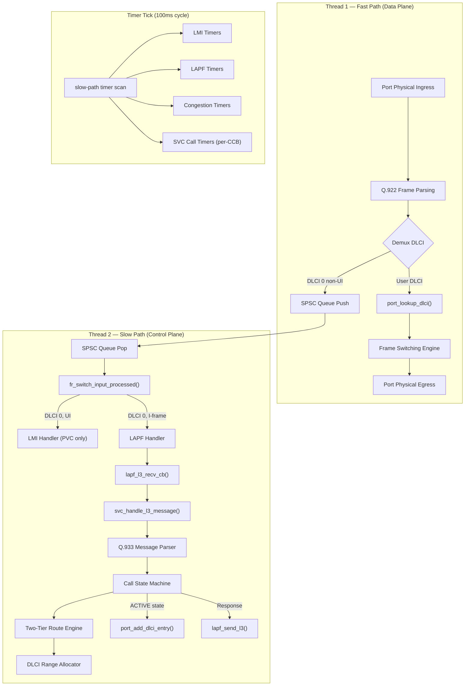
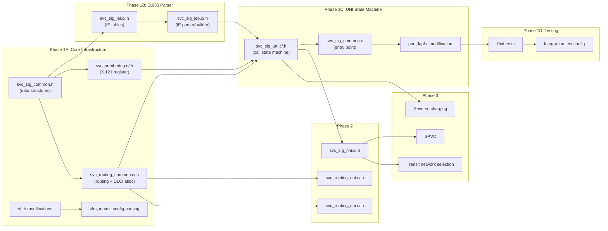

# VFRS Switched Virtual Circuit (SVC) Implementation Plan

> Comprehensive multi-phase plan for implementing SVC services and functionality in the Virtual Frame Relay Switch (VFRS), based on ITU-T X.36 Clause 10 (UNI) and ITU-T X.76 Clause 10 (NNI).

---

## Design Decisions Summary

The following 23 design decisions were established through a structured interview and drive this plan:

| # | Decision | Choice |
|---|----------|--------|
| 1 | **Scope** | UNI SVC + NNI SVC + SPVC + reverse charging + transit network selection. Call deflection/redirection deferred beyond Phase 3. CUG and call barring excluded. |
| 2 | **Sequencing** | Hybrid phased — core components developed in partial sync with each phase |
| 3 | **Call Reference Value** | 2-byte (15-bit) mandatory per X.36 §10.6.2; accept 1-byte from DTEs per Postel's principle |
| 4 | **DLCI partitioning** | Static configurable split point (default: PVC 16–511, SVC 512–991/8388607); future dynamic shared pool |
| 5 | **Routing** | Two-tier: Tier 1 local subscriber table → Tier 2 NNI prefix route table (longest-prefix match with D/G/E variable expansion) |
| 6 | **Subscriber numbers** | Manual per-port via `svc_addr` with D/G/E variable expansion; future auto-assignment |
| 7 | **File structure** | Per [vfrs_filestructure.txt](file:///c:/Users/rizki/Programming/vfrns/vfr_switch/vfrs_filestructure.txt) — `svc_signalling/`, `fr_switching/svc_routing_*`, `ports/svc_numbering/` |
| 8 | **LMI-SVC interaction** | Completely separate — LMI reports PVCs only (UI frames); SVCs use Q.933 STATUS/STATUS ENQUIRY (I-frames) |
| 9 | **CCB management** | Pre-allocated fixed-size pool per port (initially); future dynamic allocation |
| 10 | **Congestion** | SVC data DLCIs treated identically to PVCs (inherit negotiated CIR/Bc/Be) |
| 11 | **LAPF-SVC interface** | Inline: `lapf_l3_recv_cb()` → `svc_handle_l3_message()` on Thread 2 |
| 12 | **Timers** | Per-CCB `vfr_timer_t` fields, scanned in slow-path 100ms tick |
| 13 | **SPVC** | Phase 3 — PVC+SVC bridge with auto-redialing on NNI failure |
| 14 | **Testing** | Unit tests + multi-instance integration + Dynamips/Cisco IOS interop |
| 15 | **LLCORE negotiation** | Full Q.933 IE negotiation against per-port limits |
| 16 | **Number screening** | Network-side screening with configurable presentation indicator |
| 17 | **Error handling** | Comprehensive per X.36 §10.5/10.6 with Q.850 cause codes |
| 18 | **RESTART** | Phase 1 — auto-triggered on LAPF re-establishment |
| 19 | **SVC enablement** | Per-port via `svc_int`, backward compatible with PVC-only configs |
| 20 | **Build system** | Phase-gated Makefile addition |
| 21 | **NNI signaling** | X.76-compliant with UNI/NNI format detection; 3/4-octet DLCI addressing |
| 22 | **Wireshark** | Use built-in Q.933 dissector initially; separate Lua dissector later |
| 23 | **Call deflection** | Deferred beyond Phase 3; only for supported DTEs (VFRTAC/VFRAD) |

---

## Architecture Overview



---

## Phase Structure

The implementation is divided into **3 main phases + 1 deferred phase**, each producing a testable, working system:

| Phase | Scope | Outcome |
|-------|-------|---------|
| **Phase 1** | Single-switch UNI SVC | DTEs connected to the same VFRS can establish/release SVC calls |
| **Phase 2** | NNI SVC + Multi-switch | SVCs across multiple VFRS instances via NNI links |
| **Phase 3** | SPVC + Facility Services | Switched PVC, reverse charging, transit network selection |
| **Deferred** | Call deflection/redirection | DTE-initiated deflection, admin-configured redirection |

---

## Phase 1: Single-Switch UNI SVC

**Goal**: DTEs connected to the same VFRS instance can establish, use, and release SVC calls through Q.933/X.36 Clause 10 signaling on DLCI 0.

### Phase 1A — Core Infrastructure

> Build the foundational data structures, configuration parsing, and DLCI allocation that all subsequent SVC functionality depends on.

---

#### [NEW] [svc_sig_common.h](file:///c:/Users/rizki/Programming/vfrns/vfr_switch/svc_signalling/svc_sig_common.h)

SVC signaling shared header defining all core data structures:

```c
/* Call states per X.36 Table 10-26 (DCE side) */
#define SVC_STATE_NULL              0   /* U0/N0: Idle */
#define SVC_STATE_CALL_INITIATED    1   /* N1: SETUP received from calling DTE */
#define SVC_STATE_OUTGOING_PROC     3   /* N3: Overlap sending (CALL PROCEEDING sent) */
#define SVC_STATE_CALL_DELIVERED    4   /* N4: SETUP sent to called DTE */
#define SVC_STATE_CALL_PRESENT      6   /* N6: SETUP delivered, awaiting called DTE response */
#define SVC_STATE_CALL_RECEIVED     7   /* N7: Called DTE alerting */
#define SVC_STATE_CONNECT_REQUEST   8   /* N8: CONNECT received from called DTE */
#define SVC_STATE_INCOMING_PROC     9   /* N9: Overlap receiving */
#define SVC_STATE_ACTIVE           10   /* N10: Call active, data transfer */
#define SVC_STATE_DISCONNECT_REQ   11   /* N11: DISCONNECT sent */
#define SVC_STATE_DISCONNECT_IND   12   /* N12: DISCONNECT received */
#define SVC_STATE_RELEASE_REQ      19   /* N19: RELEASE sent */
#define SVC_STATE_RESTART_REQ      61   /* Restart request */
#define SVC_STATE_RESTART          62   /* Restart received */

/* Q.933 Message Types (X.36 Table 10-5) */
#define Q933_MSG_ALERTING          0x01
#define Q933_MSG_CALL_PROCEEDING   0x02
#define Q933_MSG_CONNECT           0x07
#define Q933_MSG_CONNECT_ACK       0x0F
#define Q933_MSG_SETUP             0x05
#define Q933_MSG_DISCONNECT        0x45
#define Q933_MSG_RELEASE           0x4D
#define Q933_MSG_RELEASE_COMPLETE  0x5A
#define Q933_MSG_RESTART           0x46
#define Q933_MSG_RESTART_ACK       0x4E
#define Q933_MSG_STATUS            0x7D
#define Q933_MSG_STATUS_ENQUIRY    0x75

/* Q.933 Information Element identifiers */
#define Q933_IE_BEARER_CAPABILITY  0x04
#define Q933_IE_CAUSE              0x08
#define Q933_IE_CALL_STATE         0x14
#define Q933_IE_DLCI               0x19
#define Q933_IE_LLCORE_PARAMS      0x48
#define Q933_IE_LLPROTO_PARAMS     0x44
#define Q933_IE_CALLED_NUMBER      0x70
#define Q933_IE_CALLED_SUBADDR     0x71
#define Q933_IE_CALLING_NUMBER     0x6C
#define Q933_IE_CALLING_SUBADDR    0x6D
#define Q933_IE_CONNECTED_NUMBER   0x4C
#define Q933_IE_CONNECTED_SUBADDR  0x4D
#define Q933_IE_LOW_LAYER_COMPAT   0x7C
#define Q933_IE_USER_USER          0x7E
#define Q933_IE_REVERSE_CHARGING   0x1E
#define Q933_IE_TRANSIT_NETWORK    0x78
#define Q933_IE_PRIORITY_SVC_CLASS 0x50
#define Q933_IE_RESTART_INDICATOR  0x79
/* NNI-specific (X.76) */
#define Q933_IE_CALL_IDENT         0x10
#define Q933_IE_TRANSIT_NET_ID     0x2C
#define Q933_IE_CLEARING_NET_ID    0x2D
#define Q933_IE_CUG_INTERLOCK      0x2A

/* Protocol Discriminator */
#define Q933_PROTOCOL_DISC         0x08

/* Maximum constants */
#define SVC_MAX_CALLS_PER_PORT     256  /* Pre-allocated CCB pool size */
#define SVC_MAX_ADDR_LEN           20   /* Max X.121 number digits */
#define SVC_MAX_SUBADDR_LEN        20
#define SVC_MAX_ROUTES             128
#define SVC_MAX_SUBSCRIBERS        256
#define SVC_MAX_FREE_RANGES        32

/* DLCI Range Allocator */
typedef struct {
    u32 start;
    u32 end;
} vfr_dlci_range_t;

typedef struct {
    vfr_dlci_range_t ranges[SVC_MAX_FREE_RANGES];
    int              count;
    u32              range_low;    /* Configured lower bound */
    u32              range_high;   /* Configured upper bound */
} vfr_dlci_allocator_t;

/* Parsed Q.933 message header */
typedef struct {
    u8  protocol_disc;
    u8  call_ref_len;          /* 1 or 2 */
    u16 call_ref_value;        /* 15-bit CRV (or 7-bit if len=1) */
    u8  call_ref_flag;         /* 0=originator, 1=destination */
    u8  message_type;
} q933_msg_header_t;

/* Parsed Link Layer Core Parameters */
typedef struct {
    u32 fwd_cir;        /* Forward CIR (bps) */
    u32 bwd_cir;        /* Backward CIR (bps) */
    u32 fwd_bc;         /* Forward Bc (bits) */
    u32 bwd_bc;         /* Backward Bc (bits) */
    u32 fwd_be;         /* Forward Be (bits) */
    u32 bwd_be;         /* Backward Be (bits) */
    u16 fwd_fmif;       /* Forward max frame info field (octets) */
    u16 bwd_fmif;       /* Backward max frame info field (octets) */
    u8  present;        /* 1 if LLCORE IE was present in message */
} q933_llcore_params_t;

/* Parsed Priority and Service Class */
typedef struct {
    u8  ftp;            /* Frame Transfer Priority (0-15) */
    u8  fdp;            /* Frame Discard Priority (0-7) */
    u8  svc_class;      /* Service Class (0-3) */
    u8  present;
} q933_priority_params_t;

/* Call Control Block (CCB) */
typedef struct vfr_call_s {
    u8      state;                          /* Current call state */
    u8      in_use;                         /* 1 = CCB is active */
    u16     call_ref;                       /* Call Reference Value (15-bit) */
    u8      call_ref_flag;                  /* 0=we originated, 1=peer originated */
    u8      call_ref_len;                   /* 1 or 2 (DTE's CRV length) */

    /* Addressing */
    char    calling_number[SVC_MAX_ADDR_LEN + 1];
    char    called_number[SVC_MAX_ADDR_LEN + 1];
    char    calling_subaddr[SVC_MAX_SUBADDR_LEN + 1];
    char    called_subaddr[SVC_MAX_SUBADDR_LEN + 1];
    char    connected_number[SVC_MAX_ADDR_LEN + 1];
    u8      calling_number_type;     /* 0=unknown, 1=international, 2=national */
    u8      calling_number_plan;     /* 0=unknown, 3=X.121 */
    u8      calling_presentation;    /* 0=allowed, 1=restricted */
    u8      calling_screening;       /* 0=user-provided, 1=user-verified, 3=network */

    /* Port references */
    char    ingress_port[MAX_NAME_LEN];     /* Calling DTE's port */
    char    egress_port[MAX_NAME_LEN];      /* Called DTE's port */
    u32     ingress_dlci;                    /* SVC data DLCI on ingress port */
    u32     egress_dlci;                     /* SVC data DLCI on egress port */

    /* Negotiated parameters */
    q933_llcore_params_t  llcore;
    q933_priority_params_t priority;

    /* Facility services */
    u8      reverse_charging;               /* 1 = reverse charging requested */
    u8      transit_network_present;
    char    transit_network[8];

    /* PVC entries for data phase (created at ACTIVE, freed at clearing) */
    vfr_pvc_t *fwd_pvc;                    /* ingress→egress data entry */
    vfr_pvc_t *rev_pvc;                    /* egress→ingress data entry */

    /* Timers (X.36 Tables 10-27/10-28) */
    vfr_timer_t t303;       /* 4s: SETUP sent, awaiting response */
    vfr_timer_t t305;       /* 30s: DISCONNECT sent, awaiting RELEASE */
    vfr_timer_t t308;       /* 4s: RELEASE sent (retransmit once) */
    vfr_timer_t t310;       /* 10s: CALL PROC received, awaiting CONNECT */
    vfr_timer_t t301;       /* 180s: Alerting, awaiting CONNECT */
    vfr_timer_t t322;       /* 4s: STATUS ENQUIRY sent */

    /* Retransmission counters */
    u8      t303_retries;
    u8      t308_retries;
    u8      t322_retries;
} vfr_call_t;

/* Per-port SVC context */
typedef struct {
    int                  enabled;           /* 1 = SVC active on this port */
    vfr_call_t           calls[SVC_MAX_CALLS_PER_PORT]; /* CCB pool */
    vfr_dlci_allocator_t dlci_alloc;        /* DLCI range allocator */
    char                 subscriber_number[SVC_MAX_ADDR_LEN + 1]; /* X.121 number */
    u8                   presentation;      /* 0=allowed, 1=restricted */

    /* Per-port SVC defaults */
    u32     default_cir;
    u32     default_bc;
    u32     default_be;
    u16     default_fmif;
    u8      default_ftp;
    u8      default_fdp;
    u8      default_svc_class;

    /* Per-port timer defaults */
    u32     t303_ms;
    u32     t305_ms;
    u32     t308_ms;
    u32     t310_ms;
    u32     t301_ms;
    u32     t316_ms;
    u32     t317_ms;
    u32     t322_ms;

    /* RESTART state */
    u8      restart_state;
    vfr_timer_t t316;       /* 120s: RESTART sent */
    vfr_timer_t t317;       /* 10s: RESTART received, clearing watchdog */
    u8      t316_retries;
} vfr_svc_ctx_t;
```

Key design points:
- Pre-allocated `calls[256]` pool per port — zero allocation during call setup
- `vfr_dlci_allocator_t` uses interval-based ranges (`[start, end]` pairs) — O(n) scan, O(1) memory per range
- All timers embedded in the CCB — scanned during the existing 100ms slow-path tick
- `ingress_port`/`egress_port` track the end-to-end call path within this switch

---

#### [NEW] [svc_numbering.c](file:///c:/Users/rizki/Programming/vfrns/vfr_switch/ports/svc_numbering/svc_numbering.c) / [svc_numbering.h](file:///c:/Users/rizki/Programming/vfrns/vfr_switch/ports/svc_numbering/svc_numbering.h)

X.121 numbering register and subscriber management:

- **Number expansion**: `svc_addr uni0/0 DGE1001` → `5104` + `01` + `01` + `1001` = `510401011001`
  - `D` = DNIC from `swconfig`
  - `G` = SGC (zero-padded to `sgclen`)
  - `E` = SIC (zero-padded to `siclen`)
- **Subscriber table**: Array of `{port_name, x121_number}` entries (max `SVC_MAX_SUBSCRIBERS`)
- **Lookup**: `svc_find_subscriber(ctx, called_number)` — linear scan for exact match against subscriber numbers

Functions:
- `int svc_numbering_init(vfrs_ctx_t *ctx)` — initialize subscriber table
- `int svc_numbering_add(vfrs_ctx_t *ctx, const char *port, const char *raw_number)` — expand and register
- `const char *svc_numbering_expand(vfrs_ctx_t *ctx, const char *raw)` — expand D/G/E variables
- `vfr_port_t *svc_find_subscriber(vfrs_ctx_t *ctx, const char *called_number)` — Tier 1 lookup

---

#### [NEW] [svc_routing_common.c](file:///c:/Users/rizki/Programming/vfrns/vfr_switch/fr_switching/svc_routing_common.c) / [svc_routing_common.h](file:///c:/Users/rizki/Programming/vfrns/vfr_switch/fr_switching/svc_routing_common.h)

Two-tier SVC routing engine and DLCI allocator:

**Tier 1 — Local subscriber lookup:**
- Match called number against subscriber table entries
- Returns the UNI port for local delivery

**Tier 2 — NNI prefix route table:**
- `svc_route prefix=DGE port=nni0/0` (with D/G/E expansion)
- Longest-prefix match determines egress NNI port
- Table: array of `{prefix_string, egress_port_name}` (max `SVC_MAX_ROUTES`)

**DLCI Range Allocator:**
- `svc_dlci_alloc_init(alloc, low, high)` — initialize with `[low, high]`
- `u32 svc_dlci_alloc(alloc)` — allocate next available DLCI (scan ranges, extract `start`)
- `void svc_dlci_free(alloc, dlci)` — return DLCI (insert as `[dlci, dlci]`, merge adjacent ranges)

Functions:
- `int svc_route_add(vfrs_ctx_t *ctx, const char *prefix, const char *port_name)` — add NNI route
- `vfr_port_t *svc_route_lookup(vfrs_ctx_t *ctx, const char *called_number)` — two-tier lookup
- `int svc_route_is_local(vfrs_ctx_t *ctx, const char *called_number)` — check if locally reachable

---

#### [MODIFY] [vfr.h](file:///c:/Users/rizki/Programming/vfrns/vfr_switch/vfr.h)

Add to `vfr_port_s`:
```c
    /* SVC context pointer */
    void            *svc_ctx;       /* vfr_svc_ctx_t* (NULL if SVC disabled) */
```

Add to `vfrs_ctx_t`:
```c
    /* SVC subscriber table */
    struct {
        char port_name[MAX_NAME_LEN];
        char x121_number[SVC_MAX_ADDR_LEN + 1];
    } svc_subscribers[SVC_MAX_SUBSCRIBERS];
    int             svc_subscriber_count;

    /* SVC NNI route table */
    struct {
        char prefix[SVC_MAX_ADDR_LEN + 1];
        char egress_port[MAX_NAME_LEN];
    } svc_routes[SVC_MAX_ROUTES];
    int             svc_route_count;

    /* SVC global defaults */
    u32             svc_default_cir;
    u32             svc_default_bc;
    u32             svc_default_be;
    u16             svc_default_fmif;
```

---

#### [MODIFY] [vfrs_main.c](file:///c:/Users/rizki/Programming/vfrns/vfr_switch/vfrs_main.c)

Config parsing additions:
- Parse `svc_int <port> [dlci_low=N] [dlci_high=N] [t303=N] ...` — initialize `vfr_svc_ctx_t` on the port, auto-init LAPF if not configured
- Parse `svc_addr <port> <number>` — register subscriber number with D/G/E expansion
- Parse `svc_route prefix=<prefix> port=<port>` — add NNI prefix route
- Parse `svc_default_cir/bc/be` in `swconfig` section

Slow-path thread additions:
- After LAPF/LMI/congestion timer ticks, scan SVC-enabled ports and check CCB timers:
```c
if (port->svc_ctx) {
    svc_poll_timers(port);
}
```

---

#### [MODIFY] [Makefile](file:///c:/Users/rizki/Programming/vfrns/vfr_switch/Makefile)

Add Phase 1A source files:
```makefile
SRC += svc_signalling/svc_sig_common.c \
       svc_signalling/svc_sig_iel.c \
       ports/svc_numbering/svc_numbering.c \
       fr_switching/svc_routing_common.c
```

Add `obj/` directory targets:
```makefile
dirs:
    mkdir -p obj ... obj/svc_signalling obj/ports/svc_numbering
```

---

### Phase 1B — Q.933 Message Parser/Builder

> Implement the complete Q.933 signaling message format: parse incoming messages from DTEs and build outgoing messages to DTEs.

---

#### [NEW] [svc_sig_iel.c](file:///c:/Users/rizki/Programming/vfrns/vfr_switch/svc_signalling/svc_sig_iel.c) / [svc_sig_iel.h](file:///c:/Users/rizki/Programming/vfrns/vfr_switch/svc_signalling/svc_sig_iel.h)

Information Element Layout tables and format definitions:

- IE identifier → name, min length, max length, mandatory/optional per message type
- Codeset 0 IE ordering requirements (X.36 §10.6.4)
- Q.850 Cause code table (values 1–127 with descriptions)

---

#### [NEW] [svc_sig_iep.c](file:///c:/Users/rizki/Programming/vfrns/vfr_switch/svc_signalling/svc_sig_iep.c) / [svc_sig_iep.h](file:///c:/Users/rizki/Programming/vfrns/vfr_switch/svc_signalling/svc_sig_iep.h)

Information Element Parser/Builder functions:

**Parser functions** (each returns bytes consumed, or -1 on error):
- `q933_parse_header(data, len, &header)` — Protocol Discriminator + Call Reference + Message Type
- `q933_parse_bearer_capability(ie_data, ie_len, &result)`
- `q933_parse_called_number(ie_data, ie_len, number_buf, max_len, &type, &plan)`
- `q933_parse_calling_number(ie_data, ie_len, number_buf, max_len, &type, &plan, &presentation, &screening)`
- `q933_parse_connected_number(ie_data, ie_len, ...)`
- `q933_parse_dlci_ie(ie_data, ie_len, &dlci, &dlci_len)`
- `q933_parse_llcore_params(ie_data, ie_len, &params)`
- `q933_parse_cause(ie_data, ie_len, &location, &cause_value, diag_buf, &diag_len)`
- `q933_parse_call_state(ie_data, ie_len, &state)`
- `q933_parse_restart_indicator(ie_data, ie_len, &restart_class)`
- `q933_parse_reverse_charging(ie_data, ie_len, &indication)`
- `q933_parse_transit_network(ie_data, ie_len, network_id, &id_len)`
- `q933_parse_priority_svc_class(ie_data, ie_len, &params)`
- `q933_parse_user_user(ie_data, ie_len, uu_buf, max_len, &uu_len)`

**Builder functions** (each returns bytes written):
- `q933_build_header(buf, max_len, call_ref, call_ref_flag, call_ref_len, msg_type)`
- `q933_build_bearer_capability(buf, max_len)`
- `q933_build_called_number(buf, max_len, number, type, plan)`
- `q933_build_calling_number(buf, max_len, number, type, plan, presentation, screening)`
- `q933_build_connected_number(buf, max_len, number, type, plan, presentation, screening)`
- `q933_build_dlci_ie(buf, max_len, dlci, dlci_len, preferred_exclusive)`
- `q933_build_llcore_params(buf, max_len, &params)`
- `q933_build_cause(buf, max_len, location, cause_value, diag, diag_len)`
- `q933_build_call_state(buf, max_len, state)`
- `q933_build_restart_indicator(buf, max_len, restart_class)`
- `q933_build_reverse_charging(buf, max_len, indication)`
- `q933_build_priority_svc_class(buf, max_len, &params)`

**Message-level builder helpers** (combine header + IEs for each message type):
- `q933_build_setup(buf, max_len, call, port)` — SETUP with Bearer Capability + DLCI + Called/Calling Number + LLCORE + Priority
- `q933_build_call_proceeding(buf, max_len, call)` — CALL PROCEEDING with DLCI
- `q933_build_connect(buf, max_len, call, port)` — CONNECT with DLCI + LLCORE + Connected Number
- `q933_build_connect_ack(buf, max_len, call)` — CONNECT ACKNOWLEDGE
- `q933_build_disconnect(buf, max_len, call, cause, location)`
- `q933_build_release(buf, max_len, call, cause, location)`
- `q933_build_release_complete(buf, max_len, call_ref, call_ref_flag, call_ref_len, cause, location)`
- `q933_build_status(buf, max_len, call, cause, location)`
- `q933_build_status_enquiry(buf, max_len, call)`
- `q933_build_restart(buf, max_len, restart_class, dlci)`
- `q933_build_restart_ack(buf, max_len, restart_class, dlci)`

---

### Phase 1C — UNI Call State Machine

> Implement the DCE-side call state machine for UNI SVC signaling, call setup, and call clearing.

---

#### [NEW] [svc_sig_uni.c](file:///c:/Users/rizki/Programming/vfrns/vfr_switch/svc_signalling/svc_sig_uni.c) / [svc_sig_uni.h](file:///c:/Users/rizki/Programming/vfrns/vfr_switch/svc_signalling/svc_sig_uni.h)

UNI-side (X.36 Clause 10) signaling handler. This is the DCE (network) side state machine:

**Entry point**: `svc_uni_handle_message(port, &header, ie_data, ie_len)` — dispatches by message type

**Call setup flow (network-initiated toward called DTE)**:

```
Calling DTE → SETUP → DCE(VFRS):
  1. Parse SETUP IEs (Bearer, Called#, Calling#, LLCORE, DLCI)
  2. Validate: protocol discriminator, mandatory IEs present
  3. Allocate CCB, assign call reference
  4. Route lookup: svc_route_lookup(called_number)
     → Local? Find egress UNI port via subscriber table
     → Remote? Find egress NNI port via prefix table (Phase 2)
  5. Negotiate LLCORE parameters against port limits
  6. Allocate ingress DLCI from calling port's DLCI allocator
  7. Send CALL PROCEEDING to calling DTE (with allocated DLCI)
  8. Allocate egress DLCI from called port's DLCI allocator
  9. Screen calling number (set presentation per config)
  10. Forward SETUP to called DTE (via lapf_send_l3 on egress port)
  11. Start T303 timer on egress side
  12. State → N4 (Call Delivered)

Called DTE → CONNECT → DCE(VFRS):
  1. Cancel T303/T310 timers
  2. Create bidirectional vfr_pvc_t entries (is_static=0)
  3. Initialize token buckets with negotiated CIR/Bc/Be
  4. Register entries via port_add_dlci_entry() on both ports
  5. Send CONNECT to calling DTE
  6. Send CONNECT ACKNOWLEDGE to called DTE
  7. State → N10 (Active)
```

**Call clearing flow**:

```
DTE → DISCONNECT → DCE(VFRS):
  1. Send RELEASE to the disconnecting DTE
  2. Start T308 timer
  3. Send DISCONNECT to the peer DTE
  4. State → N11/N12

DTE → RELEASE → DCE(VFRS):
  1. Remove vfr_pvc_t entries via port_del_dlci_entry()
  2. Return DLCIs to allocators via svc_dlci_free()
  3. Send RELEASE COMPLETE to the releasing DTE
  4. Free CCB (in_use = 0)
  5. State → N0 (Null)
```

**RESTART handling**:

```
LAPF link re-establishment event → DCE(VFRS):
  1. Scan all active CCBs on the port
  2. For each active call: clear data PVCs, free DLCIs, free CCB
  3. Send RESTART (restart_class=all_VCs) to the DTE
  4. Start T316 timer
  5. State → Restart Request

DTE → RESTART → DCE(VFRS):
  1. Clear all active SVCs (or specific DLCI per restart_class)
  2. Send RESTART ACKNOWLEDGE
  3. Start T317 clearing watchdog
```

**Timer expiry handlers**:
- T303 expiry: Retransmit SETUP once, then clear call (Cause #102 "Recovery on timer expiry")
- T305 expiry: Send RELEASE with Cause #102
- T308 expiry: Retransmit RELEASE once, then force-clear (free CCB, PVCs, DLCIs)
- T310 expiry: Clear call (Cause #18 "No user responding")
- T301 expiry: Clear call (Cause #19 "No answer from user")
- T316 expiry: Retransmit RESTART
- T322 expiry: Retransmit STATUS ENQUIRY

**STATUS/STATUS ENQUIRY handling** (per X.36 §10.5.5):
- On receiving STATUS ENQUIRY: respond with STATUS containing Call State + Cause #30 "Response to STATUS ENQUIRY"
- On receiving STATUS: validate call state compatibility, clear call if incompatible

**Error handling** (per X.36 §10.5/10.6):
- Invalid protocol discriminator → discard silently
- Message too short → discard silently
- Bad call reference format → RELEASE COMPLETE with Cause #81 "Invalid call reference value"
- Unknown message type → STATUS with Cause #97 "Message type non-existent"
- Mandatory IE missing → RELEASE COMPLETE with Cause #96 "Mandatory IE missing"
- IE content error → RELEASE COMPLETE with Cause #100 "Invalid IE contents"
- Call reference to unknown call → RELEASE COMPLETE with Cause #81
- Message not compatible with call state → STATUS with Cause #101 "Message not compatible with call state"

---

#### [NEW] [svc_sig_common.c](file:///c:/Users/rizki/Programming/vfrns/vfr_switch/svc_signalling/svc_sig_common.c)

Shared SVC signaling entry point and utilities:

- `svc_handle_l3_message(port, data, len)` — the master entry point called from `lapf_l3_recv_cb()`:
  1. Parse Q.933 header
  2. Determine if port is UNI or NNI
  3. Dispatch to `svc_uni_handle_message()` or `svc_nni_handle_message()`
- `svc_init_port(port, dlci_low, dlci_high, ...)` — allocate and initialize `vfr_svc_ctx_t`
- `svc_free_port(port)` — clear all active calls, free all SVC PVCs, free context
- `svc_alloc_call_ref(svc_ctx)` — find unused CCB, assign next available CRV
- `svc_find_call(svc_ctx, call_ref, call_ref_flag)` — lookup active CCB by CRV
- `svc_free_call(svc_ctx, call)` — clear timers, free PVCs, free DLCIs, mark `in_use=0`
- `svc_poll_timers(port)` — scan active CCBs, fire expired timers
- `svc_create_data_pvcs(ctx, call)` — allocate bidirectional `vfr_pvc_t` entries
- `svc_destroy_data_pvcs(ctx, call)` — remove and free SVC data PVC entries

---

#### [MODIFY] [port_lapf.c](file:///c:/Users/rizki/Programming/vfrns/vfr_switch/ports/lapf/port_lapf.c)

Replace the logging-only `lapf_l3_recv_cb()` with SVC dispatch:

```c
void lapf_l3_recv_cb(vfr_port_t *port, const u8 *data, size_t len) {
    if (port->svc_ctx) {
        svc_handle_l3_message(port, data, len);
    } else {
        LOG_INFO("LAPF on %s: Received Layer 3 Payload (size=%zu) - SVC not enabled", port->name, len);
        /* existing hex dump logging */
    }
}
```

Add LAPF link event notification:
- On SABME/UA (link established): if SVC is enabled, call `svc_on_lapf_established(port)`
- On DISC/DM (link released): if SVC is enabled, call `svc_on_lapf_released(port)` to trigger RESTART

---

### Phase 1D — Integration and Testing

> Wire everything together, build test configs, and validate single-switch UNI SVC operation.

---

#### Unit Tests

Create standalone test programs in `vfr_switch/scratch/`:

1. **`test_q933_parser.c`** — Exercise Q.933 message building and parsing:
   - Build a SETUP message, parse it back, verify all fields match
   - Test all IE types individually
   - Test malformed messages (truncated, missing mandatory IEs, invalid IE content)
   - Test 1-byte and 2-byte CRV handling

2. **`test_dlci_allocator.c`** — Exercise DLCI range allocator:
   - Initialize with `[512, 991]`, allocate all 480 DLCIs, verify exhaustion returns 0
   - Free DLCIs in random order, verify merge logic produces minimal range count
   - Allocate, free, reallocate — verify no leaks

3. **`test_call_state_machine.c`** — Exercise state transitions:
   - Simulate SETUP → CALL PROCEEDING → CONNECT → ACTIVE → DISCONNECT → RELEASE → RELEASE COMPLETE
   - Verify timer starts/cancels at each transition
   - Test abnormal flows: SETUP timeout, RELEASE timeout, RESTART

#### Integration Test Config

Create [test_svc_uni.conf](file:///c:/Users/rizki/Programming/vfrns/vfr_switch/test_svc_uni.conf):

```ini
# Two UNI ports on the same switch, SVC-enabled
swconfig swid=svc_test dnic=5104 sgclen=2 sgc=01 siclen=2 sic=01 subnumlen=4
log_level con=debug txt=debug
log_file svc_test.log

# Two UNI ports connected via localhost UDP
interface uni0/0 udp lhost=127.0.0.1 lport=10000 rhost=127.0.0.1 rport=20000
interface uni0/1 udp lhost=127.0.0.1 lport=10001 rhost=127.0.0.1 rport=20001

# LMI for PVC status
lmi uni0/0 type=ansi
lmi uni0/1 type=ansi

# Enable SVC on both ports
svc_int uni0/0 dlci_low=512 dlci_high=991
svc_int uni0/1 dlci_low=512 dlci_high=991

# Assign subscriber numbers
svc_addr uni0/0 DGE1001
svc_addr uni0/1 DGE1002

# PCAP capture for debugging
capture all svc_test_capture.pcap
```

#### Verification Checklist (Phase 1)

- [ ] Q.933 parser correctly decodes all IE types from hex data
- [ ] Q.933 builder produces byte-identical output to hand-crafted reference frames
- [ ] DLCI allocator handles full allocation/deallocation cycles without leaks
- [ ] `svc_int` config command initializes `vfr_svc_ctx_t` with correct defaults
- [ ] `svc_addr` config command expands D/G/E variables and registers subscribers
- [ ] LAPF I-frame delivery triggers `svc_handle_l3_message()` on SVC-enabled ports
- [ ] Single-switch UNI call: DTE₁ SETUP → DCE routes → SETUP to DTE₂ → CONNECT → ACTIVE → data flows → DISCONNECT → RELEASE → RELEASE COMPLETE
- [ ] PCAP capture shows correct LAPF I-frame encapsulation with Q.933 payload
- [ ] Wireshark's built-in Q.931 dissector decodes captured SVC signaling messages
- [ ] Timer expiry correctly retransmits or clears calls
- [ ] RESTART on LAPF re-establishment clears all active SVCs
- [ ] Error handling: malformed SETUP rejected with correct Cause code
- [ ] PVC-only ports unaffected — existing configs work without modification
- [ ] LMI Full Status does NOT include SVC DLCIs

---

## Phase 2: NNI SVC and Multi-Switch Operation

**Goal**: SVC calls can traverse multiple VFRS instances connected via NNI links, using X.76 Clause 10 signaling.

### Phase 2A — NNI Signaling Engine

---

#### [NEW] [svc_sig_nni.c](file:///c:/Users/rizki/Programming/vfrns/vfr_switch/svc_signalling/svc_sig_nni.c) / [svc_sig_nni.h](file:///c:/Users/rizki/Programming/vfrns/vfr_switch/svc_signalling/svc_sig_nni.h)

NNI-side (X.76 Clause 10) signaling handler. The STE (Signaling Terminal Equipment) acts as both originating and terminating endpoint:

**Key NNI differences from UNI**:
- **Bidirectional DLCI allocation**: Calling STE allocates from lower half, called STE allocates from upper half (X.76 §10.3.2.3). Configurable per-NNI-port.
- **Call Identification IE** (X.76-specific): Unique call identifier for multi-network tracing
- **Transit/Clearing Network Identification IEs**: Track the network path for billing/routing
- **3/4-octet DLCI addressing**: NNI uses extended Q.922 addressing with D/C bit
- **DLCI collision resolution**: If both STEs allocate the same DLCI, the higher-numbered CRV wins

**NNI call setup flow (transit switch)**:

```
Ingress NNI → SETUP → STE(VFRS):
  1. Parse X.76 SETUP (includes Call Identification IE)
  2. Route lookup: svc_route_lookup(called_number)
     → Local UNI? Forward as UNI SETUP (translate X.76→X.36 IEs)
     → Another NNI? Forward as NNI SETUP (add Transit Network ID IE)
  3. Allocate DLCI on egress interface
  4. Build egress SETUP message (UNI or NNI format)
  5. Forward via lapf_send_l3() on egress port
```

**UNI→NNI interworking** (per Part 3 §7):
- Map UNI SETUP IEs to NNI format (add Call Identification, Clearing Network ID)
- Map NNI CONNECT back to UNI format (remove NNI-specific IEs)
- Translate Cause codes where necessary

---

#### [NEW] [svc_routing_nni.c](file:///c:/Users/rizki/Programming/vfrns/vfr_switch/fr_switching/svc_routing_nni.c) / [svc_routing_nni.h](file:///c:/Users/rizki/Programming/vfrns/vfr_switch/fr_switching/svc_routing_nni.h)

NNI-specific routing logic:
- NNI DLCI allocation with bidirectional range splitting (calling STE vs called STE)
- DLCI collision detection and resolution
- Transit network path tracking

---

#### [MODIFY] [svc_sig_common.c](file:///c:/Users/rizki/Programming/vfrns/vfr_switch/svc_signalling/svc_sig_common.c)

Update `svc_handle_l3_message()` to dispatch to `svc_nni_handle_message()` for NNI ports.

---

#### [MODIFY] [svc_routing_common.c](file:///c:/Users/rizki/Programming/vfrns/vfr_switch/fr_switching/svc_routing_common.c)

Extend `svc_route_lookup()`:
- Tier 1 returns a UNI port for local delivery
- Tier 2 returns an NNI port for inter-switch routing
- Route lookup now indicates whether egress is UNI or NNI, triggering appropriate message format

---

#### [MODIFY] [Makefile](file:///c:/Users/rizki/Programming/vfrns/vfr_switch/Makefile)

Add Phase 2 source files:
```makefile
SRC += svc_signalling/svc_sig_nni.c \
       fr_switching/svc_routing_nni.c
```

### Phase 2B — UNI-to-NNI Routing Integration

---

#### [NEW] [svc_routing_uni.c](file:///c:/Users/rizki/Programming/vfrns/vfr_switch/fr_switching/svc_routing_uni.c) / [svc_routing_uni.h](file:///c:/Users/rizki/Programming/vfrns/vfr_switch/fr_switching/svc_routing_uni.h)

UNI-specific routing logic — handles the case where a UNI SETUP arrives and the called number routes to an NNI port:

- UNI→NNI message format translation
- NNI→UNI message format translation (for CONNECT coming back)
- Egress port selection and DLCI allocation on the NNI side

### Phase 2C — Multi-Switch Integration Testing

#### Test Topology

```
  [DTE-A]           [DTE-B]           [DTE-C]
     |                 |                 |
  UNI0/0           UNI0/0           UNI0/0
     |                 |                 |
 [VFRS-A] ===NNI=== [VFRS-B] ===NNI=== [VFRS-C]
  nni0/0            nni0/0             nni0/0
                    nni0/1
```

Create test configs for 3 switches connected via NNI (localhost UDP):

- **VFRS-A**: `dnic=5104 sgc=01 sic=01` — DTE-A at `510401011001`
- **VFRS-B**: `dnic=5104 sgc=01 sic=02` — DTE-B at `510401021001`, transit
- **VFRS-C**: `dnic=5104 sgc=01 sic=03` — DTE-C at `510401031001`

Test scenarios:
1. **Same-switch call**: DTE-A calls DTE-A's other UNI port (Phase 1 regression)
2. **Adjacent-switch call**: DTE-A calls DTE-B (1 NNI hop)
3. **Transit call**: DTE-A calls DTE-C (2 NNI hops through VFRS-B)
4. **Bidirectional**: DTE-C calls DTE-A (reverse direction through transit)
5. **Simultaneous calls**: Multiple active SVCs across the network
6. **Failure recovery**: Kill VFRS-B mid-call, verify RESTART and clearing on A and C

#### Verification Checklist (Phase 2)

- [ ] NNI SETUP includes Call Identification IE
- [ ] NNI DLCI allocation uses bidirectional range splitting
- [ ] Transit switch correctly forwards SETUP/CONNECT between NNI ports
- [ ] UNI→NNI IE translation preserves all required parameters
- [ ] NNI→UNI IE translation removes NNI-specific IEs
- [ ] Multi-hop routing works (DTE-A → VFRS-A → VFRS-B → VFRS-C → DTE-C)
- [ ] Call clearing propagates through all intermediate switches
- [ ] RESTART on NNI link clears all affected calls
- [ ] Cisco IOS interop: VFRS NNI connection to Dynamips FR switch (if supported)

---

## Phase 3: SPVC and Facility Services

**Goal**: Implement Switched PVC, reverse charging, and transit network selection.

### Phase 3A — Switched PVC (SPVC)

**SPVC operation**: A PVC on the UNI side is bridged to an SVC on the NNI side. When the NNI SVC reaches ACTIVE, data flows between the UNI PVC and the NNI SVC transparently.

#### [MODIFY] [svc_sig_common.c](file:///c:/Users/rizki/Programming/vfrns/vfr_switch/svc_signalling/svc_sig_common.c) and [svc_routing_common.c](file:///c:/Users/rizki/Programming/vfrns/vfr_switch/fr_switching/svc_routing_common.c)

Add SPVC management:

- `svc_spvc_init(ctx, uni_port, uni_dlci, called_number, nni_port)` — create the SPVC bridge:
  1. Verify the UNI PVC exists (static, `is_static=1`)
  2. Initiate SVC SETUP on the NNI port toward `called_number`
  3. When NNI SVC reaches ACTIVE, bridge the UNI PVC's egress to the NNI SVC data DLCI
  4. Set `pvc->reverse_pvc` pointers to link the two directions

- **Auto-redialing**: When the NNI SVC clears (link failure, remote RELEASE):
  1. Mark the UNI PVC as inactive (LMI will report it)
  2. Start a backoff timer (exponential: 5s, 10s, 20s, 40s, ... max 120s)
  3. On timer expiry, re-initiate SVC SETUP on the NNI port
  4. On success, re-bridge the UNI PVC and mark it active

Config format:
```ini
# SPVC: UNI PVC on uni0/0 DLCI 100 bridged to SVC toward 510401031001 via nni0/0
spvc uni0/0 100 called=510401031001 nni=nni0/0
```

#### [MODIFY] [vfrs_main.c](file:///c:/Users/rizki/Programming/vfrns/vfr_switch/vfrs_main.c)

Parse `spvc` config command after PVC and SVC initialization.

### Phase 3B — Reverse Charging

#### [MODIFY] [svc_sig_uni.c](file:///c:/Users/rizki/Programming/vfrns/vfr_switch/svc_signalling/svc_sig_uni.c)

Handle Reverse Charging Indication IE (0x1E) in SETUP messages:

1. If calling DTE includes Reverse Charging IE with `indication=requested`:
   - Check if called DTE's subscription allows reverse charging acceptance (configurable per subscriber)
   - If allowed: include Reverse Charging IE in forwarded SETUP to called DTE
   - If not allowed: reject with RELEASE COMPLETE, Cause #57 "Bearer capability not authorized"
2. Called DTE can accept or reject reverse charging in CONNECT response

Config:
```ini
# Allow reverse charging acceptance on this subscriber
svc_addr uni0/1 DGE1002 reverse_charging=accept
```

### Phase 3C — Transit Network Selection

#### [MODIFY] [svc_sig_uni.c](file:///c:/Users/rizki/Programming/vfrns/vfr_switch/svc_signalling/svc_sig_uni.c) and [svc_sig_nni.c](file:///c:/Users/rizki/Programming/vfrns/vfr_switch/svc_signalling/svc_sig_nni.c)

Handle Transit Network Selection IE (0x78) in SETUP:

1. If SETUP contains Transit Network Selection IE:
   - Match the transit network ID against configured NNI routes
   - If a specific NNI route is associated with that transit network, use it
   - If no match, reject with Cause #2 "No route to specified transit network"
2. On NNI forwarding, translate to Transit Network Identification IE (X.76 format)

Config:
```ini
# Associate transit network ID with NNI route
svc_route prefix=5104 port=nni0/0 transit_net=5104
svc_route prefix=5105 port=nni0/1 transit_net=5105
```

### Phase 3D — SPVC and Facility Testing

#### Verification Checklist (Phase 3)

- [ ] SPVC: UNI PVC bridges to NNI SVC, data flows end-to-end
- [ ] SPVC auto-redialing: NNI failure → reconnect with exponential backoff
- [ ] SPVC LMI interaction: UNI PVC shows active/inactive based on NNI SVC state
- [ ] Reverse charging: Calling DTE requests, called DTE accepts → call proceeds
- [ ] Reverse charging: Called DTE rejects → call cleared with correct Cause
- [ ] Reverse charging: Subscription disallows → immediate rejection
- [ ] Transit network selection: SETUP with Transit Network IE routes to correct NNI
- [ ] Transit network selection: Unknown transit network → Cause #2 rejection
- [ ] All Phase 1 and Phase 2 regression tests still pass

---

## Deferred: Call Deflection and Call Redirection

> Deferred beyond Phase 3. Only for supported DTEs (VFRTAC and VFRAD), implemented on a per-port basis, due to potential X.36 compliance concerns and uncertain Cisco IOS support.

**Call Deflection** (DTE-initiated):
- Called DTE sends CALL DEFLECTION message with new destination number during alerting phase
- DCE re-routes the call to the new destination
- Requires DTE capability negotiation

**Call Redirection** (Admin-configured):
- Routing rules that automatically forward calls to a substitute number
- Config: `svc_redirect from=DGE1002 to=DGE1003`
- Applied before delivering SETUP to the called DTE

---

## File Structure Summary

```
vfr_switch/
├── svc_signalling/                          ← NEW DIRECTORY
│   ├── svc_sig_common.c / .h               ← Phase 1A: Main SVC entry point, CCB management
│   ├── svc_sig_iel.c / .h                  ← Phase 1B: IE layout tables and format defs
│   ├── svc_sig_iep.c / .h                  ← Phase 1B: IE parser/builder functions
│   ├── svc_sig_uni.c / .h                  ← Phase 1C: UNI call state machine (X.36)
│   └── svc_sig_nni.c / .h                  ← Phase 2A: NNI call state machine (X.76)
├── fr_switching/
│   ├── fr_frame.c / .h                      ← EXISTING (no changes)
│   ├── fr_switch.c                          ← EXISTING (no changes)
│   ├── svc_routing_common.c / .h            ← Phase 1A: Two-tier routing + DLCI allocator
│   ├── svc_routing_uni.c / .h               ← Phase 2B: UNI-specific routing
│   └── svc_routing_nni.c / .h               ← Phase 2A: NNI-specific routing
├── ports/
│   ├── svc_numbering/                       ← NEW DIRECTORY
│   │   └── svc_numbering.c / .h             ← Phase 1A: X.121 numbering register
│   └── lapf/
│       ├── port_lapf.c                      ← MODIFY Phase 1C: SVC dispatch in L3 callback
│       └── port_lapf.h                      ← EXISTING (no changes)
├── vfr.h                                    ← MODIFY Phase 1A: Add svc_ctx, subscriber/route tables
├── vfrs_main.c                              ← MODIFY Phase 1A/1D: Config parsing, timer integration
└── Makefile                                 ← MODIFY each phase: Add new source files
```

### Total New Files: 14 source files (7 `.c` + 7 `.h`)
### Total Modified Files: 4 ([vfr.h](file:///c:/Users/rizki/Programming/vfrns/vfr_switch/vfr.h), [vfrs_main.c](file:///c:/Users/rizki/Programming/vfrns/vfr_switch/vfrs_main.c), [port_lapf.c](file:///c:/Users/rizki/Programming/vfrns/vfr_switch/ports/lapf/port_lapf.c), [Makefile](file:///c:/Users/rizki/Programming/vfrns/vfr_switch/Makefile))

---

## Implementation Dependencies



---

## Estimated Effort

| Sub-Phase | Description | Estimated LOC | Key Risk |
|-----------|-------------|---------------|----------|
| 1A | Core infrastructure (structs, config, DLCI alloc, numbering, routing) | ~1,500 | Config parsing edge cases |
| 1B | Q.933 IE parser/builder (all 18+ IEs) | ~2,500 | IE encoding correctness vs spec |
| 1C | UNI call state machine + integration | ~2,000 | State machine edge cases, timer interactions |
| 1D | Testing + validation | ~1,000 | Requires DTE-side test tooling |
| 2A | NNI signaling engine | ~1,500 | UNI↔NNI IE translation, DLCI collision |
| 2B | UNI-NNI routing integration | ~800 | Multi-hop forwarding correctness |
| 2C | Multi-switch testing | ~500 | 3-switch topology coordination |
| 3A | SPVC | ~800 | Auto-redialing state management |
| 3B | Reverse charging | ~400 | Subscription validation logic |
| 3C | Transit network selection | ~400 | Route-to-transit-network mapping |
| **Total** | | **~11,400** | |

---

## Reference Standards

| Standard | Scope | Key Sections |
|----------|-------|-------------|
| [X.36 Clause 10](file:///c:/Users/rizki/Programming/vfrns/standards-and-specifications/Markdowned/Ekstrak_ITU-T_X-36-4_Chapter-10.md) | UNI SVC signaling | §10.3 call control, §10.5 error handling, §10.6 message format |
| [X.76 Clause 10](file:///c:/Users/rizki/Programming/vfrns/standards-and-specifications/Markdowned/Ekstrak_ITU-T_X-76-3_Chapter-10.md) | NNI SVC signaling | §10.3 NNI call control, Call Identification |
| [Q.922](file:///c:/Users/rizki/Programming/vfrns/standards-and-specifications/Markdowned/Ekstrak_ITU-T_Q-922-1.md) | LAPF (Layer 2 for SVC) | I-frame sequencing on DLCI 0 |
| [Q.850](file:///c:/Users/rizki/Programming/vfrns/standards-and-specifications/Markdowned/Ekstrak_ITU-T_Q-850.md) | Cause codes | All SVC clearing cause values |
| [X.121](file:///c:/Users/rizki/Programming/vfrns/standards-and-specifications/Markdowned/Ekstrak_ITU-T_X-121.md) | Numbering plan | International data numbering |
| [SVC Format Part 1](file:///c:/Users/rizki/Programming/vfrns/svcsig_frame_format_part1.md) | Packet format spec | Frame structure, IE encoding |
| [SVC Format Part 2](file:///c:/Users/rizki/Programming/vfrns/svcsig_frame_format_part2.md) | State machines | Call states, procedures, timers |
| [SVC Format Part 3](file:///c:/Users/rizki/Programming/vfrns/svcsig_frame_format_part3.md) | Facility services | CUG, reverse charging, transit, interworking |
| [Architecture](file:///c:/Users/rizki/Programming/vfrns/vfrns_architecture_and_design_new.md) | System architecture | Subsystem design |
| [Numbering Plan](file:///c:/Users/rizki/Programming/vfrns/vfrns_numbering_plan_new.md) | Numbering scheme | DNIC, SGC, SIC, subscriber numbers |
| [SVC Architecture](file:///c:/Users/rizki/Programming/vfrns/vfr_switch/vfrs_svc_architecture.md) | Internal architecture | Signaling flow, DLCI allocator, state machine |
| [SVC Redesign Plan](file:///c:/Users/rizki/Programming/vfrns/vfr_switch/vfrs_svc_redesign_plan.md) | Capacity analysis | Memory calculations, commodity optimization |
| [NotebookLM](file:///c:/Users/rizki/Programming/vfrns/standards-and-specifications/notebooklm.md) | LMI-SVC separation | LMI reports PVCs only, SVCs use Q.933 |
