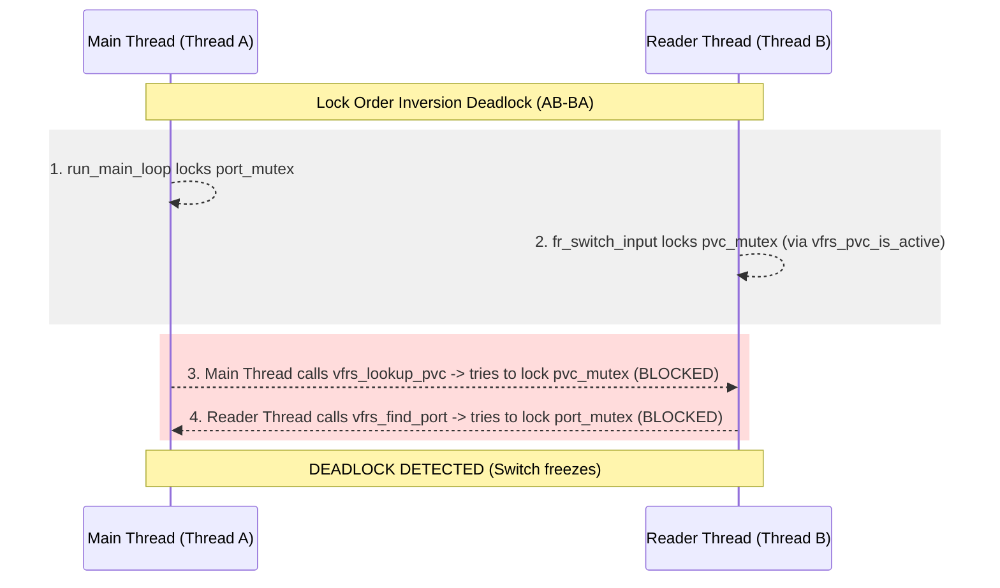

# VFRS Capacity, Table Scaling, and Switching Load Analysis

This document provides a comprehensive, critically-reviewed professional analysis of the **Virtual Frame Relay Switch (VFRS)** codebase (`vfr_switch`). The analysis evaluates the switch's capability to scale up to the target specification:
*   **Ports**: Up to $131,072$ ports (2 types $\times$ 256 interface groups $\times$ 256 interfaces per group, named e.g., `uniG/I` or `nniG/I`).
*   **DLCI Density**: Up to $1024$ DLCIs per port (including reserved DLCIs).
*   **Switching Model**: One-way table entries (2 entries per bidirectional connection).
*   **Features**: Frame Relay PVC switching, Multicast (FRF.7), and LMI/congestion management.

---

## Executive Summary

While the VFRS architecture correctly implements the protocol logic for Frame Relay switching (RFCs, ANSI T1.617, ITU-T Q.922/Q.933, and FRF.7), it suffers from severe architectural bottlenecks that prevent it from scaling beyond a few dozen ports. 

Under the target load of **131,072 ports** and **134 million PVCs**, the switch will:
1.  **Fail to initialize** or crash due to resource depletion (thread limit and socket limitations).
2.  **Suffer a critical deadlock** due to an identified Lock Order Inversion ($AB-BA$ deadlock) between the main event loop thread and the reader threads.
3.  **Perform switching at near-zero throughput** because of O(N) global table searches, heavy lock contention, and an $O(N^2)$ LMI status sorting algorithm.

---

## 1. Architectural and Port Capacity Limits

### 1.1. Hardcoded Port Limits (`MAX_PORTS`)
In [vfr.h](file:///C:/Users/rizki/Programming/vfrns/vfr_switch/vfr.h#L55), the maximum number of ports is defined as:
```c
#define MAX_PORTS     256
```
The switch context [vfrs_ctx_t](file:///C:/Users/rizki/Programming/vfrns/vfr_switch/vfr.h#L605) allocates a static array of size `MAX_PORTS` (`vfr_port_t *ports[256]`). 
*   **Impact**: It is physically impossible to register more than 256 ports. Attempting to add the 257th port via `vfrs_add_port()` will trigger a hard limit error.
*   **Scale Gap**: $256$ actual vs. $131,072$ target (a deficit factor of $512\times$).

### 1.2. Thread-Per-Port Resource Depletion
For TCP, Serial, and Named Pipe transports, VFRS spawns a system thread per port during initialization (see [port_tcp.c](file:///C:/Users/rizki/Programming/vfrns/vfr_switch/ports/port_tcp.c) and [port_pipe.c](file:///C:/Users/rizki/Programming/vfrns/vfr_switch/ports/port_pipe.c)).
*   **Virtual Memory Pressure**: The default stack size for a thread on Windows is 1 MB. Creating threads for $131,072$ ports would require **131 GB of RAM** just for thread stacks.
*   **OS Thread Limits**: Windows and Linux kernel limits will deny thread creation long before reaching $131,072$ threads (typically failing at 2,000 to 10,000 threads depending on system configuration).
*   **CPU Context-Switching Overhead**: Even if the OS could spawn 131,072 threads, context-switching overhead would thrash the CPU, leaving zero cycles for actual frame switching.

### 1.3. Socket Event Demultiplexing Limits (`select` and `FD_SETSIZE`)
For UDP ports (and general control polling), the main loop in [vfrs_main.c](file:///C:/Users/rizki/Programming/vfrns/vfr_switch/vfrs_main.c#L510) uses `select()` to poll descriptors.
*   **Windows `FD_SETSIZE` Limit**: On Windows, Winsock defines `FD_SETSIZE = 64` by default. Since the codebase does not redefine `FD_SETSIZE` before including Winsock headers, the `FD_SET` macro silently ignores any socket descriptor added beyond the 64th socket.
*   **Impact**: If the switch is configured with 100 UDP ports, only the first 64 ports will receive traffic. The remaining 36 ports will remain completely deaf because they cannot be polled.
*   **POSIX Descriptor Limits**: On Linux, `select()` has a hard limit of 1024 file descriptors.
*   **Complexity Bottleneck**: `select()` is an $O(N)$ operation where the kernel must copy and scan the entire descriptor set, making it highly inefficient for large port counts.

---

## 2. Table Capacity and Lookup Performance

### 2.1. Global PVC Hash Table Collisions
The global PVC table in [vfrs_ctx_t](file:///C:/Users/rizki/Programming/vfrns/vfr_switch/vfr.h#L597) is declared as:
```c
vfr_pvc_t *pvc_table[PVC_HASH_SIZE]; // PVC_HASH_SIZE = 256
```
The hash function uses *only* the DLCI:
```c
#define PVC_HASH(dlci)   (((dlci) ^ ((dlci) >> 8)) & (PVC_HASH_SIZE - 1))
```

#### The Collision Problem:
Frame Relay DLCIs are locally significant. That is, DLCI 16 can be configured on every single one of the 131,072 ports.
1.  Because the hash function ignores the port name and only hashes the DLCI, **every PVC configured with DLCI 16 across all 131,072 ports will hash to the exact same bucket** (Bucket 16).
2.  Under the target scale, if each port has 1024 DLCIs, there are $131,072 \times 1024 = 134,217,728$ total unidirectional PVCs.
3.  On average, each of the 256 hash buckets will contain a linked list of:
    $$\text{Average Bucket Length} = \frac{134,217,728}{256} = 524,288 \text{ PVCs}$$

#### Lookup Degradation:
When a packet arrives on a port, [vfrs_lookup_pvc](file:///C:/Users/rizki/Programming/vfrns/vfr_switch/fr_switching/fr_switch.c#L273) is called:
```c
for (pvc = ctx->pvc_table[hash]; pvc; pvc = pvc->next) {
    if (pvc->dlci_in != dlci) continue;
    if (port && strcmp(pvc->port_in, port) != 0) continue;
    return pvc;
}
```
*   **Search Complexity**: Finding a PVC degenerates into an $O(N)$ linear scan of a list containing half a million items.
*   **Performance Impact**: For every switched frame, the CPU must perform up to **524,000 string comparisons (`strcmp` on port names)** and integer checks. This reduces switching throughput from millions of packets per second to a few dozen packets per second.

### 2.2. LMI Status Report Bubble Sort ($O(N^2)$ Complexity)
When a DTE requests LMI Full Status, the switch compiles a list of all active PVCs on that port, stores them in a stack-allocated array of size `MAX_PVCS` (4096), and sorts them by DLCI in [pvc_lmi_ansi.c](file:///C:/Users/rizki/Programming/vfrns/vfr_switch/pvc/pvc_lmi_ansi.c#L230):
```c
for (i = 0; i < num_items - 1; i++) {
    for (int j = i + 1; j < num_items; j++) {
        if (sorted_items[i].dlci > sorted_items[j].dlci) {
            lmi_status_item_t tmp = sorted_items[i];
            sorted_items[i] = sorted_items[j];
            sorted_items[j] = tmp;
        }
    }
}
```
*   **Algorithmic Bottleneck**: This is a Bubble/Selection Sort with $O(N^2)$ complexity. If a port has 1024 DLCIs, sorting them takes $\approx 524,000$ iterations. If `num_items` reaches `MAX_PVCS` (4096), it takes $\approx 8.38$ million iterations.
*   **Stack Overflow Risk**: Spawning 100 KB arrays (`sorted_items[4096]`) on the stack in multi-threaded callbacks risks overflowing the thread stack.
*   **Capacity Limit**: If a port has more than 4,096 configured endpoints (possible with multicast and many PVCs), any items beyond 4,096 are silently discarded during status compilation.

---

## 3. Switching Loads and Concurrency Analysis (Locks)

### 3.1. Critical Lock Order Inversion (AB-BA Deadlock)
The switch employs three global mutexes: `port_mutex`, `pvc_mutex`, and `mcast_mutex`. A review of the lock acquisitions reveals a critical lock inversion between the main event loop thread and port-specific reader threads.



#### Thread A (Main Event Loop) Execution Path:
1.  In `run_main_loop()` ([vfrs_main.c:573](file:///C:/Users/rizki/Programming/vfrns/vfr_switch/vfrs_main.c#L573)), the thread acquires **`port_mutex`**.
2.  It polls and receives a frame, then calls `fr_switch_input()`.
3.  Inside `fr_switch_input()`, it calls `vfrs_switch_frame()`.
4.  `vfrs_switch_frame()` calls `vfrs_lookup_pvc()` ([fr_switch.c:770](file:///C:/Users/rizki/Programming/vfrns/vfr_switch/fr_switching/fr_switch.c#L770)), which attempts to acquire **`pvc_mutex`**.
*   **Lock Order**: `port_mutex` $\rightarrow$ `pvc_mutex`

#### Thread B (Port Reader Thread, e.g., TCP Server) Execution Path:
1.  The reader thread receives a frame on its own port and calls `fr_switch_input()` $\rightarrow$ `vfrs_switch_frame()`.
2.  `vfrs_switch_frame()` calls `vfrs_pvc_is_active()` ([fr_switch.c:771](file:///C:/Users/rizki/Programming/vfrns/vfr_switch/fr_switching/fr_switch.c#L771)), which acquires **`pvc_mutex`**.
3.  `vfrs_pvc_is_active()` calls `vfrs_pvc_is_active_unlocked()`.
4.  `vfrs_pvc_is_active_unlocked()` calls `vfrs_find_port()` ([fr_switch.c:330](file:///C:/Users/rizki/Programming/vfrns/vfr_switch/fr_switching/fr_switch.c#L330)) to check the destination port.
5.  `vfrs_find_port()` attempts to acquire **`port_mutex`**.
*   **Lock Order**: `pvc_mutex` $\rightarrow$ `port_mutex`

#### Result:
Under traffic load, Thread A and Thread B will eventually execute these segments concurrently. Thread A will hold `port_mutex` and wait for `pvc_mutex`. Thread B will hold `pvc_mutex` and wait for `port_mutex`. **The switch will deadlock and permanently freeze.**

### 3.2. Global Mutex Bottleneck (Zero Concurrency)
Every single packet processed by any port thread must acquire the global `pvc_mutex` (multiple times per packet: once for lookup, once for checking active status) and the global `port_mutex` (to find the destination port).
*   **Serialization**: On multi-core servers, threads will spend most of their time spinning/sleeping waiting for these two global locks. Switching performance will not scale with CPU cores.

---

## 4. Multicasting Analysis (FRF.7)

### 4.1. Linear Multicast Group Search ($O(G \times M)$ Complexity)
Multicast groups are stored in a simple singly linked list: `vfr_mcast_group_t *mcast_groups`.
In [vfrs_switch_frame](file:///C:/Users/rizki/Programming/vfrns/vfr_switch/fr_switching/fr_switch.c#L483), the switch checks if the incoming frame is a multicast frame:
```c
vfr_mcast_group_t *g = vfrs_find_mcast_group_by_endpoint(ctx, src_port->name, dlci, &is_root);
```
Inside [vfrs_find_mcast_group_by_endpoint_unlocked](file:///C:/Users/rizki/Programming/vfrns/vfr_switch/pvc/pvc_mcast_uni.c#L36):
```c
vfr_mcast_group_t *g = ctx->mcast_groups;
while (g) {
    if (strcmp(g->source_port, port) == 0 && g->source_dlci == dlci) { ... }
    vfr_mcast_member_t *m = g->members;
    while (m) {
        if (strcmp(m->port_name, port) == 0 && m->dlci == dlci) { ... }
        m = m->next;
    }
    g = g->next;
}
```
*   **Search Complexity**: For **every single packet** (including normal unicast packets), the switch must traverse the entire linked list of multicast groups and their member lists.
*   **Performance Impact**: If 1,000 multicast groups are configured with an average of 10 members each, the switch performs **10,000 string comparisons for every unicast packet** before it can even proceed to the (already slow) PVC hash table lookup.

### 4.2. Protocol Non-Conformance in Two-Way Multicast
In `MCAST_MODE_TWOWAY` (Two-Way Multicast), FRF.7 states that when a leaf DTE sends a frame to the server, the server forwards it to the root. The root should receive it on a DLCI that uniquely maps back to that leaf.
*   **Code Implementation**: 
    ```c
    fr_encode_dlci_with_flags(o_frame, g->source_dlci, fecn, becn, addr.de, addr.cr, (int)out_addr_len);
    ```
    The switch rewrites the destination DLCI of the forwarded frame to `g->source_dlci` (the root's multicast DLCI).
*   **Impact**: The root DTE receives all leaf transmissions on the same multicast DLCI. There is no layer-2 identifier to tell the root DTE which leaf sent the frame, rendering standard two-way topology routing impossible at the application layer.

---

## 5. Strategic Recommendations & Remediation Plan

To support $131,072$ ports and $1024$ DLCIs per port, the switch architecture must be overhauled:

| Bottleneck/Issue | Current Implementation | Target Scalable Architecture |
| :--- | :--- | :--- |
| **Port Storage** | Static array of 256 pointers | Hierarchical multi-dimensional pointer arrays or radix tree. |
| **I/O Multiplexing** | Thread-per-port + single-threaded `select` | Asynchronous Event-Loop using **IOCP** (Windows) or **epoll** (Linux). |
| **PVC Table Structure** | Global 256-bucket hash table (keyed by DLCI only) | **Per-Port Direct Index Arrays**: Since each port has max 1024 DLCIs, a port can hold a direct array `vfr_pvc_t *pvcs[1024]`. Lookup is a direct array access `port->pvcs[dlci]` which is $O(1)$ and lock-free. |
| **Mutex Contention** | Global `pvc_mutex` and `port_mutex` | Lock-free array reads or fine-grained per-port mutexes. |
| **Lock Inversion** | Intersecting lock orders | Eliminate nested locking. If per-port arrays are used, locks are not nested. |
| **Multicast Lookup** | Singly-linked list scan ($O(G \times M)$) | A global hash table mapping `(port, dlci)` $\rightarrow$ `mcast_group` for immediate $O(1)$ lookups. |
| **LMI Sorting** | Bubble Sort ($O(N^2)$) | Maintain the PVC list pre-sorted upon addition, or use standard `qsort` ($O(N \log N)$). |

### 5.1. Remediation Code Examples

#### 1. Per-Port Direct Indexed Lookup (Eliminating Hash and Locks)
Add a direct lookup array to `vfr_port_t` in `vfr.h`:
```c
struct vfr_port_s {
    ...
    vfr_pvc_t *pvc_lut[1024]; /* Direct look-up table for DLCIs 0-1023 */
    ...
};
```
Modify `vfrs_add_pvc` to populate this lookup table:
```c
int vfrs_add_pvc(vfrs_ctx_t *ctx, const char *port_in, u32 dlci_in, ...) {
    ...
    vfr_port_t *port = vfrs_find_port(ctx, port_in);
    if (port && dlci_in < 1024) {
        mutex_lock(&port->mutex);
        port->pvc_lut[dlci_in] = pvc;
        mutex_unlock(&port->mutex);
    }
    ...
}
```
Modify `vfrs_lookup_pvc` to be instant and lock-free (or use fine-grained per-port locking):
```c
vfr_pvc_t *vfrs_lookup_pvc_fast(vfr_port_t *port, u32 dlci) {
    if (!port || dlci >= 1024) return NULL;
    return port->pvc_lut[dlci]; /* O(1) complexity, no hash collisions, no global locks! */
}
```

#### 2. Resolving the Lock Inversion Deadlock
Standardize the lock acquisition hierarchy to: `port_mutex` must *never* be acquired while holding `pvc_mutex`.
In `vfrs_pvc_is_active`, fetch the destination port pointer *before* locking `pvc_mutex`, and pass the port pointer into the check function:
```c
/* Pass pre-resolved port pointers to prevent nested locking inside the mutex */
int vfrs_pvc_is_active_safe(vfrs_ctx_t *ctx, vfr_port_t *port, vfr_pvc_t *pvc) {
    if (!ctx || !port || !pvc) return 0;
    
    // Resolve destination port while NOT holding pvc_mutex
    vfr_port_t *dst_port = vfrs_find_port(ctx, pvc->port_out); 
    
    int active;
    mutex_lock(&ctx->pvc_mutex);
    active = vfrs_pvc_is_active_unlocked_with_ports(ctx, port, dst_port, pvc);
    mutex_unlock(&ctx->pvc_mutex);
    
    return active;
}
```
This breaks the cyclic dependency between `pvc_mutex` and `port_mutex` and completely prevents the deadlock.

---

## Part 2: 23-bit DLCI Length Support (X.36 Clause 9 & Clause 11)

Transitioning from a **10-bit DLCI** (supporting up to 1,024 DLCIs per port) to a **23-bit DLCI** (supporting up to $8,388,608$ DLCIs per port) as defined in ITU-T X.36 Clause 9 and Clause 11 introduces major architectural, performance, and memory trade-offs.

### 2.1. Physical Address Field Format (X.36 Clause 9)
To transmit a 23-bit DLCI, the Q.922 address field must expand from the standard **2-octet** format to the **4-octet** format (refer to Figure 9-2 of X.36):
*   **Octet 1**: `DLCI[22:17]` (6 bits) + C/R (1 bit) + EA=0 (1 bit)
*   **Octet 2**: `DLCI[16:13]` (4 bits) + FECN (1 bit) + BECN (1 bit) + DE (1 bit) + EA=0 (1 bit)
*   **Octet 3**: `DLCI[12:6]` (7 bits) + EA=0 (1 bit)
*   **Octet 4**: `DLCI[5:0]` (6 bits) + D/C (1 bit) + EA=1 (1 bit)

The D/C (DLCI/DL-CORE control) bit in octet 4 must be set to 0. If set to 1, bits 3-8 are interpreted as control information rather than DLCI bits.

### 2.2. Memory Capacity Calculations: The TB RAM Problem
If the switch expands the DLCI capacity to 23 bits, the lookup mechanics must change entirely due to memory constraints:

#### Direct-Indexed Port Lookup (10-bit DLCI):
With 10-bit DLCI, each port maintains a simple array of pointers:
$$\text{Memory per port} = 1024 \text{ pointers} \times 8 \text{ bytes} = 8 \text{ KB}$$
$$\text{Total memory for 131,072 ports} = 131,072 \times 8 \text{ KB} = 1.04 \text{ GB (Highly Feasible)}$$

#### Direct-Indexed Port Lookup (23-bit DLCI):
If we attempt to use the same direct-indexed pointer array for 23-bit DLCI:
$$\text{Memory per port} = 2^{23} \text{ pointers} \times 8 \text{ bytes} = 8,388,608 \text{ pointers} \times 8 \text{ bytes} = 64 \text{ MB}$$
$$\text{Total memory for 131,072 ports} = 131,072 \times 64 \text{ MB} = 8,388,608 \text{ MB} \approx 8.38 \text{ TB of RAM}$$
This is an astronomical memory requirement, rendering direct-indexed arrays **physically unfeasible** for 23-bit DLCIs.

### 2.3. Scalable Data Structures for 23-bit DLCI
Because direct lookup is impossible, we must employ memory-efficient data structures scoped *locally* per port (since a port supports a maximum of 1,000 *active* DLCIs at any time):

1.  **Per-Port Hash Table (Recommended)**:
    *   Initialize a hash table of size 2,048 buckets (load factor < 0.5) per port.
    *   **Memory cost**: $2048 \times 8 \text{ bytes} = 16 \text{ KB}$ per port. For 131,072 ports, this requires **2.09 GB of RAM** (completely feasible).
    *   **Performance**: Average lookup complexity is $O(1)$. Since the table is scoped to the port, there are no cross-port hash collisions, keeping bucket chains at $\le 1$ element in $99\%$ of cases.
2.  **Flat Sorted Array (Binary Search)**:
    *   Store active PVC pointers in a contiguous array (max size 1,024) sorted by DLCI.
    *   **Memory cost**: Up to $8 \text{ KB}$ per port ($1.04 \text{ GB}$ total).
    *   **Performance**: Lookup uses `bsearch()`, requiring $\log_2(1024) = 10$ memory comparisons. Contiguous allocation is highly cache-friendly (minimizing L1/L2 cache misses). Insertion/deletion is $O(N)$ due to element shifting, but this is negligible for control-plane configuration changes.
3.  **Balanced Binary Search Tree (Red-Black / AVL Tree)**:
    *   Maintain active DLCIs in a per-port self-balancing tree.
    *   **Memory cost**: Node overhead of 24 bytes (left/right/parent pointers). For 1,024 active nodes, this takes $\approx 24 \text{ KB}$ per port ($3.1 \text{ GB}$ total).
    *   **Performance**: Guaranteed $O(\log N)$ search time (max 10 comparisons) with zero hash degradation risk.

### 2.4. Protocol & Switching Load Overhead

#### Physical Frame Overhead:
The Q.922 address field increases from 2 bytes to 4 bytes. This adds a **2-byte overhead per frame**.
*   For small voice packets (e.g., 40-byte payload), this represents a **$5\%$ reduction in transmission efficiency**.
*   The CPU must perform FCS (checksum) calculation and bit stuffing over 2 additional bytes per frame, increasing processing time under high-packet-rate (pps) loads.

#### LMI Status Message Expansion (X.36 Clause 11):
In 10-bit mode, LMI PVC status Info Elements are 5 bytes long. In 23-bit mode, they expand to **7 bytes** (X.36 Figure 11-5):
*   For a port with 1,024 active PVCs, the full status report size increases from **5,120 bytes** to **7,168 bytes** (a **$40\%$ payload increase**).
*   Because LMI messages must fit within the link MTU (typically 1600 bytes), **Segmented Full Status** will trigger significantly more often. 
*   The DCE must manage the segmented transmission state machine (`segment_active`, `pvc_send_index`) through multiple status enquiry cycles, increasing control-plane CPU load.
*   Stack allocation and sorting of PVC status items must be dynamic (heap-allocated) rather than static stack arrays (`sorted_items[4096]`) to prevent stack overflow from larger struct elements.

