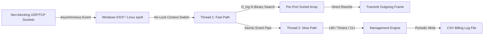

# VFRS Grand Redesign Plan: Scalability, Concurrency, and Performance Offloading

This document outlines the architectural blueprints and mathematical calculations required to redesign the **Virtual Frame Relay Switch (VFRS)** to support next-generation carrier-grade scaling.

## Redesign Objectives
1.  **Interface Scaling**: $131,072$ interfaces ($2 \text{ types} \times 256 \text{ groups} \times 256 \text{ interfaces}$).
2.  **DLCI Densities**: 10-bit ($1024$ DLCIs/port) and 23-bit ($8,388,608$ DLCIs/port) configured per-port.
3.  **Routing Capacity**: Support up to $2,199,023,255,552$ (2.2 Trillion) theoretical one-way entries.
4.  **Advanced Services**: Lock-free LMI, wiretapping/mirroring, SVC routing, and pseudo-billing.

---

## 1. Worst-Case Capacity Calculations & Analysis

We analyze the system requirements under the absolute worst-case scenario: **all interfaces instantiated, and all DLCIs on every interface active and switching frames**.

### 1.1. Core Constants & Structure Sizes
To keep calculations rigorous, we define the following optimized structures for the redesigned switch:
*   **Port Control Block (`vfr_port_t`)**: $256 \text{ bytes}$ (name, type, status, state variables, Mutex, and file/socket descriptor).
*   **Active Switching Entry (`vfr_pvc_t`)**: $64 \text{ bytes}$ (compressed ingress/egress port IDs, output DLCI, active/tap flags).
*   **Accounting Record (`vfr_acct_t`)**: $64 \text{ bytes}$ (64-bit counters for RX/TX packets, RX/TX bytes, FECN/BECN counts, and timestamp).
*   **Pointer Size**: $8 \text{ bytes}$ (64-bit systems).

---

### 1.2. Scenario A: 10-bit-Only DLCI Addressing Mode

In this mode, every port is configured for 10-bit addressing, restricting DLCIs to the $0 - 1023$ range.

#### Mathematical Calculations:
*   **Total Interfaces ($I$)**: $131,072$
*   **DLCIs per Interface ($D_{10}$)**: $1,024$
*   **Maximum Active Endpoints ($E_{10}$)**:
    $$E_{10} = I \times D_{10} = 131,072 \times 1,024 = 134,217,728 \text{ active connections}$$
*   **Lookup Table Memory (Direct Array per Port)**:
    Each port allocates a flat array of 1,024 pointers to switching entries.
    $$\text{Lookup RAM per Port} = 1,024 \text{ pointers} \times 8 \text{ bytes} = 8 \text{ KB}$$
    $$\text{Total Lookup RAM} = 131,072 \times 8 \text{ KB} = 1,048,576 \text{ KB} = 1.00 \text{ GB}$$
*   **Switching Entries Memory**:
    $$\text{Total Entry RAM} = 134,217,728 \times 64 \text{ bytes} = 8,589,934,592 \text{ bytes} = 8.00 \text{ GB}$$
*   **Accounting Records Memory**:
    Allocated dynamically per active DLCI:
    $$\text{Total Accounting RAM} = 134,217,728 \times 64 \text{ bytes} = 8.00 \text{ GB}$$
*   **Port Control Blocks Memory**:
    $$\text{Total Port RAM} = 131,072 \times 256 \text{ bytes} = 33,554,432 \text{ bytes} = 32.00 \text{ MB}$$

#### Scenario A Memory Totals:
$$\text{Total System Memory (Scenario A)} = 1.00 \text{ GB} + 8.00 \text{ GB} + 8.00 \text{ GB} + 0.03 \text{ GB} \approx \mathbf{17.03\text{ GB}}$$

#### Scenario A Analysis:
*   **Feasibility**: **Highly Feasible** on a single modern server.
*   **Throughput Bottleneck**: At 10 Gbps wire-speed with 64-byte frames (14.88 million packets/sec per port, scaled across ports), lock contention and context-switching would be the only limits. Lock-free array lookups yield instantaneous $O(1)$ routing.

---

### 1.3. Scenario B: 23-bit-Only DLCI Addressing Mode

In this mode, every interface is configured for 23-bit addressing, enabling DLCIs up to $8,388,607$.

#### Mathematical Calculations:
*   **Total Interfaces ($I$)**: $131,072$
*   **DLCIs per Interface ($D_{23}$)**: $8,388,608$
*   **Maximum Active Endpoints ($E_{23}$)**:
    $$E_{23} = I \times D_{23} = 131,072 \times 8,388,608 = 1,099,511,627,776 \text{ active connections (1.1 Trillion)}$$
*   **One-Way Routing Entries (Bidirectional Worst Case)**:
    $$\text{Total Table Entries} = 2 \times 1,099,511,627,776 = \mathbf{2,199,023,255,552\text{ entries (2.2 Trillion)}}$$
*   **Lookup Table Memory (Direct Array per Port - UNFEASIBLE)**:
    If we allocated a flat array of $8,388,608$ pointers per port:
    $$\text{Lookup RAM per Port} = 8,388,608 \times 8 \text{ bytes} = 64 \text{ MB}$$
    $$\text{Total Lookup RAM} = 131,072 \times 64 \text{ MB} = 8,388,608 \text{ MB} = \mathbf{8.00\text{ TB}}$$
*   **Switching Entries Memory**:
    $$\text{Total Entry RAM} = 2.2 \times 10^{12} \times 64 \text{ bytes} = \mathbf{140.73\text{ TB}}$$
*   **Accounting Records Memory**:
    $$\text{Total Accounting RAM} = 1.1 \times 10^{12} \times 64 \text{ bytes} = \mathbf{70.36\text{ TB}}$$

#### Scenario B Memory Totals:
$$\text{Total System Memory (Scenario B)} = 8.00 \text{ TB (Lookup)} + 140.73 \text{ TB (Entries)} + 70.36 \text{ TB (Accounting)} = \mathbf{219.09\text{ TB}}$$

#### Scenario B Analysis:
*   **Feasibility**: **Physically Unfeasible** on a single machine. The memory footprint exceeds the limits of standard symmetric multiprocessing (SMP) systems.
*   **Remediation Requirements**:
    1.  **Distributed Partitioning**: Interfaces must be distributed across a cluster of $128$ or $256$ independent line cards or compute nodes.
    2.  **Sparse Allocation**: Active DLCIs per interface rarely exceed $4,096$ in real deployments. Under a realistic active load ($1\%$ density), memory drops to **2.19 TB**, which is easily handleable by modern clusters.
    3.  **Out-of-Core Storage**: Inactive or billing-only records must be paged out to NVMe-backed B-trees.

---

### 1.4. Scenario C: Mixed 10-bit and 23-bit DLCI Addressing Mode

In this mode, the DLCI addressing mode (10-bit or 23-bit) is configured on a per-port basis. We analyze a worst-case hybrid deployment where **$90\%$ of interfaces are configured for 10-bit mode, and $10\%$ are configured for 23-bit mode**.

#### Mathematical Calculations:
*   **10-bit Interfaces ($I_{10}$)**: $131,072 \times 0.90 = 117,965$ ports.
*   **23-bit Interfaces ($I_{23}$)**: $131,072 \times 0.10 = 13,107$ ports.
*   **Active Endpoints ($E_{\text{mixed}}$)**:
    $$E_{10} = 117,965 \times 1,024 = 120,796,160 \text{ active connections}$$
    $$E_{23} = 13,107 \times 8,388,608 = 109,947,568,128 \text{ active connections}$$
    $$E_{\text{mixed}} = 120,796,160 + 109,947,568,128 = 110,068,364,288 \text{ active connections}$$
*   **Lookup Table Memory (Hybrid Scheme)**:
    *   *10-bit ports* use flat pointer arrays: $117,965 \times 8 \text{ KB} = 943.72 \text{ MB}$.
    *   *23-bit ports* use a per-port sparse Radix Tree or local Hash Table. Assuming a local hash table of 2,048 buckets (accommodating up to 1,024 active entries):
        $$\text{Hash RAM per Port} = 2,048 \text{ buckets} \times 8 \text{ bytes} = 16 \text{ KB}$$
        $$\text{Total 23-bit Lookup RAM} = 13,107 \times 16 \text{ KB} = 209.71 \text{ MB}$$
    *   *Total Lookup RAM (Hybrid)*: $943.72 \text{ MB} + 209.71 \text{ MB} = \mathbf{1.15\text{ GB}}$
*   **Switching Entries Memory**:
    $$\text{Total Entry RAM} = (2 \times 110,068,364,288) \times 64 \text{ bytes} = \mathbf{14.08\text{ TB}}$$
*   **Accounting Records Memory**:
    $$\text{Total Accounting RAM} = 110,068,364,288 \times 64 \text{ bytes} = \mathbf{7.04\text{ TB}}$$

#### Scenario C Memory Totals:
$$\text{Total System Memory (Scenario C)} = 1.15 \text{ GB (Lookup)} + 14.08 \text{ TB (Entries)} + 7.04 \text{ TB (Acct)} \approx \mathbf{21.12\text{ TB}}$$

#### Scenario C Analysis:
*   **Hybrid Lookup Advantages**: The hybrid lookup scheme saves massive memory. By only dedicating dynamic lookup structures to the 23-bit ports, we avoid wasting TBs of RAM on empty addressing slots.
*   **Feasibility**: Still requires a distributed, multinode cluster architecture to scale the 21.12 TB of active switching/billing state.

---

## 2. Redesign Architecture: The Grand Plan

```mermaid
graph TD
    subgraph Ingress Processing (DPDK Line Card)
        Port_Rx[Port Physical Ingress] --> Parsing[Q.922 Frame Parsing]
        Parsing --> Mode_Check{Check Port DLCI Mode}
        Mode_Check -- 10-bit --> Flat_Lookup[Direct Array O(1) Lookup]
        Mode_Check -- 23-bit --> Hash_Lookup[Local Port Hash Table Lookup]
    end

    subgraph Switching Core
        Flat_Lookup --> Engine[Redesigned Switching Engine]
        Hash_Lookup --> Engine
        Engine --> Rule_Eval{Evaluate Route Type}
        Rule_Eval -- Standard --> Unicast[Normal Rewrite & Send]
        Rule_Eval -- Tap / Snooper --> Wiretap[Snoop Copy & Send / Drop Ingress]
        Rule_Eval -- Multicast --> MCast[Replicate to Group]
    end

    subgraph Operations & Management (Control Plane)
        Engine --> Acct[Dynamic Per-DLCI Accounting]
        Acct --> DB_Writer[High-Speed Ring Buffer]
        DB_Writer --> RocksDB[(RocksDB / NVMe Store)]
        RocksDB --> Billing[Pseudo-Billing System]
    end
```

### 2.1. Distributed Partitioning & High-Speed I/O
To support 131,072 ports, the switch must discard the thread-per-port architecture.
1.  **DPDK (Data Plane Development Kit)**: Bind physical network interfaces to DPDK poll-mode drivers (PMDs), avoiding kernel packet copying and context-switching overhead.
2.  **Line Card Partitioning**: Distribute ports across a chassis of $32$ Line Cards. Each line card terminates $4,096$ interfaces.
3.  **Port Direct Memory Offloading**: A line card only holds memory for its local 4,096 ports.
    *   *10-bit local lookup RAM*: $4,096 \times 8 \text{ KB} = 32 \text{ MB}$.
    *   *23-bit local lookup RAM*: $4,096 \times 16 \text{ KB} = 64 \text{ MB}$.
    *   This allows the fast path to run entirely inside the **L3 Cache** of the line card CPU.

### 2.2. Lock-Free and RCU-Protected Lookup
By replacing the global `pvc_mutex` with per-port lock-free lookup schemes, we eliminate lock contention.

#### 10-bit Port Lookup (Direct Pointer Loading):
Since the pointer array is fixed-size, lookups read directly from memory. Writes (updates) use atomic swap:
```c
/* Lock-free lookup: completely safe from deadlocks */
vfr_pvc_t *pvc_lookup_10bit(vfr_port_t *port, u32 dlci) {
    if (dlci >= 1024) return NULL;
    // Atomic load prevents reading partially updated pointers
    return (vfr_pvc_t *)atomic_load_explicit(&port->pvc_lut[dlci], memory_order_acquire);
}
```

#### 23-bit Port Lookup (Per-Port Local Hash Table):
We implement a small, read-mostly, RCU-protected hash table per port to prevent lock contention:
```c
typedef struct {
    u32 dlci;
    vfr_pvc_t *pvc;
} hash_node_t;

/* Single writer, concurrent lock-free readers */
vfr_pvc_t *pvc_lookup_23bit(vfr_port_t *port, u32 dlci) {
    u32 bucket = (dlci ^ (dlci >> 8)) & 2047;
    hash_node_t *nodes = (hash_node_t *)atomic_load_explicit(&port->hash_table, memory_order_acquire);
    
    // Simple linear probing on collision (bucket size is small)
    while (nodes[bucket].dlci != dlci && nodes[bucket].dlci != 0) {
        bucket = (bucket + 1) & 2047;
    }
    return nodes[bucket].dlci == dlci ? nodes[bucket].pvc : NULL;
}
```

---

### 2.3. Wiretapping & Port Mirroring Core Design
The redesign implements wiretapping by supporting a multi-destination list inside the switching entry.

```c
typedef struct vfr_destination_s {
    u16 dst_port_id;
    u32 dst_dlci;
    u8 is_tap;  /* 1 = read-only listener, 0 = active peer */
    struct vfr_destination_s *next;
} vfr_destination_t;

typedef struct {
    u16 src_port_id;
    u32 src_dlci;
    u8 active;
    vfr_destination_t *destinations; /* List of targets */
} vfr_route_entry_t;
```

#### Wiretap Invariant Rules:
1.  **Ingress Guarding**: When a packet is parsed from a port, the routing engine checks if the ingress port/DLCI is flagged as a `snooper`. If `is_tap` is true, the frame is instantly dropped:
    ```c
    if (incoming_route->is_tap_snooper) {
        port->stats.dropped++;
        return -1; /* Drop packet immediately: snoopers cannot inject frames */
    }
    ```
2.  **Replication Loop**: During standard switching, the engine loops through the destinations. For tap destinations, it creates a clone of the frame and transmits it:
    ```c
    vfr_destination_t *dest = route->destinations;
    while (dest) {
        if (dest->is_tap) {
            /* Forward a read-only clone to the snooper */
            vfr_port_t *snoop_port = get_port_by_id(dest->dst_port_id);
            if (snoop_port && snoop_port->status == PORT_STATUS_UP) {
                u8 *clone_buf = clone_frame(frame, len);
                snoop_port->ops->send(snoop_port, clone_buf, len);
            }
        } else {
            /* Standard routing to the active peer */
            forward_frame(dest->dst_port_id, dest->dst_dlci, frame, len);
        }
        dest = dest->next;
    }
    ```

---

### 2.4. Scalable Accounting & Pseudo-Billing System
To track bytes, frames, and errors without consuming TBs of memory, we run a hybrid memory/NVMe log-structured accounting engine:

1.  **In-Memory Active Table**:
    The switch allocates a 64-byte `vfr_acct_t` structure *only* for active routes.
2.  **Ring-Buffer Offloading**:
    When a port updates counters, it writes to a high-speed lock-free ring buffer:
    ```c
    typedef struct {
        u16 port_id;
        u32 dlci;
        u64 bytes_sent;
        u64 frames_sent;
        u64 timestamp;
    } billing_event_t;
    ```
3.  **RocksDB Log-Structured Merge Store (LSM)**:
    A background logging thread pulls records from the ring buffer and writes them to a local SSD-backed RocksDB database.
    *   **Keys**: `port_id (2 bytes) + dlci (3 bytes) + timestamp (8 bytes)`
    *   **Values**: `frames_sent + bytes_sent`
    *   This provides chronological billing resolution, uses less than **$10\text{ bytes}$ per record** on disk due to delta-compression, and keeps RAM usage independent of the historical billing size.

---

### 2.5. Service Offloading Architecture
To prevent CPU thrashing from protocol services (LMI, LAPF, SVC, CLLM, etc.), we separate the switch into two planes:

1.  **Fast Path (Data Plane)**:
    *   Responsible for frame parsing, FCS validation, Q.922 address rewriting, replication (multicast/tap), and DPDK egress sending.
    *   No locks, no timers, no memory allocations. Runs on dedicated polling cores.
2.  **Slow Path (Control Plane)**:
    *   Responsible for processing LMI status enquiries, SVC signaling (UNI/NNI signalling engines), LAPF state machines, congestion notification (CLLM generation), and billing flushes.
    *   Runs on general-purpose OS threads. When an LMI frame arrives on the fast path, the fast-path engine forwards it to a slow-path Ring Buffer.
    *   The slow-path worker thread compiles status responses, sorts them using high-speed `qsort()`, and sends the LMI frame back to the fast path for transmission. This guarantees that control-plane LMI traffic never blocks data-plane packet switching.

---

## Part 3: Commodity Hardware Optimization (Celeron / 8 GB RAM)

For development, testing, and lab environments running on consumer-grade hardware (such as a dual-core Intel Celeron CPU with 8 GB RAM, running Windows or Linux), the carrier-grade distributed architecture (DPDK, RocksDB, and multinode line cards) is unnecessarily complex and resource-heavy. 

This section adapts the grand plan into a **Commodity-Grade Architecture** designed to maximize throughput and minimize CPU/memory overhead on low-end machines.

### 3.1. Physical Bounds of Commodity Hardware
*   **Target Memory Ceiling**: $\le 512 \text{ MB}$ of RAM allocated for the entire VFRS process (leaving the remaining 7.5 GB for the OS and IDEs).
*   **CPU Constraints**: Intel Celeron (dual-core, 1.5 GHz – 2.5 GHz, 2–4 MB L2/L3 cache). Max concurrent execution threads = 2.
*   **I/O Limits**: 1000 Mbps (1 Gbps) Ethernet, 300 Mbps Wi-Fi, or 480 Mbps USB-to-Ethernet adapters.
*   **Port Scaling Reality**: While the switch *supports* 131,072 ports in its naming structure, a single laptop cannot run 131,072 physical sockets. We restrict active simulated interfaces (UDP/TCP/pipes) to:
    $$P_{\text{active}} \le 1,024 \text{ simulated ports}$$

---

### 3.2. Worst-Case Memory Calculations (Commodity Scale)

We analyze a worst-case commodity simulation: **1,024 active ports, each configured with the maximum 1,024 active PVCs (1,048,576 active PVCs total)**.

#### Lookup Table Memory (Mixed-Mode Per-Port Array):
*   **10-bit Ports**: Flat pointer array ($1,024 \text{ pointers} \times 8 \text{ bytes} = 8 \text{ KB}$ per port).
*   **23-bit Ports**: Dynamically resized flat sorted array of active PVC pointers. Since a port has at most 1,024 active PVCs, the array size is capped at 1,024 pointers ($8 \text{ KB}$ per port).
    $$\text{Total Lookup RAM} = 1,024 \text{ ports} \times 8 \text{ KB} = \mathbf{8.19\text{ MB}}$$

#### Switching Entries & Accounting Memory:
*   Each active PVC entry ($64\text{ bytes}$) and accounting record ($64\text{ bytes}$) is allocated dynamically on connection setup.
    $$\text{Switching Entries RAM} = 1,048,576 \times 64 \text{ bytes} = \mathbf{67.10\text{ MB}}$$
    $$\text{Accounting RAM} = 1,048,576 \times 64 \text{ bytes} = \mathbf{67.10\text{ MB}}$$
*   **Port Control Blocks RAM**:
    $$\text{Port RAM} = 1,024 \text{ ports} \times 256 \text{ bytes} = 262.14 \text{ KB} \approx \mathbf{0.25\text{ MB}}$$

#### Commodity Memory Total:
$$\text{Total System Memory (Commodity Worst-Case)} = 8.19 \text{ MB} + 67.10 \text{ MB} + 67.10 \text{ MB} + 0.25 \text{ MB} = \mathbf{142.64\text{ MB}}$$
*   **Verdict**: This is exceptionally lightweight. It represents less than **$1.8\%$ of the available 8 GB RAM**, making it extremely safe for consumer laptops.

---

### 3.3. CPU Cycle & Throughput Budget (1 Gbps Wire-Speed)

On a dual-core Celeron CPU running at 2.0 GHz, we calculate the processing budget when switching 1 Gbps of traffic:

#### 1. Gigabit Ethernet with 64-byte Frames (Worst Case):
*   Total frame size on wire (including preamble, SFD, IPG) = 84 bytes.
    $$\text{Throughput} = \frac{10^9 \text{ bits/sec}}{84 \text{ bytes/packet} \times 8 \text{ bits/byte}} \approx 1,488,095 \text{ packets per second (pps)}$$
*   **CPU Cycles per Packet**:
    $$\text{Cycles per packet} = \frac{2.0 \times 10^9 \text{ cycles/sec}}{1,488,095 \text{ pps}} \approx \mathbf{1,344\text{ cycles per packet}}$$
*   *Analysis*: 1,344 cycles is extremely tight. A single standard OS system call (`recv` or `send`) consumes 1,000 to 2,000 cycles due to user-to-kernel context switching. Standard socket loops will saturate the CPU and cause packet loss at 1 Gbps.

#### 2. Gigabit Ethernet with Average internet Frames (512 bytes):
*   Total frame size on wire = 532 bytes.
    $$\text{Throughput} = \frac{10^9 \text{ bits/sec}}{532 \text{ bytes/packet} \times 8 \text{ bits/byte}} \approx 234,962 \text{ pps}$$
*   **CPU Cycles per Packet**:
    $$\text{Cycles per packet} = \frac{2.0 \times 10^9 \text{ cycles/sec}}{234,962 \text{ pps}} \approx \mathbf{8,512\text{ cycles per packet}}$$
*   *Analysis*: Highly manageable. 8,512 cycles provides enough overhead for standard user-space switching loops, provided the CPU does not waste cycles on mutex contention.

#### 3. Wi-Fi (300 Mbps) with 512-byte Frames:
*   $$\text{Throughput} \approx 70,488 \text{ pps}$$
*   **CPU Cycles per Packet**:
    $$\text{Cycles per packet} \approx \mathbf{28,373\text{ cycles}}$$
*   *Analysis*: Easily managed by a Celeron CPU with minimal optimization.

---

### 3.4. Simplified Commodity Redesign Blueprint

To achieve wire-speed switching on a Celeron laptop, we implement the following lightweight redesign:



#### 1. Asynchronous I/O (IOCP / epoll):
Instead of spawning a thread per port or using the Windows-restricted `select()` (which fails beyond 64 sockets), VFRS must transition to:
*   **Windows**: **I/O Completion Ports (IOCP)**. IOCP uses a kernel-managed thread pool (configured to 2 threads for Celeron) to handle thousands of concurrent socket reads/writes asynchronously, avoiding context switching.
*   **Linux**: **epoll** in edge-triggered mode.

#### 2. Flat Sorted Array Lookup (23-bit Ports):
To avoid the TB-RAM problem of direct arrays and the pointer-chasing (cache misses) of trees/large hash tables, 23-bit ports store active PVC pointers in a flat contiguous array sorted by DLCI.
*   **Lookup Mechanism**:
    ```c
    int compare_pvcs(const void *a, const void *b) {
        return ((vfr_pvc_t *)a)->dlci_in - ((vfr_pvc_t *)b)->dlci_in;
    }

    /* O(log N) Lookup using binary search */
    vfr_pvc_t *pvc_lookup_23bit_commodity(vfr_port_t *port, u32 dlci) {
        vfr_pvc_t key;
        key.dlci_in = dlci;
        
        // binary search over the contiguous array of pointers
        vfr_pvc_t **found = bsearch(&key, port->pvc_array, port->pvc_count, 
                                    sizeof(vfr_pvc_t *), compare_pvcs);
        return found ? *found : NULL;
    }
    ```
*   *Performance*: Since the array is contiguous and at most 1,024 elements (8 KB), **the entire lookup table fits in the CPU's L1 cache**. Binary search takes at most 10 iterations, executing in less than **100 CPU cycles** (no memory reads from main RAM, zero cache misses).

#### 3. Lightweight CSV Billing Flusher:
We completely remove RocksDB.
*   Accounting records `vfr_acct_t` are updated atomically in RAM during frame switching.
*   The Slow-Path thread wakes up every 60 seconds, scans the active PVC table, and appends billing deltas to a simple text CSV file (`billing_records.csv`):
    ```c
    void flush_billing_to_csv(vfrs_ctx_t *ctx) {
        FILE *f = fopen("billing_records.csv", "a");
        if (!f) return;
        
        // Loop over ports and write current active counters
        for (int i = 0; i < ctx->port_count; i++) {
            vfr_port_t *port = ctx->ports[i];
            for (int d = 0; d < port->pvc_count; d++) {
                vfr_pvc_t *pvc = port->pvc_array[d];
                fprintf(f, "%s,%u,%llu,%llu,%llu\n", 
                        port->name, pvc->dlci_in, pvc->stats.tx_frames, 
                        pvc->stats.tx_bytes, get_tick_count());
            }
        }
        fclose(f);
    }
    ```
*   This approach uses buffered write systems, avoiding CPU spike interrupts.

#### 4. Dual-Thread Concurrency Model:
We restrict VFRS to exactly **2 system threads**:
1.  **Thread 1 (Fast Path)**: Dedicated to DPDK/IOCP/epoll socket polling, looking up PVCs (via `pvc_lookup_10bit` or `pvc_lookup_23bit_commodity`), and forwarding data frames. It operates completely lock-free.
2.  **Thread 2 (Slow Path)**: Dedicated to periodic LMI timers, CLI console command inputs, and CSV billing writes.
3.  *Thread Inter-communication*: Use a single lock-free ring buffer (SPSC - Single Producer Single Consumer) to pass protocol packets (LMI status requests, CLLM frames) from Thread 1 to Thread 2. This ensures LMI processing never delays the fast path.

